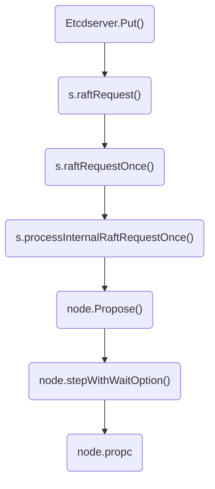

<show-structure depth="3"/>
<web-file-name>etcd/etcd-raft.html</web-file-name>

# Etcd的raft使用分析

看了raft论文，以为可以理解Etcd，实际并不是这么回事，原因是Etcd中的raft库只实现了raft协议的核心内容，**没有实现网络传输、存储的功能**，因此在etcd的`raft`库里，有一个**Application**的概念，网络传输和存储功能是**Application**的职责，而**Application**和**raft**的协作又是通过一系列**channel**完成的，导致代码逻辑断点较多，理解较为困难。

本文在理解raft库使用的基础上，分析Etcd中是如何使用raft的，进而掌握Etcd中一个请求是如何通过raft完成持久化的。

>因为生产环境用了**Etcd v3.4.3**版本，所以本文以该版本的源码进行分析。
>
{style="note"}

关于raft的原理可以参考如下动画和论文。

- [Understandable Distributed Consensus](http://thesecretlivesofdata.com/raft/) 
- [In Search of an Understandable Consensus Algorithm](https://raft.github.io/raft.pdf) 

## 1. raft库的使用说明

在raft库的README.md中，作者介绍了如何使用raft。

### 1.1 用户责任

raft库中的主要对象是**Node**，创建Node后使用者有如下责任。

1. 从**Node.Ready()**返回的**channel**获取更新并处理。
   - 按顺序将`Entries`、`HardState`和`Snapshot`写入持久化存储。
   - 将所有`Message`发送到其它节点。
   - 将`Snapshot`（如果有）和`CommiedEntries`应用到状态机。
   - 调用`Node.Advance()`发送信号进行通知，表示已准备好进行下一批更新。
2. 所有已持久化的日志条目必须能够通过`Storage`定义的接口进行访问。
3. 收到来自其它节点的消息后，将其传递给`Node.Step()`处理。
4. 以固定的时间间隔调用`Node.Tick()`。

总的来说，状态机的处理循环类似如下代码所示逻辑。

```Go
  for {
    select {
    case <-s.Ticker:
      n.Tick()
    case rd := <-s.Node.Ready():
      saveToStorage(rd.HardState, rd.Entries, rd.Snapshot)
      send(rd.Messages)
      if !raft.IsEmptySnap(rd.Snapshot) {
        processSnapshot(rd.Snapshot)
      }
      for _, entry := range rd.CommittedEntries {
        process(entry)
        if entry.Type == raftpb.EntryConfChange {
          var cc raftpb.ConfChange
          cc.Unmarshal(entry.Data)
          s.Node.ApplyConfChange(cc)
        }
      }
      s.Node.Advance()
    case <-s.done:
      return
    }
  }
```

### 1.2 数据变更

通过调用如下接口propose一个请求给raft，该请求会从`Node.Ready()`被读出，经过一系列处理后持久化到状态机。

```Go
n.Propose(ctx, data)
```

### 1.3 成员变更

要在一个cluster中添加或删除成员，构建`ConfChange`并调用如下接口进行处理。

```Go
n.ProposeConfChange(ctx, cc)
```

### 1.4 总结

可以用下图来总结下raft的使用，三个框表示三个节点，每个节点有`Application`和`raft`模块，`Application`即`raft`的用户，它通过几个channel和raft库进行交互，确保节点间数据的一致性、推进状态机持续变化。

- `propc` channel用于处理客户端请求。
- `recvc` channel用于raft协议内部通信。
- `readyc` channel用于`raft`向`Application`通知状态变化。
- 节点间的`message`网络传输、数据持久化，需要在`Application`里实现。


## 2. Propose()后的数据去哪了？

`Etcdserver`执行`Put()`请求后，通过如下一系列调用，最终数据包装成`msgWithResult{m: m}`发给了`node.prooc`，接下来这个调用就断了，那这个请求最终是在哪里被处理了呢？



```Go
// etcd/etcdserver/v3_server.go

func (s *EtcdServer) processInternalRaftRequestOnce(ctx context.Context, r pb.InternalRaftRequest) (*applyResult, error) {
	ai := s.getAppliedIndex()
	ci := s.getCommittedIndex()
	if ci > ai+maxGapBetweenApplyAndCommitIndex {
		return nil, ErrTooManyRequests
	}

	r.Header = &pb.RequestHeader{
		ID: s.reqIDGen.Next(),
	}

	authInfo, err := s.AuthInfoFromCtx(ctx)
	if err != nil {
		return nil, err
	}
	if authInfo != nil {
		r.Header.Username = authInfo.Username
		r.Header.AuthRevision = authInfo.Revision
	}

	data, err := r.Marshal()
	if err != nil {
		return nil, err
	}

	if len(data) > int(s.Cfg.MaxRequestBytes) {
		return nil, ErrRequestTooLarge
	}

	id := r.ID
	if id == 0 {
		id = r.Header.ID
	}
	ch := s.w.Register(id)

	cctx, cancel := context.WithTimeout(ctx, s.Cfg.ReqTimeout())
	defer cancel()

	start := time.Now()
	err = s.r.Propose(cctx, data)
	if err != nil {
		proposalsFailed.Inc()
		s.w.Trigger(id, nil) // GC wait
		return nil, err
	}
	proposalsPending.Inc()
	defer proposalsPending.Dec()

	select {
	case x := <-ch:
		return x.(*applyResult), nil
	case <-cctx.Done():
		proposalsFailed.Inc()
		s.w.Trigger(id, nil) // GC wait
		return nil, s.parseProposeCtxErr(cctx.Err(), start)
	case <-s.done:
		return nil, ErrStopped
	}
}
```
{collapsible="true" collapsed-title="Etcdserver.processInternalRaftRequestOnce()" default-state="collapsed"}

```Go
// etcd/raft/node.go

func (n *node) Propose(ctx context.Context, data []byte) error {
	return n.stepWait(ctx, pb.Message{Type: pb.MsgProp, Entries: []pb.Entry{{Data: data}}})
}
```
{collapsible="true" collapsed-title="node.Propose()" default-state="collapsed"}

```Go
// etcd/raft/node.go

func (n *node) stepWithWaitOption(ctx context.Context, m pb.Message, wait bool) error {
	if m.Type != pb.MsgProp {
		select {
		case n.recvc <- m:
			return nil
		case <-ctx.Done():
			return ctx.Err()
		case <-n.done:
			return ErrStopped
		}
	}
	ch := n.propc
	pm := msgWithResult{m: m}
	if wait {
		pm.result = make(chan error, 1)
	}
	select {
	case ch <- pm:
		if !wait {
			return nil
		}
	case <-ctx.Done():
		return ctx.Err()
	case <-n.done:
		return ErrStopped
	}
	select {
	case err := <-pm.result:
		if err != nil {
			return err
		}
	case <-ctx.Done():
		return ctx.Err()
	case <-n.done:
		return ErrStopped
	}
	return nil
}
```
{collapsible="true" collapsed-title="node.stepWithWaitOption()" default-state="collapsed"}
