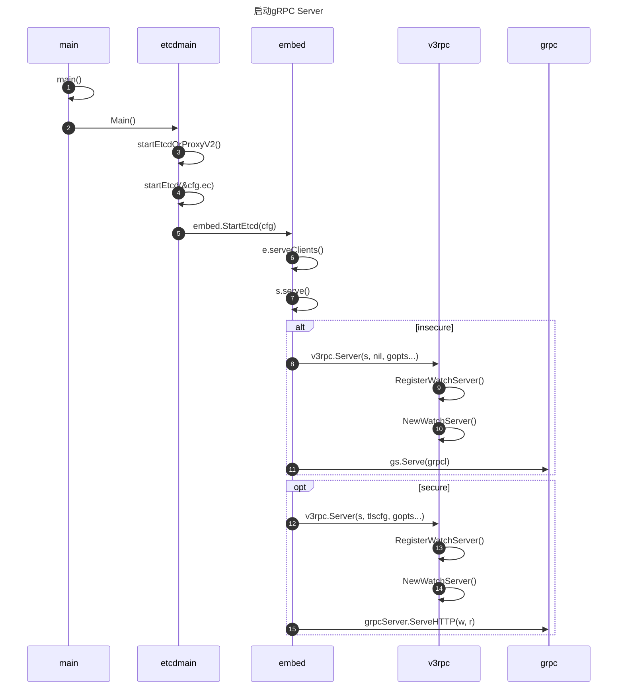
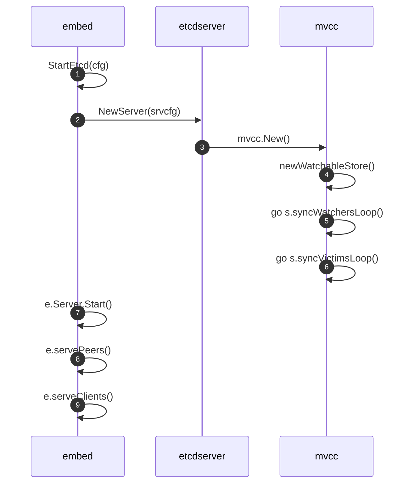
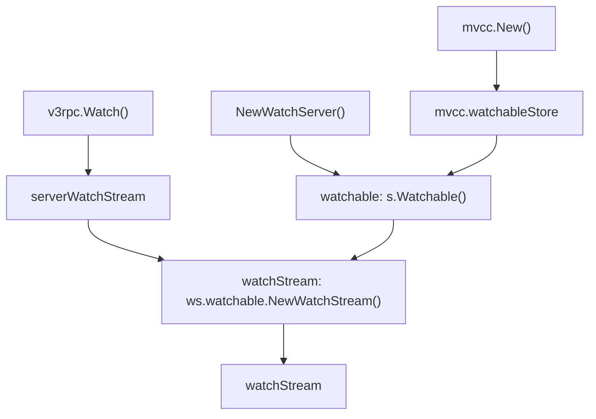
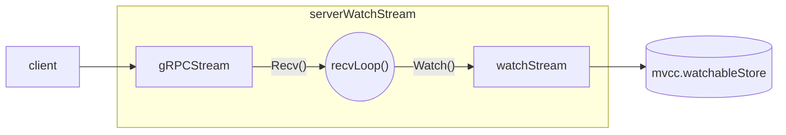
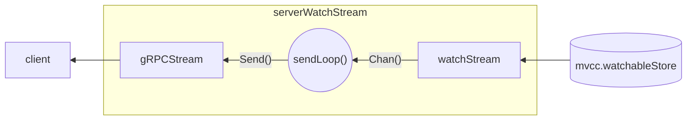
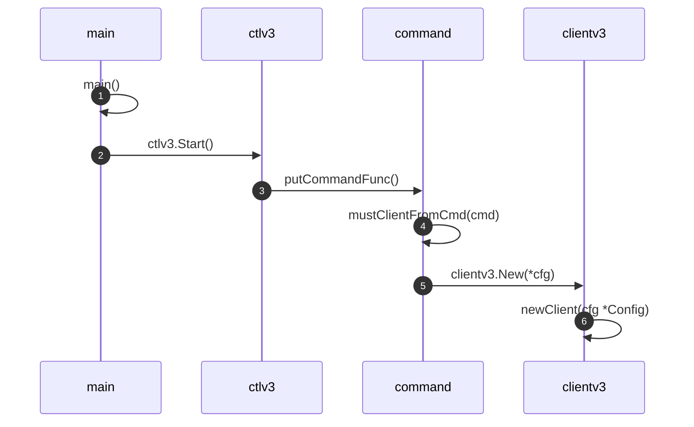
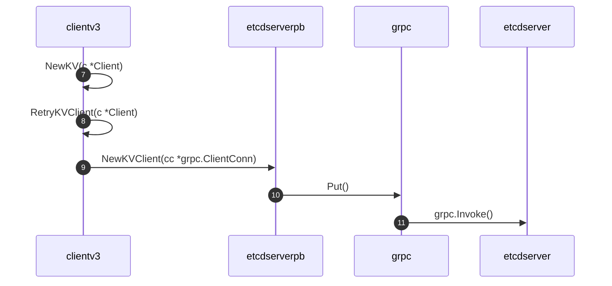
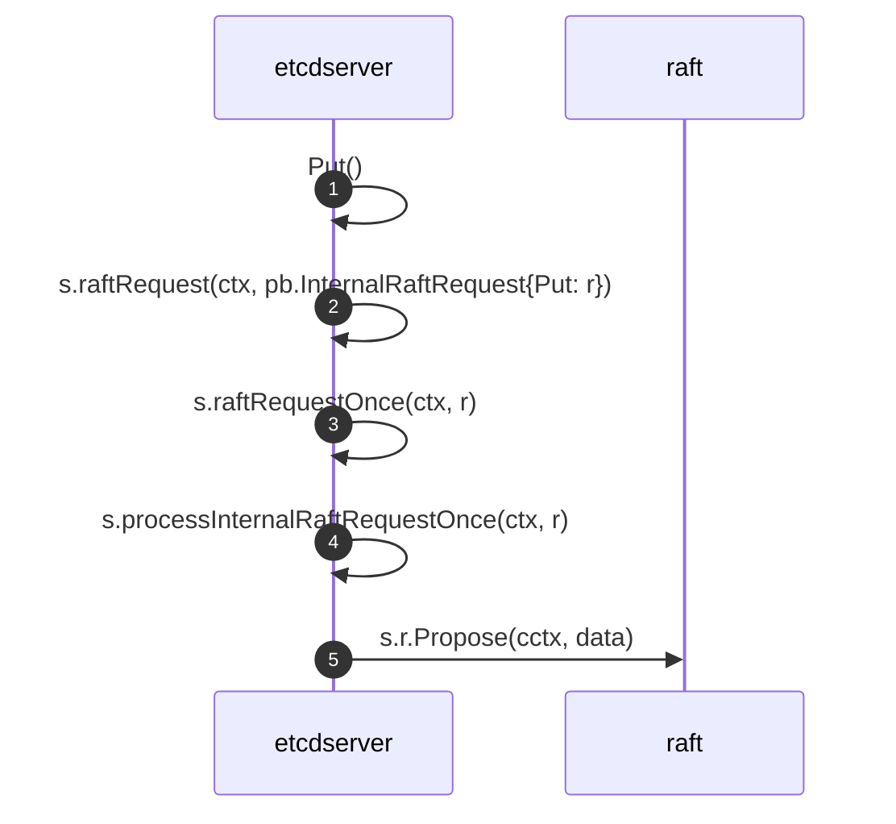
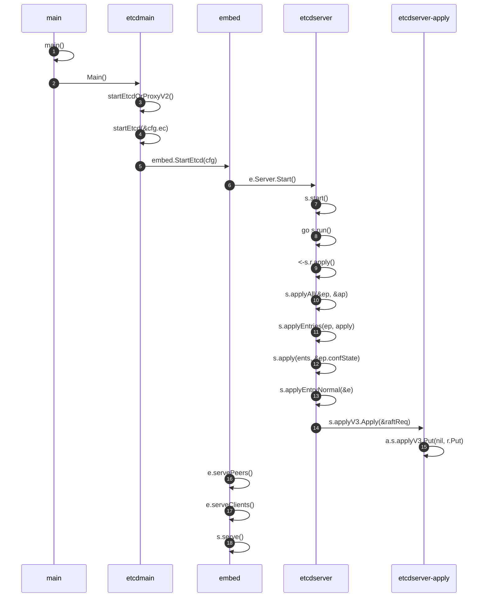

<show-structure depth="3"/>
<web-file-name>etcd/etcd-watch.html</web-file-name>

# Etcd的Watch实现分析

Etcd作为Kubernetes的控制面存储，保存了Kubernetes集群状态，各种Controller通过Watch机制感知集群事件，对比资源实际状态与期望状态执行reconcile，确保集群按期望状态运行。整个系统的性能、可靠性非常依赖**Watch机制**，因此掌握Watcher的实现原理对于理解kubernetes的运行至关重要。

本文通过提出问题、回答问题的方式，尝试揭开Watch的神秘面纱。

>因为生产环境用了**Etcd v3.4.3**版本，所以本文以该版本的源码进行分析。
> 
{style="note"}

## 1. Watch机制基于什么协议实现？

在v3版本中，Etcd使用**gRPC**进行消息传输，利用**HTTP/2**的**Multiplexing**、**Server Push**特性，以及**protocol buffers**的**二进制**、**高压缩**等优点，实现了高效的Watch机制。

>Etcd v2的Watch机制使用HTTP/1.x实现，每个watcher对应一个TCP连接。Client通过HTTP/1.1协议长连接定时轮询Server，获取最新的数据变化事件。
> 
>当watcher数量较多时，即使集群空负载，大量轮询也会产生一定的QPS，Server端会消耗大量的socket、内存等资源，导致Etcd的扩展性、稳定性无法满足Kubernetes等业务场景诉求。

接下来我们从gRPC的API开始探索，在gRPC中API是定义在`.proto`文件中的，如下所示，需要实现一个`Watch`的rpc方法。

```Go
// etcd/etcdserver/etcdserverpb/rpc.proto

service Watch {
  // Watch watches for events happening or that have happened. Both input and output
  // are streams; the input stream is for creating and canceling watchers and the output
  // stream sends events. One watch RPC can watch on multiple key ranges, streaming events
  // for several watches at once. The entire event history can be watched starting from the
  // last compaction revision.
  rpc Watch(stream WatchRequest) returns (stream WatchResponse) {
      option (google.api.http) = {
        post: "/v3/watch"
        body: "*"
    };
  }
}
```

定义显示Watch的**input**和**output**都是**stream**类型，也就是实现了**Bidirectional streaming RPC**通信，它确保了**服务端持续推送事件和客户端持续接收事件**的能力，比起传统的**poll轮训**实现，watch机制在性能和资源占用上都有绝对的优势。

>**Bidirectional streaming RPCs** where both sides send a sequence of messages using a read-write stream. The two streams operate independently, so clients and servers can read and write in whatever order they like: for example, the server could wait to receive all the client messages before writing its responses, or it could alternately read a message then write a message, or some other combination of reads and writes. The order of messages in each stream is preserved.
>
>```Go
>rpc BidiHello(stream HelloRequest) returns (stream HelloResponse);
>```
>

## 2. Watch的gRPC Server是什么时候启动的？ {id="2"}

下面对Etcd启动流程做个概要分析，核心是找到启动gRPC Server的位置，绘制出如下时序图。

>下图中的对象用函数所在的`package`名表示，交互消息用函数调用表示。

<snippet id="etcd-diagram-1">



</snippet>

可以看到etcd在启动流程中启动了gRPC Server，具体是在`embed`包中的`StartEtcd()`函数中执行相关调用完成的，在`serve()`函数中调用`v3rpc.Server()`执行了WatchServer的创建和注册，针对是否启用了tls使用了不同的方式处理，`serve()`函数的逻辑如下。

```Go
// serve accepts incoming connections on the listener l,
// creating a new service goroutine for each. The service goroutines
// read requests and then call handler to reply to them.
func (sctx *serveCtx) serve(
	s *etcdserver.EtcdServer,
	tlsinfo *transport.TLSInfo,
	handler http.Handler,
	errHandler func(error),
	gopts ...grpc.ServerOption) (err error) {
	logger := defaultLog.New(ioutil.Discard, "etcdhttp", 0)
	<-s.ReadyNotify()

    // ...
    
	if sctx.insecure {
	    // 创建gRPC Server
		gs = v3rpc.Server(s, nil, gopts...)
		// ...
		grpcl := m.Match(cmux.HTTP2())
		// 启动gRPC Server
		go func() { errHandler(gs.Serve(grpcl)) }()
	}

	if sctx.secure {
	    // ...
	    // 创建gRPC Server
		gs = v3rpc.Server(s, tlscfg, gopts...)
		// ...
		// 处理gRPC请求的handler
		handler = grpcHandlerFunc(gs, handler)
        // ...
		httpmux := sctx.createMux(gwmux, handler)

		srv := &http.Server{
			Handler:   createAccessController(sctx.lg, s, httpmux),
			TLSConfig: tlscfg,
			ErrorLog:  logger, // do not log user error
		}
		// 启动http.Server，同时支持gRPC和HTTP
		go func() { errHandler(srv.Serve(tlsl)) }()

	close(sctx.serversC)
	return m.Serve()
}
```
{collapsible="true" collapsed-title="embed.serve()" default-state="collapsed"}

`v3rpc.Server()`中注册WatchServer的代码如下。
```Go
func Server(s *etcdserver.EtcdServer, tls *tls.Config, gopts ...grpc.ServerOption) *grpc.Server {
    // ...
	pb.RegisterWatchServer(grpcServer, NewWatchServer(s))
    // ...
	return grpcServer
}
```
{collapsible="true" collapsed-title="v3rpc.Server()" default-state="expanded"}

`v3rpc.NewWatchServer()`创建WatchServer的过程如下。
```Go
// NewWatchServer returns a new watch server.
func NewWatchServer(s *etcdserver.EtcdServer) pb.WatchServer {
	return &watchServer{
		lg: s.Cfg.Logger,

		clusterID: int64(s.Cluster().ID()),
		memberID:  int64(s.ID()),

		maxRequestBytes: int(s.Cfg.MaxRequestBytes + grpcOverheadBytes),

		sg:        s,
		watchable: s.Watchable(),
		ag:        s,
	}
}
```
{collapsible="true" collapsed-title="v3rpc.NewWatchServer()" default-state="expanded"}

## 3. Watch机制和KV存储有什么关系？

第[2](#2)节看到etcd启动的主要逻辑在`StartEtcd()`中，因此重点分析下这个函数，关注和Watch相关的过程，看看是否可以找到Watch机制和KV存储的关系。

>如下是梳理关键逻辑后绘制的时序图，先有个大概框架，再详细分析下每一步代码实现。

<snippet id="etcd-diagram-2">



</snippet>

对照上图的序号，对关键步骤做个解释。

- 第1步执行`StartEtcd()`，函数签名为`func StartEtcd(inCfg *Config) (e *Etcd, err error)`，返回值是一个名为`Etcd`类型的对象。
```Go
// StartEtcd launches the etcd server and HTTP handlers for client/server communication.
// The returned Etcd.Server is not guaranteed to have joined the cluster. Wait
// on the Etcd.Server.ReadyNotify() channel to know when it completes and is ready for use.
func StartEtcd(inCfg *Config) (e *Etcd, err error) {
    // ...
    // 第2步
	if e.Server, err = etcdserver.NewServer(srvcfg); err != nil {
		return e, err
	}

    // ...
    // 第7步
	e.Server.Start()

    // 第8步
	if err = e.servePeers(); err != nil {
		return e, err
	}
    // 第9步
	if err = e.serveClients(); err != nil {
		return e, err
	}
	// ...
	serving = true
	return e, nil
}
```
{collapsible="true" collapsed-title="StartEtcd()" default-state="collapsed"}

- 第2步创建了etcdserver对象，返回值是一个名为`EtcdServer`的对象。
```Go
// etcd/etcdserver/server.go

// NewServer creates a new EtcdServer from the supplied configuration. The
// configuration is considered static for the lifetime of the EtcdServer.
func NewServer(cfg ServerConfig) (srv *EtcdServer, err error) {
	st := v2store.New(StoreClusterPrefix, StoreKeysPrefix)
	
	// ...
	
	// 创建了`mvcc`模块，这是一个实现了Watch特性的KV Store
	srv.kv = mvcc.New(srv.getLogger(), srv.be, srv.lessor, &srv.consistIndex, mvcc.StoreConfig{CompactionBatchLimit: cfg.CompactionBatchLimit})
	
	srv.r.transport = tr

	return srv, nil
}
```
{collapsible="true" collapsed-title="etcdserver.NewServer()" default-state="collapsed"}

- 第3步创建`mvcc`模块，简单调用了第4步的`newWatchableStore()`函数。
```Go
// etcd/mvcc/watchable_store.go

func New(lg *zap.Logger, b backend.Backend, le lease.Lessor, ig ConsistentIndexGetter, cfg StoreConfig) ConsistentWatchableKV {
	return newWatchableStore(lg, b, le, ig, cfg)
}
```

- 第4步是第3步的具体实现，返回值是一个实现了`ConsistentWatchableKV`接口的对象，实现这个接口的类型是名为`watchableStore`的struct。
- 第5步启动了一个goroutine执行`syncWatchersLoop()`函数，每100ms同步一次处于**unsynced map**中的watcher。
- 第6步启动了一个goroutine执行`syncVictimsLoop()`函数，在**victims**集合非空的情况下每10m同步一次，尝试给被阻塞的watcher同步事件。第4步到第6步的代码如下。
```Go
func newWatchableStore(lg *zap.Logger, b backend.Backend, le lease.Lessor, ig ConsistentIndexGetter, cfg StoreConfig) *watchableStore {
	s := &watchableStore{
		store:    NewStore(lg, b, le, ig, cfg),
		victimc:  make(chan struct{}, 1),
		unsynced: newWatcherGroup(),
		synced:   newWatcherGroup(),
		stopc:    make(chan struct{}),
	}
	s.store.ReadView = &readView{s}
	s.store.WriteView = &writeView{s}
	if s.le != nil {
		// use this store as the deleter so revokes trigger watch events
		s.le.SetRangeDeleter(func() lease.TxnDelete { return s.Write(traceutil.TODO()) })
	}
	s.wg.Add(2)
	// 启动goroutine处理unsynced的watcher
	go s.syncWatchersLoop()
	// 启动goroutine处理victims的watcher
	go s.syncVictimsLoop()
	return s
}
```
{collapsible="true" collapsed-title="mvcc.newWatchableStore()" default-state="collapsed"}

- 第7步启动了etcdserver。
- 第9步执行了`serveClients()`函数，这个函数前面已经分析过，注册并启动了gRPC Server。

总结一下，etcd在启动过程中，会初始化`mvcc`模块，它是一个实现了Watch特性的KV存储，在这之后才执行上一节介绍的gRPC Server注册及启动，因此etcd的Watch机制需要KV存储是watchable的，也就是说需要KV存储也实现Watch机制。

了解了gRPC Server注册及启动，也知道了需要KV存储实现Watch机制，那这个Watch的gRPC Service具体是如何实现的呢？

## 4. Watch的gRPC Service是如何实现的？

在[gRPC Server启动过程](#2)的分析中，看到第14步执行了`NewWatchServer()`，这里创建了`watchServer`对象，`watchServer`实现了`Watch`的rpc方法，我们看一下它的代码。

<include from="etcd-watch.md" element-id="etcd-diagram-1"></include>

<snippet id="etcd-code-1">

```Go
// etcd/etcdserver/api/v3rpc/watch.go

func (ws *watchServer) Watch(stream pb.Watch_WatchServer) (err error) {
    // 1. 创建 serverWatchStream 对象
	sws := serverWatchStream{
		lg: ws.lg,

		clusterID: ws.clusterID,
		memberID:  ws.memberID,

		maxRequestBytes: ws.maxRequestBytes,

		sg:        ws.sg,
		watchable: ws.watchable,
		ag:        ws.ag,

		gRPCStream:  stream,
		watchStream: ws.watchable.NewWatchStream(),
		// chan for sending control response like watcher created and canceled.
		ctrlStream: make(chan *pb.WatchResponse, ctrlStreamBufLen),

		progress: make(map[mvcc.WatchID]bool),
		prevKV:   make(map[mvcc.WatchID]bool),
		fragment: make(map[mvcc.WatchID]bool),

		closec: make(chan struct{}),
	}

	sws.wg.Add(1)
	go func() {
        // 2. 向客户端发送事件
		sws.sendLoop()
		sws.wg.Done()
	}()

	errc := make(chan error, 1)
	// Ideally recvLoop would also use sws.wg to signal its completion
	// but when stream.Context().Done() is closed, the stream's recv
	// may continue to block since it uses a different context, leading to
	// deadlock when calling sws.close().
	go func() {
        // 3. 接收客户端请求
		if rerr := sws.recvLoop(); rerr != nil {
			if isClientCtxErr(stream.Context().Err(), rerr) {
				if sws.lg != nil {
					sws.lg.Debug("failed to receive watch request from gRPC stream", zap.Error(rerr))
				} else {
					plog.Debugf("failed to receive watch request from gRPC stream (%q)", rerr.Error())
				}
			} else {
				if sws.lg != nil {
					sws.lg.Warn("failed to receive watch request from gRPC stream", zap.Error(rerr))
				} else {
					plog.Warningf("failed to receive watch request from gRPC stream (%q)", rerr.Error())
				}
				streamFailures.WithLabelValues("receive", "watch").Inc()
			}
			errc <- rerr
		}
	}()

	select {
	case err = <-errc:
		close(sws.ctrlStream)

	case <-stream.Context().Done():
		err = stream.Context().Err()
		// the only server-side cancellation is noleader for now.
		if err == context.Canceled {
			err = rpctypes.ErrGRPCNoLeader
		}
	}

	sws.close()
	return err
}
```
{collapsible="true" collapsed-title="v3rpc.Watch()" default-state="collapsed"}

</snippet>

我在注释中添加了序号，方便理解关键逻辑。

1. 创建并初始化了`serverWatchStream`对象，这个对象在Watch机制的实现中起着至关重要的作用，向上与客户端建立联系，向下与KV存储建立联系，确保了KV存储的变化能被及时感知并推送给客户端，在下面详细解析。
2. 创建一个goroutine，执行`sws.recvLoop()`，它的作用是接收客户端的请求，通知下层KV存储创建watcher，建立watcher和key或key range的watch关系。
3. 创建一个goroutine，执行`sws.sendLoop()`，它的作用是从KV存储获取变化，当KV中被监听的key发生变化时，实时向客户端发送事件。

接下来分别分析下这三步的代码逻辑。

### 4.1 serverWatchStream有什么作用？ {id="4.1"}

先从它的定义看起。

<snippet id="etcd-code-2">

```Go
// etcd/etcdserver/api/v3rpc/watch.go

// serverWatchStream is an etcd server side stream. It receives requests
// from client side gRPC stream. It receives watch events from mvcc.WatchStream,
// and creates responses that forwarded to gRPC stream.
// It also forwards control message like watch created and canceled.
type serverWatchStream struct {
	lg *zap.Logger

	clusterID int64
	memberID  int64

	maxRequestBytes int

	sg        etcdserver.RaftStatusGetter
	watchable mvcc.WatchableKV
	ag        AuthGetter

    // 4.1.1
	gRPCStream  pb.Watch_WatchServer
	
    // 4.1.2
	watchStream mvcc.WatchStream
	ctrlStream  chan *pb.WatchResponse

	// mu protects progress, prevKV, fragment
	mu sync.RWMutex
	// tracks the watchID that stream might need to send progress to
	// TODO: combine progress and prevKV into a single struct?
	progress map[mvcc.WatchID]bool
	// record watch IDs that need return previous key-value pair
	prevKV map[mvcc.WatchID]bool
	// records fragmented watch IDs
	fragment map[mvcc.WatchID]bool

	// closec indicates the stream is closed.
	closec chan struct{}

	// wg waits for the send loop to complete
	wg sync.WaitGroup
}
```
{collapsible="true" collapsed-title="serverWatchStream struct" default-state="collapsed"}

</snippet>

先看`gRPCStream`字段，这是一个`pb.Watch_WatchServer`类型，它是一个interface，提供了`Send()`和`Recv()`方法。

- `Send()`表示向客户端发送gRPC请求。
- `Recv()`表示从客户端接收gRPC请求。
- `gRPCStream`在这里的作用是和客户端进行grpc通信，建立了与上层客户端的联系。

`Watch_WatchServer`定义如下。


```Go
// etcd/etcdserver/etcdserverpb/rpc.pb.go

type Watch_WatchServer interface {
	Send(*WatchResponse) error
	Recv() (*WatchRequest, error)
	grpc.ServerStream
}
```


再看`watchStream`字段，这是一个`mvcc.WatchStream`类型，它是一个interface，提供了`Watch()`、`Chan()`等方法。

- `Watch()`方法用于创建watcher。
>注意这和gRPC Service的Watch不一样，方法所在的对象不同，作用也不同，只是名字相同而已。

- `Chan()`方法返回一个channel，被监听key的变化会发送到这个channel中。
- `watchStream`在这里的作用是和`mvcc`存储建立联系，从`mvcc`存储中获取新事件。

`WatchStream`定义如下。
```Go
// etcd/mvcc/watcher.go

type WatchStream interface {
	// Watch creates a watcher. The watcher watches the events happening or
	// happened on the given key or range [key, end) from the given startRev.
	//
	// The whole event history can be watched unless compacted.
	// If "startRev" <=0, watch observes events after currentRev.
	//
	// The returned "id" is the ID of this watcher. It appears as WatchID
	// in events that are sent to the created watcher through stream channel.
	// The watch ID is used when it's not equal to AutoWatchID. Otherwise,
	// an auto-generated watch ID is returned.
	Watch(id WatchID, key, end []byte, startRev int64, fcs ...FilterFunc) (WatchID, error)

	// Chan returns a chan. All watch response will be sent to the returned chan.
	Chan() <-chan WatchResponse

	// RequestProgress requests the progress of the watcher with given ID. The response
	// will only be sent if the watcher is currently synced.
	// The responses will be sent through the WatchRespone Chan attached
	// with this stream to ensure correct ordering.
	// The responses contains no events. The revision in the response is the progress
	// of the watchers since the watcher is currently synced.
	RequestProgress(id WatchID)

	// Cancel cancels a watcher by giving its ID. If watcher does not exist, an error will be
	// returned.
	Cancel(id WatchID) error

	// Close closes Chan and release all related resources.
	Close()

	// Rev returns the current revision of the KV the stream watches on.
	Rev() int64
}
```
{collapsible="true" collapsed-title="WatchStream interface" default-state="collapsed"}

上面在代码注释中标记了4.1.1和4.1.2两个关键字段，这是打通客户端到KV存储的关键。只从定义是无法得出这个结论的，需要从`serverWatchStream`的初始化过程来理解。

#### 4.1.1 gRPCStream

在`Watch`的gRPC Service实现中可以看到`serverWatchStream`的初始化，从`gRPCStream:  stream`可知`gRPCStream`字段被赋值为`stream`。`gRPCStream`字段的类型为`pb.Watch_WatchServer`，而`stream`的类型也是`pb.Watch_WatchServer`，因此这里并没有特殊的地方，就是正常传参，可以通过如下代码对比。

- `stream`类型
<include from="etcd-watch.md" element-id="etcd-code-1"></include>

- `gRPCStream`类型
<include from="etcd-watch.md" element-id="etcd-code-2"></include>

#### 4.1.2 watchStream {id="4.1.2"}

同样地，`serverWatchStream`初始化对`watchStream`字段也进行了赋值，即`watchStream: ws.watchable.NewWatchStream()`，先看下`ws.watchable.NewWatchStream()`定义。

<snippet id="etcd-code-3">

```Go
// etcd/mvcc/watchable_store.go

func (s *watchableStore) NewWatchStream() WatchStream {
	watchStreamGauge.Inc()
	return &watchStream{
		watchable: s,
		ch:        make(chan WatchResponse, chanBufLen),
		cancels:   make(map[WatchID]cancelFunc),
		watchers:  make(map[WatchID]*watcher),
	}
}
```
{collapsible="true" collapsed-title="mvcc.NewWatchStream()" default-state="collapsed"}

</snippet>

- 这里看到返回结果是基于`watchableStore`对象封装的`watchStream`对象。那`watchableStore`对象是怎么来的呢？需要从`ws`也就是`watchServer`的初始化看起。

- 从[前面的分析](#2)可知在启动过程（下图第14步）创建了`watchServer`对象，并对`ws.watchable`进行了初始化：`watchable: s.Watchable()`。

<include from="etcd-watch.md" element-id="etcd-diagram-1"></include>

```Go
// etcd/etcdserver/api/v3rpc/watch.go

// NewWatchServer returns a new watch server.
func NewWatchServer(s *etcdserver.EtcdServer) pb.WatchServer {
	return &watchServer{
		lg: s.Cfg.Logger,

		clusterID: int64(s.Cluster().ID()),
		memberID:  int64(s.ID()),

		maxRequestBytes: int(s.Cfg.MaxRequestBytes + grpcOverheadBytes),

		sg:        s,
		watchable: s.Watchable(),
		ag:        s,
	}
}
```

- 那`s.Watchable()`做了什么呢？查看`s.Watchable()`的定义，最终返回了`s.kv`，那`s.kv`是哪来的呢？

```Go
// etcd/etcdserver/v3_server.go

// Watchable returns a watchable interface attached to the etcdserver.
func (s *EtcdServer) Watchable() mvcc.WatchableKV { return s.KV() }

// etcd/etcdserver/server.go
func (s *EtcdServer) KV() mvcc.ConsistentWatchableKV { return s.kv }
```

- 从前面的分析可以看到，`s.kv`正是在下图第3步被创建的，`mvcc.New()`内部通过调用`newWatchableStore()`返回了一个`watchableStore`对象，它实现了`WatchableKV`这个interface，也实现了`KV`interface，因此这个`watchableStore`对象就是一个实现了**watchable**接口的**KV**存储。

<include from="etcd-watch.md" element-id="etcd-diagram-2"></include>

```Go
// etcd/etcdserver/server.go

func NewServer(cfg ServerConfig) (srv *EtcdServer, err error) {
	st := v2store.New(StoreClusterPrefix, StoreKeysPrefix)
	
	// ...
	
	// 创建了`mvcc`模块，这是一个实现了Watch特性的KV Store
	srv.kv = mvcc.New(srv.getLogger(), srv.be, srv.lessor, &srv.consistIndex, mvcc.StoreConfig{CompactionBatchLimit: cfg.CompactionBatchLimit})
	
	srv.r.transport = tr

	return srv, nil
}
```
{collapsible="true" collapsed-title="etcdserver.NewServer()" default-state="expanded"}

```Go
// etcd/mvcc/watchable_store.go

func New(lg *zap.Logger, b backend.Backend, le lease.Lessor, ig ConsistentIndexGetter, cfg StoreConfig) ConsistentWatchableKV {
	return newWatchableStore(lg, b, le, ig, cfg)
}
```
{collapsible="true" collapsed-title="mvcc.New()" default-state="expanded"}

```Go
func newWatchableStore(lg *zap.Logger, b backend.Backend, le lease.Lessor, ig ConsistentIndexGetter, cfg StoreConfig) *watchableStore {
	s := &watchableStore{
		store:    NewStore(lg, b, le, ig, cfg),
		victimc:  make(chan struct{}, 1),
		unsynced: newWatcherGroup(),
		synced:   newWatcherGroup(),
		stopc:    make(chan struct{}),
	}
	s.store.ReadView = &readView{s}
	s.store.WriteView = &writeView{s}
	if s.le != nil {
		// use this store as the deleter so revokes trigger watch events
		s.le.SetRangeDeleter(func() lease.TxnDelete { return s.Write(traceutil.TODO()) })
	}
	s.wg.Add(2)
	go s.syncWatchersLoop()
	go s.syncVictimsLoop()
	return s
}
```
{collapsible="true" collapsed-title="mvcc.newWatchableStore()" default-state="collapsed"}

- **到这里我们已经知道，`serverWatchStream`在`watchStream: ws.watchable.NewWatchStream()`这个初始化过程中，最终是将`mvcc.watchableStore`封装成`watchStream`对象赋值给了`watchStream`**。

- 继续往下跟踪`store`的初始化：`store:    NewStore(lg, b, le, ig, cfg)`，可以看到这个`store`封装了`backend.Backend`这个interface。

```Go
// etcd/mvcc/kvstore.go

// NewStore returns a new store. It is useful to create a store inside
// mvcc pkg. It should only be used for testing externally.
func NewStore(lg *zap.Logger, b backend.Backend, le lease.Lessor, ig ConsistentIndexGetter, cfg StoreConfig) *store {
	if cfg.CompactionBatchLimit == 0 {
		cfg.CompactionBatchLimit = defaultCompactBatchLimit
	}
	s := &store{
		cfg:     cfg,
		b:       b,
		ig:      ig,
		kvindex: newTreeIndex(lg),

		le: le,

		currentRev:     1,
		compactMainRev: -1,

		bytesBuf8: make([]byte, 8),
		fifoSched: schedule.NewFIFOScheduler(),

		stopc: make(chan struct{}),

		lg: lg,
	}
	s.ReadView = &readView{s}
	s.WriteView = &writeView{s}
	if s.le != nil {
		s.le.SetRangeDeleter(func() lease.TxnDelete { return s.Write(traceutil.TODO()) })
	}

	tx := s.b.BatchTx()
	tx.Lock()
	tx.UnsafeCreateBucket(keyBucketName)
	tx.UnsafeCreateBucket(metaBucketName)
	tx.Unlock()
	s.b.ForceCommit()

	s.mu.Lock()
	defer s.mu.Unlock()
	if err := s.restore(); err != nil {
		// TODO: return the error instead of panic here?
		panic("failed to recover store from backend")
	}

	return s
}
```
{collapsible="true" collapsed-title="mvcc.NewStore()" default-state="collapsed"}

- 而`backend`的实现则是封装了`bolt.DB`，也就是`etcd`最终是通过`boltDB`实现的持久化存储。

```Go
type backend struct {
	// size and commits are used with atomic operations so they must be
	// 64-bit aligned, otherwise 32-bit tests will crash

	// size is the number of bytes allocated in the backend
	size int64
	// sizeInUse is the number of bytes actually used in the backend
	sizeInUse int64
	// commits counts number of commits since start
	commits int64
	// openReadTxN is the number of currently open read transactions in the backend
	openReadTxN int64

	mu sync.RWMutex
	db *bolt.DB

	batchInterval time.Duration
	batchLimit    int
	batchTx       *batchTxBuffered

	readTx *readTx

	stopc chan struct{}
	donec chan struct{}

	lg *zap.Logger
}
```
{collapsible="true" collapsed-title="mvcc/backend.backend" default-state="collapsed"}

上面嵌套比较深，总结一下。
1. 在`etcd`启动过程中，创建了`mvcc.watchableStore`并赋值给`etcdserver`的`kv`字段，代码为`srv.kv = mvcc.New()`。
2. 在`Watch`的gRPC Service注册过程中，创建了`watchServer`并对`ws.watchable`字段进行了初始化，代码为`watchable: s.Watchable()`。
3. 在`s.Watchable()`函数中返回了第1步的`s.kv`，也就是`mvcc.watchableStore`对象。
4. 在`Watch`的gRPC Service执行中，创建了`serverWatchStream`，并对`sws.watchStream`字段进行了初始化，代码为`watchStream: ws.watchable.NewWatchStream()`。
5. 结合第2步、第3步，可以知到`ws.watchable`就是`mvcc.watchableStore`，所以`ws.watchable.NewWatchStream()`就是`mvcc.watchableStore.NewWatchStream()`。
6. 因此`sws.watchStream`的值就是`mvcc.watchableStore.NewWatchStream()`结果，实际代码如下，是基于`mvcc.watchableStore`封装的`watchStream`对象。

<include from="etcd-watch.md" element-id="etcd-code-3"></include>



经过多层嵌套，最终`sws.watchStream`被赋值为基于`mvcc.watchableStore`封装的`watchStream`对象，和KV存储完成了关联。

### 4.2 recvLoop()做了什么事情？ {id="4.2"}

```Go
// etcd/etcdserver/api/v3rpc/watch.go

func (sws *serverWatchStream) recvLoop() error {
	for {
        // 4.2.1
        // 通过sws.gRPCStream.Recv()接收客户端的rpc请求
		req, err := sws.gRPCStream.Recv()
		if err == io.EOF {
			return nil
		}
		if err != nil {
			return err
		}

		switch uv := req.RequestUnion.(type) {
        // 4.2.2
        / Watch的Create请求处理逻辑
		case *pb.WatchRequest_CreateRequest:
			if uv.CreateRequest == nil {
				break
			}

			creq := uv.CreateRequest
			if len(creq.Key) == 0 {
				// \x00 is the smallest key
				creq.Key = []byte{0}
			}
			if len(creq.RangeEnd) == 0 {
				// force nil since watchstream.Watch distinguishes
				// between nil and []byte{} for single key / >=
				creq.RangeEnd = nil
			}
			if len(creq.RangeEnd) == 1 && creq.RangeEnd[0] == 0 {
				// support  >= key queries
				creq.RangeEnd = []byte{}
			}

			if !sws.isWatchPermitted(creq) {
				wr := &pb.WatchResponse{
					Header:       sws.newResponseHeader(sws.watchStream.Rev()),
					WatchId:      creq.WatchId,
					Canceled:     true,
					Created:      true,
					CancelReason: rpctypes.ErrGRPCPermissionDenied.Error(),
				}

				select {
				case sws.ctrlStream <- wr:
				case <-sws.closec:
				}
				return nil
			}

			filters := FiltersFromRequest(creq)

			wsrev := sws.watchStream.Rev()
			rev := creq.StartRevision
			if rev == 0 {
				rev = wsrev + 1
			}
            // 4.2.3
            // 调用mvcc的watchableStore.Watch方法创建watcher并返回watchID
			id, err := sws.watchStream.Watch(mvcc.WatchID(creq.WatchId), creq.Key, creq.RangeEnd, rev, filters...)
			if err == nil {
				sws.mu.Lock()
				if creq.ProgressNotify {
					sws.progress[id] = true
				}
				if creq.PrevKv {
					sws.prevKV[id] = true
				}
				if creq.Fragment {
					sws.fragment[id] = true
				}
				sws.mu.Unlock()
			}
			wr := &pb.WatchResponse{
				Header:   sws.newResponseHeader(wsrev),
				WatchId:  int64(id),
				Created:  true,
				Canceled: err != nil,
			}
			if err != nil {
				wr.CancelReason = err.Error()
			}
			select {
			case sws.ctrlStream <- wr:
			case <-sws.closec:
				return nil
			}

		case *pb.WatchRequest_CancelRequest:
			if uv.CancelRequest != nil {
				id := uv.CancelRequest.WatchId
				err := sws.watchStream.Cancel(mvcc.WatchID(id))
				if err == nil {
					sws.ctrlStream <- &pb.WatchResponse{
						Header:   sws.newResponseHeader(sws.watchStream.Rev()),
						WatchId:  id,
						Canceled: true,
					}
					sws.mu.Lock()
					delete(sws.progress, mvcc.WatchID(id))
					delete(sws.prevKV, mvcc.WatchID(id))
					delete(sws.fragment, mvcc.WatchID(id))
					sws.mu.Unlock()
				}
			}
		case *pb.WatchRequest_ProgressRequest:
			if uv.ProgressRequest != nil {
				sws.ctrlStream <- &pb.WatchResponse{
					Header:  sws.newResponseHeader(sws.watchStream.Rev()),
					WatchId: -1, // response is not associated with any WatchId and will be broadcast to all watch channels
				}
			}
		default:
			// we probably should not shutdown the entire stream when
			// receive an valid command.
			// so just do nothing instead.
			continue
		}
	}
}
```
{collapsible="true" collapsed-title="v3rpc.recvLoop()" default-state="collapsed"}

通过关键代码注释，可以将`recvLoop()`的主要逻辑总结如下。
1. 通过`sws.gRPCStream.Recv()`接收客户端的rpc请求。
2. 如果是Watch的Create请求，调用mvcc实现的watchableStore.Watch方法进行处理。
3. 如果是Watch的Cancel、Progress请求，执行对应的逻辑进行处理。

简单总结下，`recvLoop`会持续接收客户端的rpc请求，并调用底层的`mvcc`模块进行相应处理。



### 4.3 sendLoop()做了什么事情？ {id="4.3"}

```Go
// etcd/etcdserver/api/v3rpc/watch.go
func (sws *serverWatchStream) sendLoop() {
	// watch ids that are currently active
	ids := make(map[mvcc.WatchID]struct{})
	// watch responses pending on a watch id creation message
	pending := make(map[mvcc.WatchID][]*pb.WatchResponse)

	interval := GetProgressReportInterval()
	progressTicker := time.NewTicker(interval)

	defer func() {
		progressTicker.Stop()
		// drain the chan to clean up pending events
		for ws := range sws.watchStream.Chan() {
			mvcc.ReportEventReceived(len(ws.Events))
		}
		for _, wrs := range pending {
			for _, ws := range wrs {
				mvcc.ReportEventReceived(len(ws.Events))
			}
		}
	}()

	for {
		select {
		// 1. 调用Chan()从mvcc获取WatchResponse
		case wresp, ok := <-sws.watchStream.Chan():
			if !ok {
				return
			}

			// TODO: evs is []mvccpb.Event type
			// either return []*mvccpb.Event from the mvcc package
			// or define protocol buffer with []mvccpb.Event.
			evs := wresp.Events
			events := make([]*mvccpb.Event, len(evs))
			sws.mu.RLock()
			needPrevKV := sws.prevKV[wresp.WatchID]
			sws.mu.RUnlock()
			for i := range evs {
				events[i] = &evs[i]
				if needPrevKV {
					opt := mvcc.RangeOptions{Rev: evs[i].Kv.ModRevision - 1}
					r, err := sws.watchable.Range(evs[i].Kv.Key, nil, opt)
					if err == nil && len(r.KVs) != 0 {
						events[i].PrevKv = &(r.KVs[0])
					}
				}
			}

			canceled := wresp.CompactRevision != 0
			wr := &pb.WatchResponse{
				Header:          sws.newResponseHeader(wresp.Revision),
				WatchId:         int64(wresp.WatchID),
				Events:          events,
				CompactRevision: wresp.CompactRevision,
				Canceled:        canceled,
			}

			if _, okID := ids[wresp.WatchID]; !okID {
				// buffer if id not yet announced
				wrs := append(pending[wresp.WatchID], wr)
				pending[wresp.WatchID] = wrs
				continue
			}

			mvcc.ReportEventReceived(len(evs))

			sws.mu.RLock()
			fragmented, ok := sws.fragment[wresp.WatchID]
			sws.mu.RUnlock()

			var serr error
			// 1.1 调用sws.gRPCStream.Send()将事件发送给client
			if !fragmented && !ok {
				serr = sws.gRPCStream.Send(wr)
			} else {
				serr = sendFragments(wr, sws.maxRequestBytes, sws.gRPCStream.Send)
			}

			if serr != nil {
				if isClientCtxErr(sws.gRPCStream.Context().Err(), serr) {
					if sws.lg != nil {
						sws.lg.Debug("failed to send watch response to gRPC stream", zap.Error(serr))
					} else {
						plog.Debugf("failed to send watch response to gRPC stream (%q)", serr.Error())
					}
				} else {
					if sws.lg != nil {
						sws.lg.Warn("failed to send watch response to gRPC stream", zap.Error(serr))
					} else {
						plog.Warningf("failed to send watch response to gRPC stream (%q)", serr.Error())
					}
					streamFailures.WithLabelValues("send", "watch").Inc()
				}
				return
			}

			sws.mu.Lock()
			if len(evs) > 0 && sws.progress[wresp.WatchID] {
				// elide next progress update if sent a key update
				sws.progress[wresp.WatchID] = false
			}
			sws.mu.Unlock()

        // 2. 控制逻辑，消息由recvLoop()产生
		case c, ok := <-sws.ctrlStream:
			if !ok {
				return
			}

			if err := sws.gRPCStream.Send(c); err != nil {
				if isClientCtxErr(sws.gRPCStream.Context().Err(), err) {
					if sws.lg != nil {
						sws.lg.Debug("failed to send watch control response to gRPC stream", zap.Error(err))
					} else {
						plog.Debugf("failed to send watch control response to gRPC stream (%q)", err.Error())
					}
				} else {
					if sws.lg != nil {
						sws.lg.Warn("failed to send watch control response to gRPC stream", zap.Error(err))
					} else {
						plog.Warningf("failed to send watch control response to gRPC stream (%q)", err.Error())
					}
					streamFailures.WithLabelValues("send", "watch").Inc()
				}
				return
			}

			// track id creation
			wid := mvcc.WatchID(c.WatchId)
			// 2.1 删除watcher
			if c.Canceled {
				delete(ids, wid)
				continue
			}
			// 2.2 创建watcher
			if c.Created {
				// flush buffered events
				ids[wid] = struct{}{}
				for _, v := range pending[wid] {
					mvcc.ReportEventReceived(len(v.Events))
					if err := sws.gRPCStream.Send(v); err != nil {
						if isClientCtxErr(sws.gRPCStream.Context().Err(), err) {
							if sws.lg != nil {
								sws.lg.Debug("failed to send pending watch response to gRPC stream", zap.Error(err))
							} else {
								plog.Debugf("failed to send pending watch response to gRPC stream (%q)", err.Error())
							}
						} else {
							if sws.lg != nil {
								sws.lg.Warn("failed to send pending watch response to gRPC stream", zap.Error(err))
							} else {
								plog.Warningf("failed to send pending watch response to gRPC stream (%q)", err.Error())
							}
							streamFailures.WithLabelValues("send", "watch").Inc()
						}
						return
					}
				}
				delete(pending, wid)
			}

        // 3. 定时同步client
		case <-progressTicker.C:
			sws.mu.Lock()
			for id, ok := range sws.progress {
				if ok {
					sws.watchStream.RequestProgress(id)
				}
				sws.progress[id] = true
			}
			sws.mu.Unlock()

		case <-sws.closec:
			return
		}
	}
}
```
{collapsible="true" collapsed-title="v3rpc.sendLoop()" default-state="collapsed"}

通过关键代码注释，可以将`sendLoop()`的主要逻辑总结如下。
1. 通过`sws.watchStream.Chan()`从mvcc获取event消息，并推送给client。 `sws.watchStream`是`mvcc.WatchStream`类型，这个类型实现了`Chan()`方法，会返回一个channel，channel存储的类型为`WatchResponse`。
2. 接收`recvLoop()`发送的control消息，包括watcher的create、cancel，以维护watcher列表。
3. 定时机制维持watcher心跳



结合[4.1](#4.1)、[4.2](#4.2)、[4.3](#4.3)，可以得出结论，`serverWatchStream`将客户端和KV存储做了关联，这个对象中既可以通过`gRPC Server`和客户端通信，也可以通过`mvcc`和KV存储通信。

`serverWatchStream`承上启下的作用可以用下图来概括。

 {id="etcd-diagram-3"}

## 5. mvcc的watchableStore是如何处理Watch的？

在[4.1.2](#4.1.2)节中，已经分析出来`watchStream.watchable`就是`mvcc.watchableStore`，在第[4.2](#4.2)节，看到在`recvLoop()`里调用了`sws.watchStream.Watch()`，那它是怎么处理Watch的呢？

我们从`sws.watchStream.Watch()`和`mvcc.watchableStore`的定义及实现一步一步看下。

### 5.1 sws.watchStream.Watch()

- 从`mvcc.Watch()`代码定义可以看到，第[4.2](#4.2)节中`recvLoop()`调用的`sws.watchStream.Watch()`主要做了两件事件
  1. 获取WathID
  2. 调用`ws.watchable.watch()`创建watcher，也就是调用`mvcc.watchableStore.watch()`方法

```Go
// etcd/mvcc/watcher.go

// Watch creates a new watcher in the stream and returns its WatchID.
func (ws *watchStream) Watch(id WatchID, key, end []byte, startRev int64, fcs ...FilterFunc) (WatchID, error) {
	// prevent wrong range where key >= end lexicographically
	// watch request with 'WithFromKey' has empty-byte range end
	if len(end) != 0 && bytes.Compare(key, end) != -1 {
		return -1, ErrEmptyWatcherRange
	}

	ws.mu.Lock()
	defer ws.mu.Unlock()
	if ws.closed {
		return -1, ErrEmptyWatcherRange
	}
    
    // 分配WatchID
	if id == AutoWatchID {
		for ws.watchers[ws.nextID] != nil {
			ws.nextID++
		}
		id = ws.nextID
		ws.nextID++
	} else if _, ok := ws.watchers[id]; ok {
		return -1, ErrWatcherDuplicateID
	}

    // 调用`watchableStore.watch()`方法创建watcher
	w, c := ws.watchable.watch(key, end, startRev, id, ws.ch, fcs...)

	ws.cancels[id] = c
	ws.watchers[id] = w
	return id, nil
}
```
{collapsible="true" collapsed-title="mvcc.Watch()" default-state="collapsed"}

>在创建watcher时将`ws.ch`传给了`ws.watchable.watch()`。当有新事件产生时，在`mvcc.notify()`中调用`mvcc.send()`将事件发送到`watcher.ch`，而`sendLoop()`中调用的`sws.watchStream.Chan()`实际也是这个channel，因此这就将事件与`serverWatchStream`关联起来了。
> 

<snippet id="mvcc.watch()">

```Go
// etcd/mvcc/watchable_store.go

func (s *watchableStore) watch(key, end []byte, startRev int64, id WatchID, ch chan<- WatchResponse, fcs ...FilterFunc) (*watcher, cancelFunc) {
	wa := &watcher{
		key:    key,
		end:    end,
		minRev: startRev,
		id:     id,
		ch:     ch,
		fcs:    fcs,
	}

	s.mu.Lock()
	s.revMu.RLock()
	synced := startRev > s.store.currentRev || startRev == 0
	if synced {
		wa.minRev = s.store.currentRev + 1
		if startRev > wa.minRev {
			wa.minRev = startRev
		}
	}
	if synced {
		s.synced.add(wa)
	} else {
		slowWatcherGauge.Inc()
		s.unsynced.add(wa)
	}
	s.revMu.RUnlock()
	s.mu.Unlock()

	watcherGauge.Inc()

	return wa, func() { s.cancelWatcher(wa) }
}
```
{collapsible="true" collapsed-title="mvcc.watch()" default-state="collapsed"}

</snippet>

### 5.2 mvcc.watchableStore

- `watchableStore`中将watcher分为了三类，分别是**victims**、**unsynced**、**synced**这三种，用于应对不同进度下的watcher处理。

```Go
// etcd/mvcc/watcher_group.go

type watchableStore struct {
    *store

	// mu protects watcher groups and batches. It should never be locked
	// before locking store.mu to avoid deadlock.
	mu sync.RWMutex

	// victims are watcher batches that were blocked on the watch channel
	victims []watcherBatch
	victimc chan struct{}

	// contains all unsynced watchers that needs to sync with events that have happened
	unsynced watcherGroup

	// contains all synced watchers that are in sync with the progress of the store.
	// The key of the map is the key that the watcher watches on.
	synced watcherGroup

	stopc chan struct{}
	wg    sync.WaitGroup
}

type watcherBatch map[*watcher]*eventBatch
```
{collapsible="true" collapsed-title="mvcc.watchableStore struct" default-state="collapsed"}

- `watcher`类型的构成如下，保存了key、id、reversion等信息。

```Go
// etcd/mvcc/watchable_store.go

type watcher struct {
	// the watcher key
	key []byte
	// end indicates the end of the range to watch.
	// If end is set, the watcher is on a range.
	end []byte

	// victim is set when ch is blocked and undergoing victim processing
	victim bool

	// compacted is set when the watcher is removed because of compaction
	compacted bool

	// restore is true when the watcher is being restored from leader snapshot
	// which means that this watcher has just been moved from "synced" to "unsynced"
	// watcher group, possibly with a future revision when it was first added
	// to the synced watcher
	// "unsynced" watcher revision must always be <= current revision,
	// except when the watcher were to be moved from "synced" watcher group
	restore bool

	// minRev is the minimum revision update the watcher will accept
	minRev int64
	id     WatchID

	fcs []FilterFunc
	// a chan to send out the watch response.
	// The chan might be shared with other watchers.
	ch chan<- WatchResponse
}
```
{collapsible="true" collapsed-title="mvcc.watcher struct" default-state="collapsed"}

- `eventBatch`类型保存了`Event`及相关版本号，用于记录因watcher的channel被阻塞时要保存的event信息。
```Go
// etcd/mvcc/watcher_group.go

type eventBatch struct {
	// evs is a batch of revision-ordered events
	evs []mvccpb.Event
	// revs is the minimum unique revisions observed for this batch
	revs int
	// moreRev is first revision with more events following this batch
	moreRev int64
}
```

- **synced**和**unsynced**类型的数据结构，这里通过区间树、集合等数据结构保存watcher，在性能上可以保障 **O(log^n)** 的时间复杂度。

```Go
// etcd/mvcc/watcher_group.go

// watcherGroup is a collection of watchers organized by their ranges
type watcherGroup struct {
	// keyWatchers has the watchers that watch on a single key
	keyWatchers watcherSetByKey
	// ranges has the watchers that watch a range; it is sorted by interval
	ranges adt.IntervalTree
	// watchers is the set of all watchers
	watchers watcherSet
}
```

- 在`mvcc.watch()`实现中，可以看到主要是根据要监控的版本号将watcher放在了**synced**或**unsynced**结构中。

<include from="etcd-watch.md" element-id="mvcc.watch()"></include>

总结如下。
1. 在`v3rpc.recvLoop()`里调用`sws.watchStream.Watch()`，分配了WatchID
2. 在`sws.watchStream.Watch()`调用`ws.watchable.watch()`，也就是调用`mvcc.watchableStore.watch()`，创建了watcher
3. `mvcc.watchableStore.watch()`会根据要监听的版本号将watcher保存在不同的数据结构，对不同进度的watcher执行不同的处理，也就是下图的第5步、第6步完成的工作。

<include from="etcd-watch.md" element-id="etcd-diagram-2"></include>


## 6. mvcc是在什么时机产生事件的？

Watch的作用是及时感知事件，而KV存储是事件的来源，那具体是在什么时机产生的事件呢？

### 6.1 从etcdctl跟踪Put调用过程

如下以`etcdctl put`执行为例，分析一个数据从无到有的过程，进而了解触发`Watch`的位置及原理。

- 根据`cobra`的用法可知，`etcdctl put`实际是通过`putCommandFunc()`完成的。
- 在`putCommandFunc()`中调用`mustClientFromCmd(cmd)`会返回一个`*clientv3.Client`对象。

```Go
// putCommandFunc executes the "put" command.
func putCommandFunc(cmd *cobra.Command, args []string) {
	key, value, opts := getPutOp(args)

	ctx, cancel := commandCtx(cmd)
	resp, err := mustClientFromCmd(cmd).Put(ctx, key, value, opts...)
	cancel()
	if err != nil {
		ExitWithError(ExitError, err)
	}
	display.Put(*resp)
}
```
{collapsible="true" collapsed-title="putCommandFunc()" default-state="collapsed"}

 


- 到这里已经获取了`clientv3.Client`对象，根据`putCommandFunc()`的实现可看到接下来调用了`clientv3.Client`对象的`Put()`方法。从`clientv3.Client`定义可知它需要实现`KV`接口，而`Put()`正是这个`KV`接口下的方法，接下来需要分析`clientv3.Client`的`Put`方法是如何实现的。

```Go
// Client provides and manages an etcd v3 client session.
type Client struct {
	Cluster
	KV
	Lease
	Watcher
	Auth
	Maintenance

	conn *grpc.ClientConn

	cfg           Config
	creds         grpccredentials.TransportCredentials
	resolverGroup *endpoint.ResolverGroup
	mu            *sync.RWMutex

	ctx    context.Context
	cancel context.CancelFunc

	// Username is a user name for authentication.
	Username string
	// Password is a password for authentication.
	Password        string
	authTokenBundle credentials.Bundle

	callOpts []grpc.CallOption

	lg *zap.Logger
}
```
{collapsible="true" collapsed-title="Client struct" default-state="collapsed"}

- 根据`clientv3`这个package的结构可以判断出`kv`实现了`KV`接口，因此`client.Put()`将调用如下`kv`对象的`Put()`方法。

```Go
type kv struct {
	remote   pb.KVClient
	callOpts []grpc.CallOption
}
```
{collapsible="true" collapsed-title="clientv3.kv struct" default-state="collapsed"}

```Go
// etcd/clientv3/kv.go
func (kv *kv) Put(ctx context.Context, key, val string, opts ...OpOption) (*PutResponse, error) {
	r, err := kv.Do(ctx, OpPut(key, val, opts...))
	return r.put, toErr(ctx, err)
}
```
{collapsible="true" collapsed-title="clientv3.Put()" default-state="collapsed"}

- 接下来到了`kv.Do()`，它通过`kv.remote.Range(ctx, op.toRangeRequest(), kv.callOpts...)`执行了远程调用，实际上就是`gRPC`调用，那它是怎么实现的呢？

```Go
// etcd/clientv3/kv.go

func (kv *kv) Do(ctx context.Context, op Op) (OpResponse, error) {
	var err error
	switch op.t {
	case tRange:
		var resp *pb.RangeResponse
		resp, err = kv.remote.Range(ctx, op.toRangeRequest(), kv.callOpts...)
		if err == nil {
			return OpResponse{get: (*GetResponse)(resp)}, nil
		}
	case tPut:
		var resp *pb.PutResponse
		r := &pb.PutRequest{Key: op.key, Value: op.val, Lease: int64(op.leaseID), PrevKv: op.prevKV, IgnoreValue: op.ignoreValue, IgnoreLease: op.ignoreLease}
		resp, err = kv.remote.Put(ctx, r, kv.callOpts...)
		if err == nil {
			return OpResponse{put: (*PutResponse)(resp)}, nil
		}
	case tDeleteRange:
		var resp *pb.DeleteRangeResponse
		r := &pb.DeleteRangeRequest{Key: op.key, RangeEnd: op.end, PrevKv: op.prevKV}
		resp, err = kv.remote.DeleteRange(ctx, r, kv.callOpts...)
		if err == nil {
			return OpResponse{del: (*DeleteResponse)(resp)}, nil
		}
	case tTxn:
		var resp *pb.TxnResponse
		resp, err = kv.remote.Txn(ctx, op.toTxnRequest(), kv.callOpts...)
		if err == nil {
			return OpResponse{txn: (*TxnResponse)(resp)}, nil
		}
	default:
		panic("Unknown op")
	}
	return OpResponse{}, toErr(ctx, err)
}
```
{collapsible="true" collapsed-title="clientv3.kv.Do()" default-state="collapsed"}

- 这个细节藏在`clientv3.New()`中，它会调用`newClient(cfg *Config)`，接着来到`NewKV(c *Client)`，得到一个`kVclient`对象，它实现了`Put()`的rpc客户端方法。

```Go
func NewKV(c *Client) KV {
	api := &kv{remote: RetryKVClient(c)}
	if c != nil {
		api.callOpts = c.callOpts
	}
	return api
}
```
{collapsible="true" collapsed-title="clientv3.NewKV()" default-state="collapsed"}

```Go
func RetryKVClient(c *Client) pb.KVClient {
	return &retryKVClient{
		kc: pb.NewKVClient(c.conn),
	}
}
```
{collapsible="true" collapsed-title="clientv3.RetryKVClient()" default-state="collapsed"}


```Go
type kVClient struct {
	cc *grpc.ClientConn
}

func NewKVClient(cc *grpc.ClientConn) KVClient {
	return &kVClient{cc}
}
```
{collapsible="true" collapsed-title="clientv3.NewKVClient()" default-state="collapsed"}

```Go
func (c *kVClient) Put(ctx context.Context, in *PutRequest, opts ...grpc.CallOption) (*PutResponse, error) {
	out := new(PutResponse)
	err := grpc.Invoke(ctx, "/etcdserverpb.KV/Put", in, out, c.cc, opts...)
	if err != nil {
		return nil, err
	}
	return out, nil
}
```
{collapsible="true" collapsed-title="kVClient.Put()" default-state="collapsed"}



- 从`NewKV(c *Client)`可知，`kv.remote`是grpc的客户端`KVClient`，所以`kv.Do()`中实际是执行了`gRPC`调用，因为是`gRPC`调用，所以`KVClient`会对应存在一个`KVServer`，`Put()`的实现在`KVServer`中，在启动过程会可以找到`KVServer`的注册及启动，在后面解释。


### 6.2 etcdserver中的Put调用过程

在前面分析启动过程时，提到`v3rpc.Server()`函数，在这个函数中注册了`WatchServer`，也注册了**KVServer**，`Put()`的rpc方法就是在这个KVServer中实现的，从`NewQuotaKVServer(s)`中的`s`可以看出，实际上是**EtcdServer**实例实现了这个**KVServer**接口，可以顺着这个逻辑找到`Put()`的实现。

#### 6.2.1 KVServer处理

启动过程注册`KVServer`。

```Go
// etcd/etcdserver/api/v3rpc/grpc.go

func Server(s *etcdserver.EtcdServer, tls *tls.Config, gopts ...grpc.ServerOption) *grpc.Server {
	var opts []grpc.ServerOption
	opts = append(opts, grpc.CustomCodec(&codec{}))
	if tls != nil {
		bundle := credentials.NewBundle(credentials.Config{TLSConfig: tls})
		opts = append(opts, grpc.Creds(bundle.TransportCredentials()))
	}
	opts = append(opts, grpc.UnaryInterceptor(grpc_middleware.ChainUnaryServer(
		newLogUnaryInterceptor(s),
		newUnaryInterceptor(s),
		grpc_prometheus.UnaryServerInterceptor,
	)))
	opts = append(opts, grpc.StreamInterceptor(grpc_middleware.ChainStreamServer(
		newStreamInterceptor(s),
		grpc_prometheus.StreamServerInterceptor,
	)))
	opts = append(opts, grpc.MaxRecvMsgSize(int(s.Cfg.MaxRequestBytes+grpcOverheadBytes)))
	opts = append(opts, grpc.MaxSendMsgSize(maxSendBytes))
	opts = append(opts, grpc.MaxConcurrentStreams(maxStreams))
	grpcServer := grpc.NewServer(append(opts, gopts...)...)

    // 注册KVServer
	pb.RegisterKVServer(grpcServer, NewQuotaKVServer(s))
	pb.RegisterWatchServer(grpcServer, NewWatchServer(s))
	pb.RegisterLeaseServer(grpcServer, NewQuotaLeaseServer(s))
	pb.RegisterClusterServer(grpcServer, NewClusterServer(s))
	pb.RegisterAuthServer(grpcServer, NewAuthServer(s))
	pb.RegisterMaintenanceServer(grpcServer, NewMaintenanceServer(s))

	// server should register all the services manually
	// use empty service name for all etcd services' health status,
	// see https://github.com/grpc/grpc/blob/master/doc/health-checking.md for more
	hsrv := health.NewServer()
	hsrv.SetServingStatus("", healthpb.HealthCheckResponse_SERVING)
	healthpb.RegisterHealthServer(grpcServer, hsrv)

	// set zero values for metrics registered for this grpc server
	grpc_prometheus.Register(grpcServer)

	return grpcServer
}
```
{collapsible="true" collapsed-title="v3rpc.Server()" default-state="collapsed"}

因为`EtcdServer`实现了`KVServer`接口，因此这个`Put()`方法还是体现在`EtcdServer`上。

```Go
func (s *EtcdServer) Put(ctx context.Context, r *pb.PutRequest) (*pb.PutResponse, error) {
	ctx = context.WithValue(ctx, traceutil.StartTimeKey, time.Now())
	// Put操作转化raft请求
	resp, err := s.raftRequest(ctx, pb.InternalRaftRequest{Put: r})
	if err != nil {
		return nil, err
	}
	return resp.(*pb.PutResponse), nil
}
```
{collapsible="true" collapsed-title="etcdserver.Put()" default-state="collapsed"}

#### 6.2.2 Raft处理

从`Put()`实现可以看到，Put操作就是一个raft请求，请求经过`raft`模块的处理后，最终会在`etcdserver.run()`方法中的`<-s.r.apply()`读取出来，下面再介绍。

```Go
// etcd/etcdserver/v3_server.go

func (s *EtcdServer) processInternalRaftRequestOnce(ctx context.Context, r pb.InternalRaftRequest) (*applyResult, error) {
	ai := s.getAppliedIndex()
	ci := s.getCommittedIndex()
	if ci > ai+maxGapBetweenApplyAndCommitIndex {
		return nil, ErrTooManyRequests
	}

	r.Header = &pb.RequestHeader{
		ID: s.reqIDGen.Next(),
	}

	authInfo, err := s.AuthInfoFromCtx(ctx)
	if err != nil {
		return nil, err
	}
	if authInfo != nil {
		r.Header.Username = authInfo.Username
		r.Header.AuthRevision = authInfo.Revision
	}

	data, err := r.Marshal()
	if err != nil {
		return nil, err
	}

	if len(data) > int(s.Cfg.MaxRequestBytes) {
		return nil, ErrRequestTooLarge
	}

	id := r.ID
	if id == 0 {
		id = r.Header.ID
	}
	ch := s.w.Register(id)

	cctx, cancel := context.WithTimeout(ctx, s.Cfg.ReqTimeout())
	defer cancel()

	start := time.Now()
	err = s.r.Propose(cctx, data)
	if err != nil {
		proposalsFailed.Inc()
		s.w.Trigger(id, nil) // GC wait
		return nil, err
	}
	proposalsPending.Inc()
	defer proposalsPending.Dec()

	select {
	case x := <-ch:
		return x.(*applyResult), nil
	case <-cctx.Done():
		proposalsFailed.Inc()
		s.w.Trigger(id, nil) // GC wait
		return nil, s.parseProposeCtxErr(cctx.Err(), start)
	case <-s.done:
		return nil, ErrStopped
	}
}
```
{collapsible="true" collapsed-title="etcdserver.processInternalRaftRequestOnce()" default-state="collapsed"}




#### 6.2.3 Apply处理

etcd启动过程中会执行一个`run()`函数，然后在这个函数中执行`<-s.r.apply()`等待经过`raft`完成`propose`的数据，这里调用链比较长，最终会执行到`a.s.applyV3.Put(nil, r.Put)`，也就是下面的`Put()`方法，终于进入`mvcc`模块了。



```Go
// etcd/etcdserver/apply.go

func (a *applierV3backend) Apply(r *pb.InternalRaftRequest) *applyResult {
	ar := &applyResult{}
	defer func(start time.Time) {
		warnOfExpensiveRequest(a.s.getLogger(), start, &pb.InternalRaftStringer{Request: r}, ar.resp, ar.err)
	}(time.Now())

	// call into a.s.applyV3.F instead of a.F so upper appliers can check individual calls
	switch {
	case r.Range != nil:
		ar.resp, ar.err = a.s.applyV3.Range(context.TODO(), nil, r.Range)
	// 执行Put操作
	case r.Put != nil:
		ar.resp, ar.trace, ar.err = a.s.applyV3.Put(nil, r.Put)
	case r.DeleteRange != nil:
		ar.resp, ar.err = a.s.applyV3.DeleteRange(nil, r.DeleteRange)
	case r.Txn != nil:
		ar.resp, ar.err = a.s.applyV3.Txn(r.Txn)
	case r.Compaction != nil:
		ar.resp, ar.physc, ar.trace, ar.err = a.s.applyV3.Compaction(r.Compaction)
	case r.LeaseGrant != nil:
		ar.resp, ar.err = a.s.applyV3.LeaseGrant(r.LeaseGrant)
	case r.LeaseRevoke != nil:
		ar.resp, ar.err = a.s.applyV3.LeaseRevoke(r.LeaseRevoke)
	case r.LeaseCheckpoint != nil:
		ar.resp, ar.err = a.s.applyV3.LeaseCheckpoint(r.LeaseCheckpoint)
	case r.Alarm != nil:
		ar.resp, ar.err = a.s.applyV3.Alarm(r.Alarm)
	case r.Authenticate != nil:
		ar.resp, ar.err = a.s.applyV3.Authenticate(r.Authenticate)
	case r.AuthEnable != nil:
		ar.resp, ar.err = a.s.applyV3.AuthEnable()
	case r.AuthDisable != nil:
		ar.resp, ar.err = a.s.applyV3.AuthDisable()
	case r.AuthUserAdd != nil:
		ar.resp, ar.err = a.s.applyV3.UserAdd(r.AuthUserAdd)
	case r.AuthUserDelete != nil:
		ar.resp, ar.err = a.s.applyV3.UserDelete(r.AuthUserDelete)
	case r.AuthUserChangePassword != nil:
		ar.resp, ar.err = a.s.applyV3.UserChangePassword(r.AuthUserChangePassword)
	case r.AuthUserGrantRole != nil:
		ar.resp, ar.err = a.s.applyV3.UserGrantRole(r.AuthUserGrantRole)
	case r.AuthUserGet != nil:
		ar.resp, ar.err = a.s.applyV3.UserGet(r.AuthUserGet)
	case r.AuthUserRevokeRole != nil:
		ar.resp, ar.err = a.s.applyV3.UserRevokeRole(r.AuthUserRevokeRole)
	case r.AuthRoleAdd != nil:
		ar.resp, ar.err = a.s.applyV3.RoleAdd(r.AuthRoleAdd)
	case r.AuthRoleGrantPermission != nil:
		ar.resp, ar.err = a.s.applyV3.RoleGrantPermission(r.AuthRoleGrantPermission)
	case r.AuthRoleGet != nil:
		ar.resp, ar.err = a.s.applyV3.RoleGet(r.AuthRoleGet)
	case r.AuthRoleRevokePermission != nil:
		ar.resp, ar.err = a.s.applyV3.RoleRevokePermission(r.AuthRoleRevokePermission)
	case r.AuthRoleDelete != nil:
		ar.resp, ar.err = a.s.applyV3.RoleDelete(r.AuthRoleDelete)
	case r.AuthUserList != nil:
		ar.resp, ar.err = a.s.applyV3.UserList(r.AuthUserList)
	case r.AuthRoleList != nil:
		ar.resp, ar.err = a.s.applyV3.RoleList(r.AuthRoleList)
	default:
		panic("not implemented")
	}
	return ar
}
```
{collapsible="true" collapsed-title="applyV3.Apply()" default-state="collapsed"}

根据case分支可以判断最终会走到如下函数。

```Go
// etcd/etcdserver/apply.go

func (a *applierV3backend) Put(txn mvcc.TxnWrite, p *pb.PutRequest) (resp *pb.PutResponse, trace *traceutil.Trace, err error) {
	resp = &pb.PutResponse{}
	resp.Header = &pb.ResponseHeader{}
	trace = traceutil.New("put",
		a.s.getLogger(),
		traceutil.Field{Key: "key", Value: string(p.Key)},
		traceutil.Field{Key: "req_size", Value: proto.Size(p)},
	)
	val, leaseID := p.Value, lease.LeaseID(p.Lease)
	if txn == nil {
		if leaseID != lease.NoLease {
			if l := a.s.lessor.Lookup(leaseID); l == nil {
				return nil, nil, lease.ErrLeaseNotFound
			}
		}
		// 这一步创建了TxnWrite，具体实现是`watchableStoreTxnWrite`
		txn = a.s.KV().Write(trace)
		defer txn.End()
	}

	var rr *mvcc.RangeResult
	if p.IgnoreValue || p.IgnoreLease || p.PrevKv {
		trace.DisableStep()
		rr, err = txn.Range(p.Key, nil, mvcc.RangeOptions{})
		if err != nil {
			return nil, nil, err
		}
		trace.EnableStep()
		trace.Step("get previous kv pair")
	}
	if p.IgnoreValue || p.IgnoreLease {
		if rr == nil || len(rr.KVs) == 0 {
			// ignore_{lease,value} flag expects previous key-value pair
			return nil, nil, ErrKeyNotFound
		}
	}
	if p.IgnoreValue {
		val = rr.KVs[0].Value
	}
	if p.IgnoreLease {
		leaseID = lease.LeaseID(rr.KVs[0].Lease)
	}
	if p.PrevKv {
		if rr != nil && len(rr.KVs) != 0 {
			resp.PrevKv = &rr.KVs[0]
		}
	}

	resp.Header.Revision = txn.Put(p.Key, val, leaseID)
	trace.AddField(traceutil.Field{Key: "response_revision", Value: resp.Header.Revision})
	return resp, trace, nil
}
```
{collapsible="true" collapsed-title="applyV3.Put()" default-state="collapsed"}

这个`Put()`方法中的`defer txn.End()`表明这个函数最后会执行`txn.End()`，向客户端发送事件就是在这里触发的。从`txn = a.s.KV().Write(trace)`可知，这个`Write`方法是`watchableStore`实现的，追踪下去发现`txn`具体是`watchableStoreTxnWrite`结构体，它实现了`TxnWrite`接口。

```Go
func (s *watchableStore) Write(trace *traceutil.Trace) TxnWrite {
	return &watchableStoreTxnWrite{s.store.Write(trace), s}
}
```

```Go
type watchableStoreTxnWrite struct {
	TxnWrite
	s *watchableStore
}
```

```Go
func (tw *watchableStoreTxnWrite) End() {
	changes := tw.Changes()
	if len(changes) == 0 {
		tw.TxnWrite.End()
		return
	}

	rev := tw.Rev() + 1
	evs := make([]mvccpb.Event, len(changes))
	for i, change := range changes {
		evs[i].Kv = &changes[i]
		if change.CreateRevision == 0 {
			evs[i].Type = mvccpb.DELETE
			evs[i].Kv.ModRevision = rev
		} else {
			evs[i].Type = mvccpb.PUT
		}
	}

	// end write txn under watchable store lock so the updates are visible
	// when asynchronous event posting checks the current store revision
	tw.s.mu.Lock()
	// 调用notify将事件发送给watchStream
	tw.s.notify(rev, evs)
	tw.TxnWrite.End()
	tw.s.mu.Unlock()
}
```
{collapsible="true" collapsed-title="txn.End()" default-state="collapsed"}

#### 6.2.4 触发新事件发送 

从上面的`End`方法中可以看到，首先将本次事务中的`changes`转换成`Event`，然后调用`notify`方法通知`watchStream`，完成事件推送。`notify()`的实现如下。

```Go
// etcd/mvcc/watchable_store.go

// notify notifies the fact that given event at the given rev just happened to
// watchers that watch on the key of the event.
func (s *watchableStore) notify(rev int64, evs []mvccpb.Event) {
	var victim watcherBatch
	for w, eb := range newWatcherBatch(&s.synced, evs) {
		if eb.revs != 1 {
			if s.store != nil && s.store.lg != nil {
				s.store.lg.Panic(
					"unexpected multiple revisions in watch notification",
					zap.Int("number-of-revisions", eb.revs),
				)
			} else {
				plog.Panicf("unexpected multiple revisions in notification")
			}
		}
		// 调用send将事件发送出去
		if w.send(WatchResponse{WatchID: w.id, Events: eb.evs, Revision: rev}) {
			pendingEventsGauge.Add(float64(len(eb.evs)))
		} else {
			// move slow watcher to victims
			w.minRev = rev + 1
			if victim == nil {
				victim = make(watcherBatch)
			}
			w.victim = true
			victim[w] = eb
			s.synced.delete(w)
			slowWatcherGauge.Inc()
		}
	}
	s.addVictim(victim)
}
```
{collapsible="true" collapsed-title="mvcc.notify()" default-state="collapsed"}

在`send()`方法中将`WatchResponse`发送给`serverWatchStream.watchStream.ch`，也就是`mvcc.watchStream.ch`，然后`sendLoop`不断从 `watchStream.ch`中取出`Event`并发送给Client。

```Go
// etcd/mvcc/watchable_store.go
func (w *watcher) send(wr WatchResponse) bool {
	progressEvent := len(wr.Events) == 0

	if len(w.fcs) != 0 {
		ne := make([]mvccpb.Event, 0, len(wr.Events))
		for i := range wr.Events {
			filtered := false
			for _, filter := range w.fcs {
				if filter(wr.Events[i]) {
					filtered = true
					break
				}
			}
			if !filtered {
				ne = append(ne, wr.Events[i])
			}
		}
		wr.Events = ne
	}

	// if all events are filtered out, we should send nothing.
	if !progressEvent && len(wr.Events) == 0 {
		return true
	}
	select {
	// w.ch 实际上就是serverWatchStream.watchStream.ch，也就是mvcc.watchStream.ch
	case w.ch <- wr:
		return true
	default:
		return false
	}
}
```
{collapsible="true" collapsed-title="mvcc.send()" default-state="collapsed"}

### 6.3 总结

总结一下。

1. 客户端执行`etcdctl put hello`操作，会转换成`clientv3.Put()`进行gRPC调用。
2. 因为`EtcdServer`实现了`KVServer`并启动了gRPC Server，所以客户端的gRPC请求先来到`KVServer`模块进行处理。
3. `KVServer`模块处理后进入`Raft`模块，最终会在`EtcdServer.run()`中获取被raft处理后的提案消息，接着进行apply。
4. 进入`Apply`模块后，经过一系列调用，会进入mvcc的`Put()`事务中，在事务结束后会调用`End()`。
5. `End()`会调用到`notify()`，`notify()`实现了**最新事件推送**，发送给watcher的channel，而创建watcher时传入的channel正是`serverWatchStream.watchStream.ch`，因此`notify()`最终将事件发送给了`serverWatchStream`，在`sendLoop()`通过调用`sws.watchStream.Chan()`对这些事件进行了消费，并最终发送给客户端。


## 参考资料
- gRPC的概念可以参考官方文档的 [core-concepts](https://grpc.io/docs/what-is-grpc/core-concepts/) 学习。
- Etcd深入解析可以参考Etcd作者在CNCF的演讲 [Deep Dive: etcd - Xiang Li, Alibaba & Wenjia Zhang, Google](https://youtu.be/GJqO1TYzVDE?si=fuQroGUNRO2sewqX) 。
- Watch在Kubernetes中的应用可以参考 [The Life of a Kubernetes Watch Event - Wenjia Zhang & Haowei Cai, Google](https://youtu.be/PLSDvFjR9HY?si=jKTer1TEFhOfnE5T) 。
- https://segmentfault.com/a/1190000040582989
- https://juejin.cn/post/7253020765312860216#heading-0
