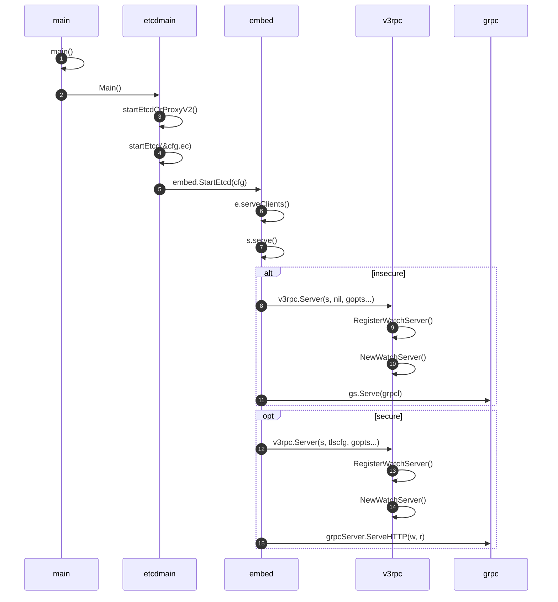
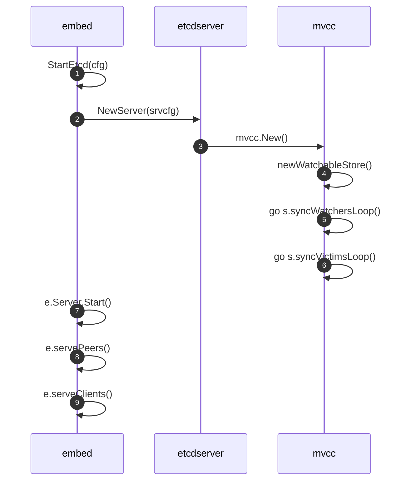
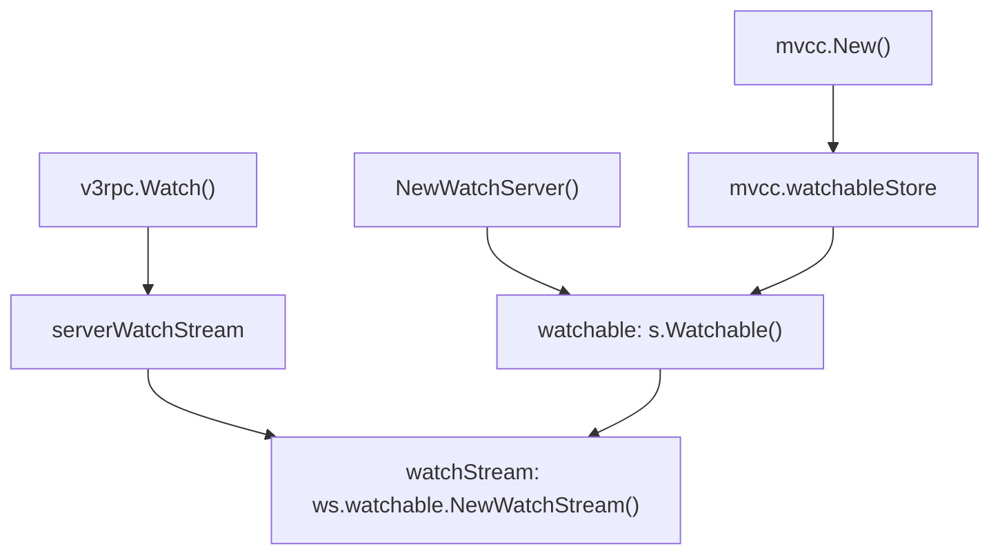

<show-structure depth="3"/>
<web-file-name>etcd/etcd-watch.html</web-file-name>

# Etcd的Watch实现分析

Etcd作为Kubernetes的控制面存储，保存了Kubernetes集群状态，各种Controller通过Watch机制感知集群事件，对比资源实际状态与期望状态执行reconcile，确保集群按期望状态运行。整个系统的性能、可靠性非常依赖**Watch机制**，因此掌握Watcher的实现原理对于理解kubernetes的运行至关重要。

本文通过提出问题、回答问题的方式，尝试揭开Watch的神秘面纱。

>因为生产环境用了**Etcd v3.4.3**版本，所以本文以该版本的源码进行分析。
> 
{style="note"}

## 1. Watch机制基于什么协议实现？

在v3版本中，Etcd使用**gRPC**进行消息传输，利用**HTTP/2**的**Multiplexing**、**Server Push**特性，以及**protocol buffers**的**二进制**、**高压缩**等优点，实现了高效的Watch机制。

>Etcd v2的Watch机制使用HTTP/1.x实现，每个watcher对应一个TCP连接。Client通过HTTP/1.1协议长连接定时轮询Server，获取最新的数据变化事件。
> 
>当watcher数量较多时，即使集群空负载，大量轮询也会产生一定的QPS，Server端会消耗大量的socket、内存等资源，导致Etcd的扩展性、稳定性无法满足Kubernetes等业务场景诉求。

接下来我们从gRPC的API开始探索，在gRPC中API是定义在`.proto`文件中的，如下所示，需要实现一个`Watch`的rpc方法。

```Go
// etcd/etcdserver/etcdserverpb/rpc.proto

service Watch {
  // Watch watches for events happening or that have happened. Both input and output
  // are streams; the input stream is for creating and canceling watchers and the output
  // stream sends events. One watch RPC can watch on multiple key ranges, streaming events
  // for several watches at once. The entire event history can be watched starting from the
  // last compaction revision.
  rpc Watch(stream WatchRequest) returns (stream WatchResponse) {
      option (google.api.http) = {
        post: "/v3/watch"
        body: "*"
    };
  }
}
```

定义显示Watch的**input**和**output**都是**stream**类型，也就是实现了**Bidirectional streaming RPC**通信，它确保了**服务端持续推送事件和客户端持续接收事件**的能力，比起传统的**poll轮训**实现，watch机制在性能和资源占用上都有绝对的优势。

>**Bidirectional streaming RPCs** where both sides send a sequence of messages using a read-write stream. The two streams operate independently, so clients and servers can read and write in whatever order they like: for example, the server could wait to receive all the client messages before writing its responses, or it could alternately read a message then write a message, or some other combination of reads and writes. The order of messages in each stream is preserved.
>
>```Go
>rpc BidiHello(stream HelloRequest) returns (stream HelloResponse);
>```
>

## 2. Watch的gRPC Server是什么时候启动的？

下面对Etcd启动流程做个概要分析，核心是找到启动gRPC Server的位置，绘制出如下时序图。

>下图中的对象用函数所在的`package`名表示，交互消息用函数调用表示。

<snippet id="etcd-diagram-1">



</snippet>

可以看到etcd在启动流程中启动了gRPC Server，具体是在`embed`包中的`StartEtcd()`函数中执行相关调用完成的，在`serve()`函数中调用`v3rpc.Server()`执行了WatchServer的创建和注册，针对是否启用了tls使用了不同的方式处理，`serve()`函数的逻辑如下。

```Go
// serve accepts incoming connections on the listener l,
// creating a new service goroutine for each. The service goroutines
// read requests and then call handler to reply to them.
func (sctx *serveCtx) serve(
	s *etcdserver.EtcdServer,
	tlsinfo *transport.TLSInfo,
	handler http.Handler,
	errHandler func(error),
	gopts ...grpc.ServerOption) (err error) {
	logger := defaultLog.New(ioutil.Discard, "etcdhttp", 0)
	<-s.ReadyNotify()

    // ...
    
	if sctx.insecure {
	    // 创建gRPC Server
		gs = v3rpc.Server(s, nil, gopts...)
		// ...
		grpcl := m.Match(cmux.HTTP2())
		// 启动gRPC Server
		go func() { errHandler(gs.Serve(grpcl)) }()
	}

	if sctx.secure {
	    // ...
	    // 创建gRPC Server
		gs = v3rpc.Server(s, tlscfg, gopts...)
		// ...
		// 处理gRPC请求的handler
		handler = grpcHandlerFunc(gs, handler)
        // ...
		httpmux := sctx.createMux(gwmux, handler)

		srv := &http.Server{
			Handler:   createAccessController(sctx.lg, s, httpmux),
			TLSConfig: tlscfg,
			ErrorLog:  logger, // do not log user error
		}
		// 启动http.Server，同时支持gRPC和HTTP
		go func() { errHandler(srv.Serve(tlsl)) }()

	close(sctx.serversC)
	return m.Serve()
}
```
{collapsible="true" collapsed-title="embed.serve()" default-state="collapsed"}

`v3rpc.Server()`中注册WatchServer的代码如下。
```Go
func Server(s *etcdserver.EtcdServer, tls *tls.Config, gopts ...grpc.ServerOption) *grpc.Server {
    // ...
	pb.RegisterWatchServer(grpcServer, NewWatchServer(s))
    // ...
	return grpcServer
}
```
{collapsible="true" collapsed-title="v3rpc.Server()" default-state="expanded"}

`v3rpc.NewWatchServer()`创建WatchServer的过程如下。
```Go
// NewWatchServer returns a new watch server.
func NewWatchServer(s *etcdserver.EtcdServer) pb.WatchServer {
	return &watchServer{
		lg: s.Cfg.Logger,

		clusterID: int64(s.Cluster().ID()),
		memberID:  int64(s.ID()),

		maxRequestBytes: int(s.Cfg.MaxRequestBytes + grpcOverheadBytes),

		sg:        s,
		watchable: s.Watchable(),
		ag:        s,
	}
}
```
{collapsible="true" collapsed-title="v3rpc.NewWatchServer()" default-state="expanded"}

## 3. Watch机制和KV存储有什么关系？

上一节看到etcd启动的主要逻辑在`StartEtcd()`中，因此重点分析下这个函数，关注和Watch相关的过程，看看是否可以找到Watch机制和KV存储的关系。

>如下是梳理关键逻辑后绘制的时序图，先有个大概框架，再详细分析下每一步代码实现。

<snippet id="etcd-diagram-2">



</snippet>

对照上图的序号，对关键步骤做个解释。

- 第1步执行`StartEtcd()`，函数签名为`func StartEtcd(inCfg *Config) (e *Etcd, err error)`，返回值是一个名为`Etcd`类型的对象。
```Go
// StartEtcd launches the etcd server and HTTP handlers for client/server communication.
// The returned Etcd.Server is not guaranteed to have joined the cluster. Wait
// on the Etcd.Server.ReadyNotify() channel to know when it completes and is ready for use.
func StartEtcd(inCfg *Config) (e *Etcd, err error) {
    // ...
    // 第2步
	if e.Server, err = etcdserver.NewServer(srvcfg); err != nil {
		return e, err
	}

    // ...
    // 第7步
	e.Server.Start()

    // 第8步
	if err = e.servePeers(); err != nil {
		return e, err
	}
    // 第9步
	if err = e.serveClients(); err != nil {
		return e, err
	}
	// ...
	serving = true
	return e, nil
}
```
{collapsible="true" collapsed-title="StartEtcd()" default-state="collapsed"}

- 第2步创建了etcdserver对象，返回值是一个名为`EtcdServer`的对象。
```Go
// etcd/etcdserver/server.go

// NewServer creates a new EtcdServer from the supplied configuration. The
// configuration is considered static for the lifetime of the EtcdServer.
func NewServer(cfg ServerConfig) (srv *EtcdServer, err error) {
	st := v2store.New(StoreClusterPrefix, StoreKeysPrefix)
	
	// ...
	
	// 创建了`mvcc`模块，这是一个实现了Watch特性的KV Store
	srv.kv = mvcc.New(srv.getLogger(), srv.be, srv.lessor, &srv.consistIndex, mvcc.StoreConfig{CompactionBatchLimit: cfg.CompactionBatchLimit})
	
	srv.r.transport = tr

	return srv, nil
}
```
{collapsible="true" collapsed-title="etcdserver.NewServer()" default-state="collapsed"}

- 第3步创建`mvcc`模块，简单调用了第4步的`newWatchableStore()`函数。
```Go
// etcd/mvcc/watchable_store.go

func New(lg *zap.Logger, b backend.Backend, le lease.Lessor, ig ConsistentIndexGetter, cfg StoreConfig) ConsistentWatchableKV {
	return newWatchableStore(lg, b, le, ig, cfg)
}
```

- 第4步是第3步的具体实现，返回值是一个实现了`ConsistentWatchableKV`接口的对象，实现这个接口的类型是名为`watchableStore`的struct。
- 第5步启动了一个goroutine执行`syncWatchersLoop()`函数，每100ms同步一次处于**unsynced map**中的watcher。
- 第6步启动了一个goroutine执行`syncVictimsLoop()`函数，在**victims**集合非空的情况下每10m同步一次，尝试给被阻塞的watcher同步事件。第4步到第6步的代码如下。
```Go
func newWatchableStore(lg *zap.Logger, b backend.Backend, le lease.Lessor, ig ConsistentIndexGetter, cfg StoreConfig) *watchableStore {
	s := &watchableStore{
		store:    NewStore(lg, b, le, ig, cfg),
		victimc:  make(chan struct{}, 1),
		unsynced: newWatcherGroup(),
		synced:   newWatcherGroup(),
		stopc:    make(chan struct{}),
	}
	s.store.ReadView = &readView{s}
	s.store.WriteView = &writeView{s}
	if s.le != nil {
		// use this store as the deleter so revokes trigger watch events
		s.le.SetRangeDeleter(func() lease.TxnDelete { return s.Write(traceutil.TODO()) })
	}
	s.wg.Add(2)
	// 启动goroutine处理unsynced的watcher
	go s.syncWatchersLoop()
	// 启动goroutine处理victims的watcher
	go s.syncVictimsLoop()
	return s
}
```
{collapsible="true" collapsed-title="mvcc.newWatchableStore()" default-state="collapsed"}

- 第7步启动了etcdserver。
- 第9步执行了`serveClients()`函数，这个函数前面已经分析过，注册并启动了gRPC Server。

总结一下，etcd在启动过程中，会初始化`mvcc`模块，它是一个实现了Watch特性的KV存储，在这之后才执行上一节介绍的gRPC Server注册及启动，因此etcd的Watch机制需要KV存储是watchable的，也就是说需要KV存储也实现Watch机制。

了解了gRPC Server注册及启动，也知道了需要KV存储实现Watch机制，那这个Watch的gRPC Service具体是如何实现的呢？

## 4. Watch的gRPC Service是如何实现的？

在gRPC Server启动过程的分析中，看到第14步执行了`NewWatchServer()`，这里创建了`watchServer`对象，`watchServer`实现了`Watch`的rpc方法，我们看一下它的代码。

<include from="etcd-watch.md" element-id="etcd-diagram-1"></include>

<snippet id="etcd-code-1">

```Go
// etcd/etcdserver/api/v3rpc/watch.go

func (ws *watchServer) Watch(stream pb.Watch_WatchServer) (err error) {
    // 1. 创建 serverWatchStream 对象
	sws := serverWatchStream{
		lg: ws.lg,

		clusterID: ws.clusterID,
		memberID:  ws.memberID,

		maxRequestBytes: ws.maxRequestBytes,

		sg:        ws.sg,
		watchable: ws.watchable,
		ag:        ws.ag,

		gRPCStream:  stream,
		watchStream: ws.watchable.NewWatchStream(),
		// chan for sending control response like watcher created and canceled.
		ctrlStream: make(chan *pb.WatchResponse, ctrlStreamBufLen),

		progress: make(map[mvcc.WatchID]bool),
		prevKV:   make(map[mvcc.WatchID]bool),
		fragment: make(map[mvcc.WatchID]bool),

		closec: make(chan struct{}),
	}

	sws.wg.Add(1)
	go func() {
        // 2. 向客户端发送事件
		sws.sendLoop()
		sws.wg.Done()
	}()

	errc := make(chan error, 1)
	// Ideally recvLoop would also use sws.wg to signal its completion
	// but when stream.Context().Done() is closed, the stream's recv
	// may continue to block since it uses a different context, leading to
	// deadlock when calling sws.close().
	go func() {
        // 3. 接收客户端请求
		if rerr := sws.recvLoop(); rerr != nil {
			if isClientCtxErr(stream.Context().Err(), rerr) {
				if sws.lg != nil {
					sws.lg.Debug("failed to receive watch request from gRPC stream", zap.Error(rerr))
				} else {
					plog.Debugf("failed to receive watch request from gRPC stream (%q)", rerr.Error())
				}
			} else {
				if sws.lg != nil {
					sws.lg.Warn("failed to receive watch request from gRPC stream", zap.Error(rerr))
				} else {
					plog.Warningf("failed to receive watch request from gRPC stream (%q)", rerr.Error())
				}
				streamFailures.WithLabelValues("receive", "watch").Inc()
			}
			errc <- rerr
		}
	}()

	select {
	case err = <-errc:
		close(sws.ctrlStream)

	case <-stream.Context().Done():
		err = stream.Context().Err()
		// the only server-side cancellation is noleader for now.
		if err == context.Canceled {
			err = rpctypes.ErrGRPCNoLeader
		}
	}

	sws.close()
	return err
}
```
{collapsible="true" collapsed-title="v3rpc.Watch()" default-state="collapsed"}

</snippet>

我在注释中添加了序号，方便理解关键逻辑。

1. 创建并初始化了`serverWatchStream`对象，这个对象在Watch机制的实现中起着至关重要的作用，向上与客户端建立联系，向下与KV存储建立联系，确保了KV存储的变化能被及时感知并推送给客户端，在下面详细解析。
2. 创建一个goroutine，执行`sws.recvLoop()`，它的作用是接收客户端的请求，通知下层KV存储创建watcher，建立watcher和key或key range的watch关系。
3. 创建一个goroutine，执行`sws.sendLoop()`，它的作用是从KV存储获取变化，当KV中被监听的key发生变化时，实时向客户端发送事件。

核心逻辑就是这3步，可以用下图来概括，我们具体分析下每一步分别做了什么。

 {id="etcd-diagram-3"}

### 4.1 serverWatchStream有什么作用？

先从它的定义看起。

<snippet id="etcd-code-2">

```Go
// etcd/etcdserver/api/v3rpc/watch.go

// serverWatchStream is an etcd server side stream. It receives requests
// from client side gRPC stream. It receives watch events from mvcc.WatchStream,
// and creates responses that forwarded to gRPC stream.
// It also forwards control message like watch created and canceled.
type serverWatchStream struct {
	lg *zap.Logger

	clusterID int64
	memberID  int64

	maxRequestBytes int

	sg        etcdserver.RaftStatusGetter
	watchable mvcc.WatchableKV
	ag        AuthGetter

    // 4.1.1
	gRPCStream  pb.Watch_WatchServer
	
    // 4.1.2
	watchStream mvcc.WatchStream
	ctrlStream  chan *pb.WatchResponse

	// mu protects progress, prevKV, fragment
	mu sync.RWMutex
	// tracks the watchID that stream might need to send progress to
	// TODO: combine progress and prevKV into a single struct?
	progress map[mvcc.WatchID]bool
	// record watch IDs that need return previous key-value pair
	prevKV map[mvcc.WatchID]bool
	// records fragmented watch IDs
	fragment map[mvcc.WatchID]bool

	// closec indicates the stream is closed.
	closec chan struct{}

	// wg waits for the send loop to complete
	wg sync.WaitGroup
}
```
{collapsible="true" collapsed-title="serverWatchStream struct" default-state="collapsed"}

</snippet>

先看`gRPCStream`字段，这是一个`pb.Watch_WatchServer`类型，它是一个interface，提供了`Send()`和`Recv()`方法。

- `Send()`表示向客户端发送gRPC请求。
- `Recv()`表示从客户端接收gRPC请求。
- `gRPCStream`在这里的作用是和客户端进行grpc通信，建立了与上层客户端的联系。

`Watch_WatchServer`定义如下。


```Go
// etcd/etcdserver/etcdserverpb/rpc.pb.go

type Watch_WatchServer interface {
	Send(*WatchResponse) error
	Recv() (*WatchRequest, error)
	grpc.ServerStream
}
```


再看`watchStream`字段，这是一个`mvcc.WatchStream`类型，它是一个interface，提供了`Watch()`、`Chan()`等方法。

- `Watch()`方法用于创建watcher。
>注意这和gRPC Service的Watch不一样，方法所在的对象不同，作用也不同，只是名字相同而已。

- `Chan()`方法返回一个channel，被监听key的变化会发送到这个channel中。
- `watchStream`在这里的作用是和`mvcc`存储建立联系，从`mvcc`存储中获取新事件。

`WatchStream`定义如下。
```Go
// etcd/mvcc/watcher.go

type WatchStream interface {
	// Watch creates a watcher. The watcher watches the events happening or
	// happened on the given key or range [key, end) from the given startRev.
	//
	// The whole event history can be watched unless compacted.
	// If "startRev" <=0, watch observes events after currentRev.
	//
	// The returned "id" is the ID of this watcher. It appears as WatchID
	// in events that are sent to the created watcher through stream channel.
	// The watch ID is used when it's not equal to AutoWatchID. Otherwise,
	// an auto-generated watch ID is returned.
	Watch(id WatchID, key, end []byte, startRev int64, fcs ...FilterFunc) (WatchID, error)

	// Chan returns a chan. All watch response will be sent to the returned chan.
	Chan() <-chan WatchResponse

	// RequestProgress requests the progress of the watcher with given ID. The response
	// will only be sent if the watcher is currently synced.
	// The responses will be sent through the WatchRespone Chan attached
	// with this stream to ensure correct ordering.
	// The responses contains no events. The revision in the response is the progress
	// of the watchers since the watcher is currently synced.
	RequestProgress(id WatchID)

	// Cancel cancels a watcher by giving its ID. If watcher does not exist, an error will be
	// returned.
	Cancel(id WatchID) error

	// Close closes Chan and release all related resources.
	Close()

	// Rev returns the current revision of the KV the stream watches on.
	Rev() int64
}
```
{collapsible="true" collapsed-title="WatchStream interface" default-state="collapsed"}

上面在代码注释中标记了4.1.1和4.1.2两个关键字段，这是打通客户端到KV存储的关键。只从定义是无法得出这个结论的，需要从`serverWatchStream`的初始化过程来理解。

#### 4.1.1 gRPCStream

在`Watch`的gRPC Service实现中可以看到`serverWatchStream`的初始化，从`gRPCStream:  stream`可知`gRPCStream`字段被赋值为`stream`。`gRPCStream`字段的类型为`pb.Watch_WatchServer`，而`stream`的类型也是`pb.Watch_WatchServer`，因此这里并没有特殊的地方，就是正常传参，可以通过如下代码对比。

- `stream`类型
<include from="etcd-watch.md" element-id="etcd-code-1"></include>

- `gRPCStream`类型
<include from="etcd-watch.md" element-id="etcd-code-2"></include>

#### 4.1.2 watchStream

同样地，`serverWatchStream`初始化对`watchStream`字段也进行了赋值，即`watchStream: ws.watchable.NewWatchStream()`，先看下`ws.watchable.NewWatchStream()`定义。

<snippet id="etcd-code-3">

```Go
// etcd/mvcc/watchable_store.go

func (s *watchableStore) NewWatchStream() WatchStream {
	watchStreamGauge.Inc()
	return &watchStream{
		watchable: s,
		ch:        make(chan WatchResponse, chanBufLen),
		cancels:   make(map[WatchID]cancelFunc),
		watchers:  make(map[WatchID]*watcher),
	}
}
```
{collapsible="true" collapsed-title="mvcc.NewWatchStream()" default-state="collapsed"}

</snippet>

- 这里看到返回结果是基于`watchableStore`对象封装的`watchStream`对象。那`watchableStore`对象是怎么来的呢？需要从`ws`也就是`watchServer`的初始化看起。

- 从前面的分析可知在启动过程（下图第14步）创建了`watchServer`对象，并对`ws.watchable`进行了初始化：`watchable: s.Watchable()`。

<include from="etcd-watch.md" element-id="etcd-diagram-1"></include>

```Go
// etcd/etcdserver/api/v3rpc/watch.go

// NewWatchServer returns a new watch server.
func NewWatchServer(s *etcdserver.EtcdServer) pb.WatchServer {
	return &watchServer{
		lg: s.Cfg.Logger,

		clusterID: int64(s.Cluster().ID()),
		memberID:  int64(s.ID()),

		maxRequestBytes: int(s.Cfg.MaxRequestBytes + grpcOverheadBytes),

		sg:        s,
		watchable: s.Watchable(),
		ag:        s,
	}
}
```

- 那`s.Watchable()`做了什么呢？查看`s.Watchable()`的定义，最终返回了`s.kv`，那`s.kv`是哪来的呢？

```Go
// etcd/etcdserver/v3_server.go

// Watchable returns a watchable interface attached to the etcdserver.
func (s *EtcdServer) Watchable() mvcc.WatchableKV { return s.KV() }

// etcd/etcdserver/server.go
func (s *EtcdServer) KV() mvcc.ConsistentWatchableKV { return s.kv }
```

- 从前面的分析可以看到，`s.kv`正是在下图第3步被创建的，`mvcc.New()`内部通过调用`newWatchableStore()`返回了一个`watchableStore`对象，它实现了`WatchableKV`这个interface，也实现了`KV`interface，因此这个`watchableStore`对象就是一个实现了**watchable**接口的**KV**存储。

<include from="etcd-watch.md" element-id="etcd-diagram-2"></include>

```Go
// etcd/etcdserver/server.go

func NewServer(cfg ServerConfig) (srv *EtcdServer, err error) {
	st := v2store.New(StoreClusterPrefix, StoreKeysPrefix)
	
	// ...
	
	// 创建了`mvcc`模块，这是一个实现了Watch特性的KV Store
	srv.kv = mvcc.New(srv.getLogger(), srv.be, srv.lessor, &srv.consistIndex, mvcc.StoreConfig{CompactionBatchLimit: cfg.CompactionBatchLimit})
	
	srv.r.transport = tr

	return srv, nil
}
```
{collapsible="true" collapsed-title="etcdserver.NewServer()" default-state="expanded"}

```Go
// etcd/mvcc/watchable_store.go

func New(lg *zap.Logger, b backend.Backend, le lease.Lessor, ig ConsistentIndexGetter, cfg StoreConfig) ConsistentWatchableKV {
	return newWatchableStore(lg, b, le, ig, cfg)
}
```
{collapsible="true" collapsed-title="mvcc.New()" default-state="expanded"}

```Go
func newWatchableStore(lg *zap.Logger, b backend.Backend, le lease.Lessor, ig ConsistentIndexGetter, cfg StoreConfig) *watchableStore {
	s := &watchableStore{
		store:    NewStore(lg, b, le, ig, cfg),
		victimc:  make(chan struct{}, 1),
		unsynced: newWatcherGroup(),
		synced:   newWatcherGroup(),
		stopc:    make(chan struct{}),
	}
	s.store.ReadView = &readView{s}
	s.store.WriteView = &writeView{s}
	if s.le != nil {
		// use this store as the deleter so revokes trigger watch events
		s.le.SetRangeDeleter(func() lease.TxnDelete { return s.Write(traceutil.TODO()) })
	}
	s.wg.Add(2)
	go s.syncWatchersLoop()
	go s.syncVictimsLoop()
	return s
}
```
{collapsible="true" collapsed-title="mvcc.newWatchableStore()" default-state="collapsed"}

- **到这里我们已经知道，`serverWatchStream`在`watchStream: ws.watchable.NewWatchStream()`这个初始化过程中，最终是将`mvcc.watchableStore`封装成`watchStream`对象赋值给了`watchStream`**。

- 继续往下跟踪`store`的初始化：`store:    NewStore(lg, b, le, ig, cfg)`，可以看到这个`store`封装了`backend.Backend`这个interface。

```Go
// etcd/mvcc/kvstore.go

// NewStore returns a new store. It is useful to create a store inside
// mvcc pkg. It should only be used for testing externally.
func NewStore(lg *zap.Logger, b backend.Backend, le lease.Lessor, ig ConsistentIndexGetter, cfg StoreConfig) *store {
	if cfg.CompactionBatchLimit == 0 {
		cfg.CompactionBatchLimit = defaultCompactBatchLimit
	}
	s := &store{
		cfg:     cfg,
		b:       b,
		ig:      ig,
		kvindex: newTreeIndex(lg),

		le: le,

		currentRev:     1,
		compactMainRev: -1,

		bytesBuf8: make([]byte, 8),
		fifoSched: schedule.NewFIFOScheduler(),

		stopc: make(chan struct{}),

		lg: lg,
	}
	s.ReadView = &readView{s}
	s.WriteView = &writeView{s}
	if s.le != nil {
		s.le.SetRangeDeleter(func() lease.TxnDelete { return s.Write(traceutil.TODO()) })
	}

	tx := s.b.BatchTx()
	tx.Lock()
	tx.UnsafeCreateBucket(keyBucketName)
	tx.UnsafeCreateBucket(metaBucketName)
	tx.Unlock()
	s.b.ForceCommit()

	s.mu.Lock()
	defer s.mu.Unlock()
	if err := s.restore(); err != nil {
		// TODO: return the error instead of panic here?
		panic("failed to recover store from backend")
	}

	return s
}
```
{collapsible="true" collapsed-title="mvcc.NewStore()" default-state="collapsed"}

- 而`backend`的实现则是封装了`bolt.DB`，也就是`etcd`最终是通过`boltDB`实现的持久化存储。

```Go
type backend struct {
	// size and commits are used with atomic operations so they must be
	// 64-bit aligned, otherwise 32-bit tests will crash

	// size is the number of bytes allocated in the backend
	size int64
	// sizeInUse is the number of bytes actually used in the backend
	sizeInUse int64
	// commits counts number of commits since start
	commits int64
	// openReadTxN is the number of currently open read transactions in the backend
	openReadTxN int64

	mu sync.RWMutex
	db *bolt.DB

	batchInterval time.Duration
	batchLimit    int
	batchTx       *batchTxBuffered

	readTx *readTx

	stopc chan struct{}
	donec chan struct{}

	lg *zap.Logger
}
```
{collapsible="true" collapsed-title="mvcc/backend.backend" default-state="collapsed"}

上面嵌套比较深，总结一下。
1. 在`etcd`启动过程中，创建了`mvcc.watchableStore`并赋值给`etcdserver`的`kv`字段，代码为`srv.kv = mvcc.New()`。
2. 在`Watch`的gRPC Service注册过程中，创建了`watchServer`并对`ws.watchable`字段进行了初始化，代码为`watchable: s.Watchable()`。
3. 在`s.Watchable()`函数中返回了第1步的`s.kv`，也就是`mvcc.watchableStore`对象。
4. 在`Watch`的gRPC Service执行中，创建了`serverWatchStream`，并对`sws.watchStream`字段进行了初始化，代码为`watchStream: ws.watchable.NewWatchStream()`。
5. 结合第2步、第3步，可以知到`ws.watchable`就是`mvcc.watchableStore`，所以`ws.watchable.NewWatchStream()`就是`mvcc.watchableStore.NewWatchStream()`。
6. 因此`sws.watchStream`的值就是`mvcc.watchableStore.NewWatchStream()`结果，实际代码如下，是基于`mvcc.watchableStore`封装的`watchStream`对象。

<include from="etcd-watch.md" element-id="etcd-code-3"></include>



也看可以看到，在`serverWatchStream`对象中，最终和底层的KV存储进行了关联。

结合4.1.1和4.1.2，可以得出结论，`serverWatchStream`将客户端和KV存储做了关联，在这个对象中既可以通过`gRPC Server`和客户端通信，也可以通过`mvcc`和KV存储通信。


### 4.2 recvLoop()做了什么事情？

```Go
// etcd/etcdserver/api/v3rpc/watch.go

func (sws *serverWatchStream) recvLoop() error {
	for {
        // 4.2.1
        // 通过sws.gRPCStream.Recv()接收客户端的rpc请求
		req, err := sws.gRPCStream.Recv()
		if err == io.EOF {
			return nil
		}
		if err != nil {
			return err
		}

		switch uv := req.RequestUnion.(type) {
        // 4.2.2
        / Watch的Create请求处理逻辑
		case *pb.WatchRequest_CreateRequest:
			if uv.CreateRequest == nil {
				break
			}

			creq := uv.CreateRequest
			if len(creq.Key) == 0 {
				// \x00 is the smallest key
				creq.Key = []byte{0}
			}
			if len(creq.RangeEnd) == 0 {
				// force nil since watchstream.Watch distinguishes
				// between nil and []byte{} for single key / >=
				creq.RangeEnd = nil
			}
			if len(creq.RangeEnd) == 1 && creq.RangeEnd[0] == 0 {
				// support  >= key queries
				creq.RangeEnd = []byte{}
			}

			if !sws.isWatchPermitted(creq) {
				wr := &pb.WatchResponse{
					Header:       sws.newResponseHeader(sws.watchStream.Rev()),
					WatchId:      creq.WatchId,
					Canceled:     true,
					Created:      true,
					CancelReason: rpctypes.ErrGRPCPermissionDenied.Error(),
				}

				select {
				case sws.ctrlStream <- wr:
				case <-sws.closec:
				}
				return nil
			}

			filters := FiltersFromRequest(creq)

			wsrev := sws.watchStream.Rev()
			rev := creq.StartRevision
			if rev == 0 {
				rev = wsrev + 1
			}
            // 4.2.3
            // 调用mvcc的watchableStore.Watch方法创建watcher并返回watchID
			id, err := sws.watchStream.Watch(mvcc.WatchID(creq.WatchId), creq.Key, creq.RangeEnd, rev, filters...)
			if err == nil {
				sws.mu.Lock()
				if creq.ProgressNotify {
					sws.progress[id] = true
				}
				if creq.PrevKv {
					sws.prevKV[id] = true
				}
				if creq.Fragment {
					sws.fragment[id] = true
				}
				sws.mu.Unlock()
			}
			wr := &pb.WatchResponse{
				Header:   sws.newResponseHeader(wsrev),
				WatchId:  int64(id),
				Created:  true,
				Canceled: err != nil,
			}
			if err != nil {
				wr.CancelReason = err.Error()
			}
			select {
			case sws.ctrlStream <- wr:
			case <-sws.closec:
				return nil
			}

		case *pb.WatchRequest_CancelRequest:
			if uv.CancelRequest != nil {
				id := uv.CancelRequest.WatchId
				err := sws.watchStream.Cancel(mvcc.WatchID(id))
				if err == nil {
					sws.ctrlStream <- &pb.WatchResponse{
						Header:   sws.newResponseHeader(sws.watchStream.Rev()),
						WatchId:  id,
						Canceled: true,
					}
					sws.mu.Lock()
					delete(sws.progress, mvcc.WatchID(id))
					delete(sws.prevKV, mvcc.WatchID(id))
					delete(sws.fragment, mvcc.WatchID(id))
					sws.mu.Unlock()
				}
			}
		case *pb.WatchRequest_ProgressRequest:
			if uv.ProgressRequest != nil {
				sws.ctrlStream <- &pb.WatchResponse{
					Header:  sws.newResponseHeader(sws.watchStream.Rev()),
					WatchId: -1, // response is not associated with any WatchId and will be broadcast to all watch channels
				}
			}
		default:
			// we probably should not shutdown the entire stream when
			// receive an valid command.
			// so just do nothing instead.
			continue
		}
	}
}
```
{collapsible="true" collapsed-title="v3rpc.recvLoop()" default-state="collapsed"}

通过关键代码注释，可以将`recvLoop`的主要逻辑总结如下。
1. 通过sws.gRPCStream.Recv()接收客户端的rpc请求。
2. 如果是Watch的Create请求，调用mvcc实现的watchableStore.Watch方法进行处理。
3. 如果是Watch的Cancel、Progress请求，执行对应的逻辑进行处理。

简单总结下，`recvLoop`会持续接收客户端的rpc请求，并调用底层的`mvcc`模块进行相应处理。

## 5. mvcc的watchableStore是如何处理Watch的？

在4.1.2节中，已经分析出来`watchStream`就是`mvcc.watchableStore`，在第4.2节，看到在`recvLoop()`里调用了`sws.watchStream.Watch()`，那它是怎么处理Watch的呢？

我们从`sws.watchStream.Watch()`和`mvcc.watchableStore`的定义及实现一步一步看下。

### 5.1 sws.watchStream.Watch()
```Go
// etcd/mvcc/watcher.go

// Watch creates a new watcher in the stream and returns its WatchID.
func (ws *watchStream) Watch(id WatchID, key, end []byte, startRev int64, fcs ...FilterFunc) (WatchID, error) {
	// prevent wrong range where key >= end lexicographically
	// watch request with 'WithFromKey' has empty-byte range end
	if len(end) != 0 && bytes.Compare(key, end) != -1 {
		return -1, ErrEmptyWatcherRange
	}

	ws.mu.Lock()
	defer ws.mu.Unlock()
	if ws.closed {
		return -1, ErrEmptyWatcherRange
	}
    
    // 分配WatchID
	if id == AutoWatchID {
		for ws.watchers[ws.nextID] != nil {
			ws.nextID++
		}
		id = ws.nextID
		ws.nextID++
	} else if _, ok := ws.watchers[id]; ok {
		return -1, ErrWatcherDuplicateID
	}

    // 调用`watchableStore.watch()`方法
	w, c := ws.watchable.watch(key, end, startRev, id, ws.ch, fcs...)

	ws.cancels[id] = c
	ws.watchers[id] = w
	return id, nil
}
```

- 上述代码可以看到，第4.2节中`recvLoop()`调用的`sws.watchStream.Watch()`主要做了两件事件
  1. 获取WathID
  2. 调用`ws.watchable.watch()`创建watcher，也就是调用`watchableStore.watch()`方法

- 如下watchableStore中将watcher分为了三类，分别是 *victims* 、 *unsynced* 、 *synced* 这三种，用于应对不同进度下的watcher处理。

```Go
// etcd/mvcc/watcher_group.go

type watchableStore struct {
    *store

	// mu protects watcher groups and batches. It should never be locked
	// before locking store.mu to avoid deadlock.
	mu sync.RWMutex

	// victims are watcher batches that were blocked on the watch channel
	victims []watcherBatch
	victimc chan struct{}

	// contains all unsynced watchers that needs to sync with events that have happened
	unsynced watcherGroup

	// contains all synced watchers that are in sync with the progress of the store.
	// The key of the map is the key that the watcher watches on.
	synced watcherGroup

	stopc chan struct{}
	wg    sync.WaitGroup
}

type watcherBatch map[*watcher]*eventBatch
```

- watcher的构成如下，保存了key、id、reversion等信息

```Go
// etcd/mvcc/watchable_store.go

type watcher struct {
// the watcher key
key []byte
// end indicates the end of the range to watch.
// If end is set, the watcher is on a range.
end []byte

	// victim is set when ch is blocked and undergoing victim processing
	victim bool

	// compacted is set when the watcher is removed because of compaction
	compacted bool

	// restore is true when the watcher is being restored from leader snapshot
	// which means that this watcher has just been moved from "synced" to "unsynced"
	// watcher group, possibly with a future revision when it was first added
	// to the synced watcher
	// "unsynced" watcher revision must always be <= current revision,
	// except when the watcher were to be moved from "synced" watcher group
	restore bool

	// minRev is the minimum revision update the watcher will accept
	minRev int64
	id     WatchID

	fcs []FilterFunc
	// a chan to send out the watch response.
	// The chan might be shared with other watchers.
	ch chan<- WatchResponse
}
```

- eventBatch保存了Event及相关版本号，用于记录因watcher的channel被阻塞时要保存的event信息
```Go
// etcd/mvcc/watcher_group.go

type eventBatch struct {
	// evs is a batch of revision-ordered events
	evs []mvccpb.Event
	// revs is the minimum unique revisions observed for this batch
	revs int
	// moreRev is first revision with more events following this batch
	moreRev int64
}
```

- *synced* 和 *unsynced* 类型的数据结构，这里通过区间树、集合等数据结构保存watcher，在性能上可以保障 *O(log^n)* 的时间复杂度

```Go
// etcd/mvcc/watcher_group.go

// watcherGroup is a collection of watchers organized by their ranges
type watcherGroup struct {
	// keyWatchers has the watchers that watch on a single key
	keyWatchers watcherSetByKey
	// ranges has the watchers that watch a range; it is sorted by interval
	ranges adt.IntervalTree
	// watchers is the set of all watchers
	watchers watcherSet
}
```

- 下面即`sws.watchStream.Watch`中的`watch`实现，可以看到主要是根据要监控的版本号将watcher放在了 *synced* 或 *unsynced* 结构中

```Go
// etcd/mvcc/watchable_store.go

func (s *watchableStore) watch(key, end []byte, startRev int64, id WatchID, ch chan<- WatchResponse, fcs ...FilterFunc) (*watcher, cancelFunc) {
	wa := &watcher{
		key:    key,
		end:    end,
		minRev: startRev,
		id:     id,
		ch:     ch,
		fcs:    fcs,
	}

	s.mu.Lock()
	s.revMu.RLock()
	synced := startRev > s.store.currentRev || startRev == 0
	if synced {
		wa.minRev = s.store.currentRev + 1
		if startRev > wa.minRev {
			wa.minRev = startRev
		}
	}
	if synced {
		s.synced.add(wa)
	} else {
		slowWatcherGauge.Inc()
		s.unsynced.add(wa)
	}
	s.revMu.RUnlock()
	s.mu.Unlock()

	watcherGauge.Inc()

	return wa, func() { s.cancelWatcher(wa) }
}
```

总结一下，在`recvLoop`里调用`sws.watchStream.Watch()`后，分配了WatchID，`sws.watchStream.Watch()`又调用`ws.watchable.watch()`创建watcher，并根据要监听的版本号将watcher保存在了不同的数据结构，以便对不同进度的watcher执行不同的处理。


## 6. mvcc是在什么时机产生事件的？

Watch的作用是及时感知事件，而KV存储是事件的来源，那具体是在什么时机产生的事件呢？

## 参考资料
- gRPC的概念可以参考官方文档的 [core-concepts](https://grpc.io/docs/what-is-grpc/core-concepts/) 学习。
- Etcd深入解析可以参考Etcd作者在CNCF的演讲 [Deep Dive: etcd - Xiang Li, Alibaba & Wenjia Zhang, Google](https://youtu.be/GJqO1TYzVDE?si=fuQroGUNRO2sewqX) 。
- Watch在Kubernetes中的应用可以参考 [The Life of a Kubernetes Watch Event - Wenjia Zhang & Haowei Cai, Google](https://youtu.be/PLSDvFjR9HY?si=jKTer1TEFhOfnE5T) 。
