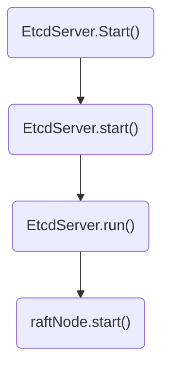
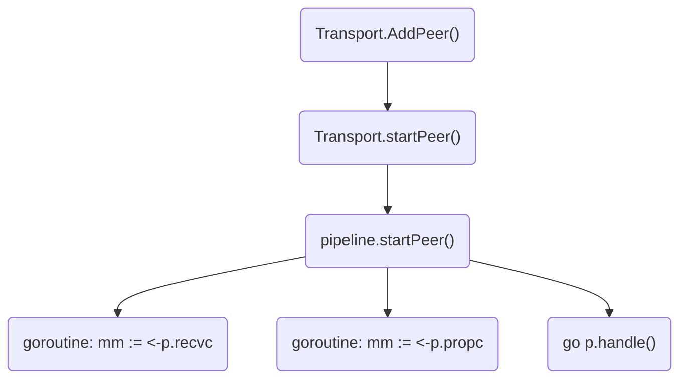
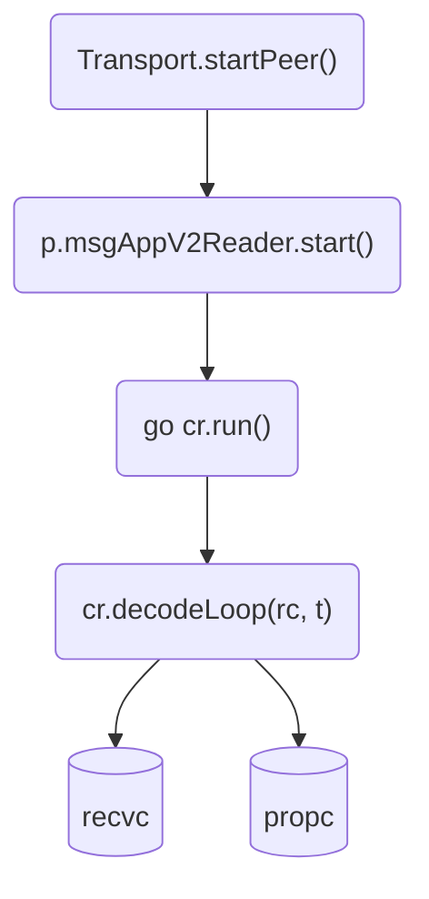
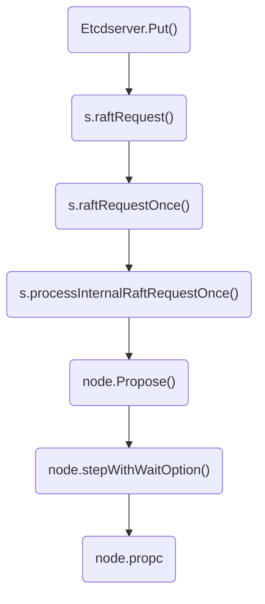

# Etcd的Raft运行原理分析

<show-structure depth="2"/>

> 本文基于**Etcd v3.5.6**版本源码进行分析，对于异步逻辑导致代码跳转难以跟踪的情况，采用debugging方式进行解释。
>
{style="note"}

看了raft论文，以为可以理解Etcd，实际并不是这么回事，原因是Etcd中的raft库只实现了raft协议的核心内容，**没有实现网络传输、存储的功能**，因此在etcd的`raft`库里，有一个**Application**的概念，网络传输和存储功能是**Application**的职责，而**Application**和**raft**的协作又是通过一系列**channel**完成的，导致代码逻辑断点较多，理解较为困难。

本文在理解raft库使用的基础上，分析Etcd中是如何使用raft的，进而掌握Etcd中一个请求是如何通过raft完成持久化的。

关于raft的原理可以参考如下动画和论文。

- [Understandable Distributed Consensus](http://thesecretlivesofdata.com/raft/) 
- [In Search of an Understandable Consensus Algorithm](https://raft.github.io/raft.pdf) 

## 1. raft库的使用说明

在raft库的README.md中，作者介绍了如何使用raft。

### 1.1 用户责任

raft库中的主要对象是**Node**，创建Node后使用者有如下责任。

1. 从**Node.Ready()**返回的**channel**获取更新并处理。
   - 按顺序将`Entries`、`HardState`和`Snapshot`写入持久化存储。
   - 将所有`Message`发送到其它节点。
   - 将`Snapshot`（如果有）和`CommiedEntries`应用到状态机。
   - 调用`Node.Advance()`发送信号进行通知，表示已准备好进行下一批更新。
2. 所有已持久化的日志条目必须能够通过`Storage`定义的接口进行访问。
3. 收到来自其它节点的消息后，将其传递给`Node.Step()`处理。
4. 以固定的时间间隔调用`Node.Tick()`。

总的来说，状态机的处理循环类似如下代码所示逻辑。

```Go
  for {
    select {
    case <-s.Ticker:
      n.Tick()
    case rd := <-s.Node.Ready():
      saveToStorage(rd.HardState, rd.Entries, rd.Snapshot)
      send(rd.Messages)
      if !raft.IsEmptySnap(rd.Snapshot) {
        processSnapshot(rd.Snapshot)
      }
      for _, entry := range rd.CommittedEntries {
        process(entry)
        if entry.Type == raftpb.EntryConfChange {
          var cc raftpb.ConfChange
          cc.Unmarshal(entry.Data)
          s.Node.ApplyConfChange(cc)
        }
      }
      s.Node.Advance()
    case <-s.done:
      return
    }
  }
```

### 1.2 数据变更

通过调用如下接口propose一个请求给raft，该请求会从`Node.Ready()`被读出，经过一系列处理后持久化到状态机。

```Go
n.Propose(ctx, data)
```

### 1.3 成员变更

要在一个cluster中添加或删除成员，构建`ConfChange`并调用如下接口进行处理。

```Go
n.ProposeConfChange(ctx, cc)
```

### 1.4 总结

可以用下图来总结下raft的使用，三个框表示三个节点，每个节点有`Application`和`raft`模块，`Application`即`raft`的用户，它通过几个channel和raft库进行交互，确保节点间数据的一致性、推进状态机持续变化。

- `propc` channel用于处理客户端请求。
- `recvc` channel用于raft协议内部通信。
- `readyc` channel用于`raft`向`Application`通知状态变化。
- 节点间的`message`网络传输、数据持久化，需要在`Application`里实现。

<procedure>

</procedure>

## 2. 创建和启动raftNode

学习了raft库的使用后，接下来分析etcd中是如何使用raft的，先看下`raftNode`的创建和启动。

### 2.1 创建raftNode

Etcd启动过程中，在`embed.StartEtcd()`里执行了`etcdserver.NewServer(srvcfg)`，这个函数中创建了raft节点。

```Go
	srv = &EtcdServer{
		readych:     make(chan struct{}),
		Cfg:         cfg,
		lgMu:        new(sync.RWMutex),
		lg:          cfg.Logger,
		errorc:      make(chan error, 1),
		v2store:     st,
		snapshotter: ss,
		r: *newRaftNode(
			raftNodeConfig{
				lg:          cfg.Logger,
				isIDRemoved: func(id uint64) bool { return cl.IsIDRemoved(types.ID(id)) },
				Node:        n,
				heartbeat:   heartbeat,
				raftStorage: s,
				storage:     NewStorage(w, ss),
			},
		),
		id:                 id,
		attributes:         membership.Attributes{Name: cfg.Name, ClientURLs: cfg.ClientURLs.StringSlice()},
		cluster:            cl,
		stats:              sstats,
		lstats:             lstats,
		SyncTicker:         time.NewTicker(500 * time.Millisecond),
		peerRt:             prt,
		reqIDGen:           idutil.NewGenerator(uint16(id), time.Now()),
		AccessController:   &AccessController{CORS: cfg.CORS, HostWhitelist: cfg.HostWhitelist},
		consistIndex:       ci,
		firstCommitInTermC: make(chan struct{}),
	}
```
{collapsible="true" collapsed-title="etcdserver.NewServer()" default-state="collapsed"}

`Etcdserver`中的raft节点是个`raftNode`结构体，实现了raft库的`Node`接口，具体在`raftNode.raftNodeConfig`这个结构体中。

```Go
type raftNode struct {
	lg *zap.Logger

	tickMu *sync.Mutex
	raftNodeConfig

	// a chan to send/receive snapshot
	msgSnapC chan raftpb.Message

	// a chan to send out apply
	applyc chan apply

	// a chan to send out readState
	readStateC chan raft.ReadState

	// utility
	ticker *time.Ticker
	// contention detectors for raft heartbeat message
	td *contention.TimeoutDetector

	stopped chan struct{}
	done    chan struct{}
}
```
{collapsible="true" collapsed-title="etcdserver.raftNode struct" default-state="collapsed"}

```Go
type raftNodeConfig struct {
	lg *zap.Logger

	// to check if msg receiver is removed from cluster
	isIDRemoved func(id uint64) bool
	raft.Node
	raftStorage *raft.MemoryStorage
	storage     Storage
	heartbeat   time.Duration // for logging
	// transport specifies the transport to send and receive msgs to members.
	// Sending messages MUST NOT block. It is okay to drop messages, since
	// clients should timeout and reissue their messages.
	// If transport is nil, server will panic.
	transport rafthttp.Transporter
}
```
{collapsible="true" collapsed-title="etcdserver.raftNodeConfig struct" default-state="collapsed"}

可以看到`etcdserver.NewServer(srvcfg)`初始化过程中将`raft.Node`传给了`raftNodeConfig.Node`，这一步建立了`etcdserver.raftNode`和`raft.Node`的关系。

### 2.2 启动raftNode

在`embed.StartEtcd()`执行了如下代码启动了`Etcdserver`。

```Go
	e.Server.Start()
```
在`EtcdServer.Start()`中经过如下调用后，最终在`run()`中执行`s.r.start(rh)`启动了`raftNode`。



1. 执行`EtcdServer.run()`中启动`raftNode`，作为一个goroutine在后台运行。
```Go

func (s *EtcdServer) run() {
	lg := s.Logger()

	sn, err := s.r.raftStorage.Snapshot()
	if err != nil {
		lg.Panic("failed to get snapshot from Raft storage", zap.Error(err))
	}

	// asynchronously accept apply packets, dispatch progress in-order
	sched := schedule.NewFIFOScheduler()

	var (
		smu   sync.RWMutex
		syncC <-chan time.Time
	)
	setSyncC := func(ch <-chan time.Time) {
		smu.Lock()
		syncC = ch
		smu.Unlock()
	}
	getSyncC := func() (ch <-chan time.Time) {
		smu.RLock()
		ch = syncC
		smu.RUnlock()
		return
	}
	rh := &raftReadyHandler{
		getLead:    func() (lead uint64) { return s.getLead() },
		updateLead: func(lead uint64) { s.setLead(lead) },
		updateLeadership: func(newLeader bool) {
			if !s.isLeader() {
				if s.lessor != nil {
					s.lessor.Demote()
				}
				if s.compactor != nil {
					s.compactor.Pause()
				}
				setSyncC(nil)
			} else {
				if newLeader {
					t := time.Now()
					s.leadTimeMu.Lock()
					s.leadElectedTime = t
					s.leadTimeMu.Unlock()
				}
				setSyncC(s.SyncTicker.C)
				if s.compactor != nil {
					s.compactor.Resume()
				}
			}
			if newLeader {
				s.leaderChangedMu.Lock()
				lc := s.leaderChanged
				s.leaderChanged = make(chan struct{})
				close(lc)
				s.leaderChangedMu.Unlock()
			}
			// TODO: remove the nil checking
			// current test utility does not provide the stats
			if s.stats != nil {
				s.stats.BecomeLeader()
			}
		},
		updateCommittedIndex: func(ci uint64) {
			cci := s.getCommittedIndex()
			if ci > cci {
				s.setCommittedIndex(ci)
			}
		},
	}
	s.r.start(rh)

	ep := etcdProgress{
		confState: sn.Metadata.ConfState,
		snapi:     sn.Metadata.Index,
		appliedt:  sn.Metadata.Term,
		appliedi:  sn.Metadata.Index,
	}

	defer func() {
		s.wgMu.Lock() // block concurrent waitgroup adds in GoAttach while stopping
		close(s.stopping)
		s.wgMu.Unlock()
		s.cancel()
		sched.Stop()

		// wait for gouroutines before closing raft so wal stays open
		s.wg.Wait()

		s.SyncTicker.Stop()

		// must stop raft after scheduler-- etcdserver can leak rafthttp pipelines
		// by adding a peer after raft stops the transport
		s.r.stop()

		s.Cleanup()

		close(s.done)
	}()

	var expiredLeaseC <-chan []*lease.Lease
	if s.lessor != nil {
		expiredLeaseC = s.lessor.ExpiredLeasesC()
	}

	for {
		select {
		case ap := <-s.r.apply():
			f := func(context.Context) { s.applyAll(&ep, &ap) }
			sched.Schedule(f)
		case leases := <-expiredLeaseC:
			s.revokeExpiredLeases(leases)
		case err := <-s.errorc:
			lg.Warn("server error", zap.Error(err))
			lg.Warn("data-dir used by this member must be removed")
			return
		case <-getSyncC():
			if s.v2store.HasTTLKeys() {
				s.sync(s.Cfg.ReqTimeout())
			}
		case <-s.stop:
			return
		}
	}
}
```
{collapsible="true" collapsed-title="Etcdserver.run()" default-state="collapsed"}


2. 在`raftNode.start()`执行`rd := <-r.Ready()`从raft模块获取数据，对数据进行处理后，接着执行`r.applyc <- ap`将处理结果发往`raftNode.applyc` channel。

<procedure>

</procedure>

<procedure>

</procedure>

```Go

// start prepares and starts raftNode in a new goroutine. It is no longer safe
// to modify the fields after it has been started.
func (r *raftNode) start(rh *raftReadyHandler) {
	internalTimeout := time.Second

	go func() {
		defer r.onStop()
		islead := false

		for {
			select {
			case <-r.ticker.C:
				r.tick()
			case rd := <-r.Ready():
				if rd.SoftState != nil {
					newLeader := rd.SoftState.Lead != raft.None && rh.getLead() != rd.SoftState.Lead
					if newLeader {
						leaderChanges.Inc()
					}

					if rd.SoftState.Lead == raft.None {
						hasLeader.Set(0)
					} else {
						hasLeader.Set(1)
					}

					rh.updateLead(rd.SoftState.Lead)
					islead = rd.RaftState == raft.StateLeader
					if islead {
						isLeader.Set(1)
					} else {
						isLeader.Set(0)
					}
					rh.updateLeadership(newLeader)
					r.td.Reset()
				}

				if len(rd.ReadStates) != 0 {
					select {
					case r.readStateC <- rd.ReadStates[len(rd.ReadStates)-1]:
					case <-time.After(internalTimeout):
						r.lg.Warn("timed out sending read state", zap.Duration("timeout", internalTimeout))
					case <-r.stopped:
						return
					}
				}

				notifyc := make(chan struct{}, 1)
				ap := apply{
					entries:  rd.CommittedEntries,
					snapshot: rd.Snapshot,
					notifyc:  notifyc,
				}

				updateCommittedIndex(&ap, rh)

				waitWALSync := shouldWaitWALSync(rd)
				if waitWALSync {
					// gofail: var raftBeforeSaveWaitWalSync struct{}
					if err := r.storage.Save(rd.HardState, rd.Entries); err != nil {
						r.lg.Fatal("failed to save Raft hard state and entries", zap.Error(err))
					}
				}

				select {
				case r.applyc <- ap:
				case <-r.stopped:
					return
				}

				// the leader can write to its disk in parallel with replicating to the followers and them
				// writing to their disks.
				// For more details, check raft thesis 10.2.1
				if islead {
					// gofail: var raftBeforeLeaderSend struct{}
					r.transport.Send(r.processMessages(rd.Messages))
				}

				// Must save the snapshot file and WAL snapshot entry before saving any other entries or hardstate to
				// ensure that recovery after a snapshot restore is possible.
				if !raft.IsEmptySnap(rd.Snapshot) {
					// gofail: var raftBeforeSaveSnap struct{}
					if err := r.storage.SaveSnap(rd.Snapshot); err != nil {
						r.lg.Fatal("failed to save Raft snapshot", zap.Error(err))
					}
					// gofail: var raftAfterSaveSnap struct{}
				}

				if !waitWALSync {
					// gofail: var raftBeforeSave struct{}
					if err := r.storage.Save(rd.HardState, rd.Entries); err != nil {
						r.lg.Fatal("failed to save Raft hard state and entries", zap.Error(err))
					}
				}
				if !raft.IsEmptyHardState(rd.HardState) {
					proposalsCommitted.Set(float64(rd.HardState.Commit))
				}
				// gofail: var raftAfterSave struct{}

				if !raft.IsEmptySnap(rd.Snapshot) {
					// Force WAL to fsync its hard state before Release() releases
					// old data from the WAL. Otherwise could get an error like:
					// panic: tocommit(107) is out of range [lastIndex(84)]. Was the raft log corrupted, truncated, or lost?
					// See https://github.com/etcd-io/etcd/issues/10219 for more details.
					if err := r.storage.Sync(); err != nil {
						r.lg.Fatal("failed to sync Raft snapshot", zap.Error(err))
					}

					// etcdserver now claim the snapshot has been persisted onto the disk
					notifyc <- struct{}{}

					// gofail: var raftBeforeApplySnap struct{}
					r.raftStorage.ApplySnapshot(rd.Snapshot)
					r.lg.Info("applied incoming Raft snapshot", zap.Uint64("snapshot-index", rd.Snapshot.Metadata.Index))
					// gofail: var raftAfterApplySnap struct{}

					if err := r.storage.Release(rd.Snapshot); err != nil {
						r.lg.Fatal("failed to release Raft wal", zap.Error(err))
					}
					// gofail: var raftAfterWALRelease struct{}
				}

				r.raftStorage.Append(rd.Entries)

				if !islead {
					// finish processing incoming messages before we signal raftdone chan
					msgs := r.processMessages(rd.Messages)

					// now unblocks 'applyAll' that waits on Raft log disk writes before triggering snapshots
					notifyc <- struct{}{}

					// Candidate or follower needs to wait for all pending configuration
					// changes to be applied before sending messages.
					// Otherwise we might incorrectly count votes (e.g. votes from removed members).
					// Also slow machine's follower raft-layer could proceed to become the leader
					// on its own single-node cluster, before apply-layer applies the config change.
					// We simply wait for ALL pending entries to be applied for now.
					// We might improve this later on if it causes unnecessary long blocking issues.
					waitApply := false
					for _, ent := range rd.CommittedEntries {
						if ent.Type == raftpb.EntryConfChange {
							waitApply = true
							break
						}
					}
					if waitApply {
						// blocks until 'applyAll' calls 'applyWait.Trigger'
						// to be in sync with scheduled config-change job
						// (assume notifyc has cap of 1)
						select {
						case notifyc <- struct{}{}:
						case <-r.stopped:
							return
						}
					}

					// gofail: var raftBeforeFollowerSend struct{}
					r.transport.Send(msgs)
				} else {
					// leader already processed 'MsgSnap' and signaled
					notifyc <- struct{}{}
				}

				r.Advance()
			case <-r.stopped:
				return
			}
		}
	}()
}
```
{collapsible="true" collapsed-title="raftNode.start()" default-state="collapsed"}

3. 在`Etcdserver.run()`中执行`ap := <-s.r.apply()`，从`raftNode.applyc`获取第2步的处理结果，最终会调用到apply模块完成持久化。

<procedure>

</procedure>

```Go

	for {
		select {
		case ap := <-s.r.apply():
			f := func(context.Context) { s.applyAll(&ep, &ap) }
			sched.Schedule(f)
		case leases := <-expiredLeaseC:
			s.revokeExpiredLeases(leases)
		case err := <-s.errorc:
			lg.Warn("server error", zap.Error(err))
			lg.Warn("data-dir used by this member must be removed")
			return
		case <-getSyncC():
			if s.v2store.HasTTLKeys() {
				s.sync(s.Cfg.ReqTimeout())
			}
		case <-s.stop:
			return
		}
	}
```
{collapsible="true" collapsed-title="Etcdserver.run().for{select}" default-state="collapsed"}

### 2.3 总结

创建并启动`raftNode`后，从raft库输出的数据与`EtcdServer`就关联起来了，通过channel传递消息，以异步的方式处理，最终会持久化到`EtcdServer`的存储中。

`raft`模块通过`readyc`输出数据给`raftNode`，`raftNode`通过`applyc`输出数据给`EtcdServer`，数据流向可以用下图表示。

<procedure>

</procedure>


## 3. 创建和启动transport

raft库并没有提供网络传输的功能，这是留给用户做的工作，那在etcd中这个功能是在哪实现的呢？

etcd通过rafthttp实现了这个功能，这个模块中定义了如下`Transporter`接口，并且在`Transport` struct中实现了这个接口。

```Go
type Transporter interface {
	// Start starts the given Transporter.
	// Start MUST be called before calling other functions in the interface.
	Start() error
	// Handler returns the HTTP handler of the transporter.
	// A transporter HTTP handler handles the HTTP requests
	// from remote peers.
	// The handler MUST be used to handle RaftPrefix(/raft)
	// endpoint.
	Handler() http.Handler
	// Send sends out the given messages to the remote peers.
	// Each message has a To field, which is an id that maps
	// to an existing peer in the transport.
	// If the id cannot be found in the transport, the message
	// will be ignored.
	Send(m []raftpb.Message)
	// SendSnapshot sends out the given snapshot message to a remote peer.
	// The behavior of SendSnapshot is similar to Send.
	SendSnapshot(m snap.Message)
	// AddRemote adds a remote with given peer urls into the transport.
	// A remote helps newly joined member to catch up the progress of cluster,
	// and will not be used after that.
	// It is the caller's responsibility to ensure the urls are all valid,
	// or it panics.
	AddRemote(id types.ID, urls []string)
	// AddPeer adds a peer with given peer urls into the transport.
	// It is the caller's responsibility to ensure the urls are all valid,
	// or it panics.
	// Peer urls are used to connect to the remote peer.
	AddPeer(id types.ID, urls []string)
	// RemovePeer removes the peer with given id.
	RemovePeer(id types.ID)
	// RemoveAllPeers removes all the existing peers in the transport.
	RemoveAllPeers()
	// UpdatePeer updates the peer urls of the peer with the given id.
	// It is the caller's responsibility to ensure the urls are all valid,
	// or it panics.
	UpdatePeer(id types.ID, urls []string)
	// ActiveSince returns the time that the connection with the peer
	// of the given id becomes active.
	// If the connection is active since peer was added, it returns the adding time.
	// If the connection is currently inactive, it returns zero time.
	ActiveSince(id types.ID) time.Time
	// ActivePeers returns the number of active peers.
	ActivePeers() int
	// Stop closes the connections and stops the transporter.
	Stop()
}
```
{collapsible="true" collapsed-title="rafthttp.Transporter interface" default-state="collapsed"}

`Transport`实现了`Transporter`接口，它提供向其它节点发送消息、从其它节点接收消息的功能。

```Go
// Transport implements Transporter interface. It provides the functionality
// to send raft messages to peers, and receive raft messages from peers.
// User should call Handler method to get a handler to serve requests
// received from peerURLs.
// User needs to call Start before calling other functions, and call
// Stop when the Transport is no longer used.
type Transport struct {
	Logger *zap.Logger

	DialTimeout time.Duration // maximum duration before timing out dial of the request
	// DialRetryFrequency defines the frequency of streamReader dial retrial attempts;
	// a distinct rate limiter is created per every peer (default value: 10 events/sec)
	DialRetryFrequency rate.Limit

	TLSInfo transport.TLSInfo // TLS information used when creating connection

	ID          types.ID   // local member ID
	URLs        types.URLs // local peer URLs
	ClusterID   types.ID   // raft cluster ID for request validation
	Raft        Raft       // raft state machine, to which the Transport forwards received messages and reports status
	Snapshotter *snap.Snapshotter
	ServerStats *stats.ServerStats // used to record general transportation statistics
	// used to record transportation statistics with followers when
	// performing as leader in raft protocol
	LeaderStats *stats.LeaderStats
	// ErrorC is used to report detected critical errors, e.g.,
	// the member has been permanently removed from the cluster
	// When an error is received from ErrorC, user should stop raft state
	// machine and thus stop the Transport.
	ErrorC chan error

	streamRt   http.RoundTripper // roundTripper used by streams
	pipelineRt http.RoundTripper // roundTripper used by pipelines

	mu      sync.RWMutex         // protect the remote and peer map
	remotes map[types.ID]*remote // remotes map that helps newly joined member to catch up
	peers   map[types.ID]Peer    // peers map

	pipelineProber probing.Prober
	streamProber   probing.Prober
}
```
{collapsible="true" collapsed-title="rafthttp.Transport struct" default-state="collapsed"}

<procedure>

</procedure>

- **peer**: peer代表远程raft节点，本地的raft节点通过peer将消息发送给远程raft节点，peer有两种发送消息的机制，分别是**stream**和**pipeline**。
- **stream**: stream的实现是HTTP长连接，使用`GET`方法，始终处理open状态，用于发送频率较高、数据量小的数据传输，例如追加日志、心跳等raft协议数据。
- **pipeline**: pipeline的实现是HTTP短连接，使用`POST`方法，用于发送频率较低、数据量大的数据传输，例如快照数据。

<procedure>

</procedure>

### 3.1 创建transport

在`etcdserver.NewServer(srvcfg)`函数中创建并启动了`Transport`，从前面的分析可知，在etcd启动过程中会执行这个函数，因此也是在etcd启动过程中创建并启动了`transport`。

```Go
func NewServer(cfg ServerConfig) (srv *EtcdServer, err error) {
    // 省略

	// TODO: move transport initialization near the definition of remote
	tr := &rafthttp.Transport{
		Logger:      cfg.Logger,
		TLSInfo:     cfg.PeerTLSInfo,
		DialTimeout: cfg.peerDialTimeout(),
		ID:          id,
		URLs:        cfg.PeerURLs,
		ClusterID:   cl.ID(),
		Raft:        srv,
		Snapshotter: ss,
		ServerStats: sstats,
		LeaderStats: lstats,
		ErrorC:      srv.errorc,
	}
	if err = tr.Start(); err != nil {
		return nil, err
	}
	// add all remotes into transport
	// 已有集群要处理的member
	for _, m := range remotes {
		if m.ID != id {
			tr.AddRemote(m.ID, m.PeerURLs)
		}
	}
	// 新建集群要处理的member
	for _, m := range cl.Members() {
		if m.ID != id {
			tr.AddPeer(m.ID, m.PeerURLs)
		}
	}
	srv.r.transport = tr

	return srv, nil
}
```
{collapsible="true" collapsed-title="Etcdserver.NewServer()" default-state="collapsed"}

这段代码创建了`Transport`，设置了`ID`、`URLs`、`ClusterID`、`Raft`等相关属性。

`Transport.Raft`是个接口，这里将`srv`赋值给`Transport.Raft`，说明`EtcdServer`实现了这个接口，具体如下。

```Go
type Raft interface {
	Process(ctx context.Context, m raftpb.Message) error
	IsIDRemoved(id uint64) bool
	ReportUnreachable(id uint64)
	ReportSnapshot(id uint64, status raft.SnapshotStatus)
}
```
{collapsible="true" collapsed-title="rafthttp.Raft interface" default-state="collapsed"}

```Go
func (s *EtcdServer) RaftHandler() http.Handler { return s.r.transport.Handler() }

// Process takes a raft message and applies it to the server's raft state
// machine, respecting any timeout of the given context.
func (s *EtcdServer) Process(ctx context.Context, m raftpb.Message) error {
	if s.cluster.IsIDRemoved(types.ID(m.From)) {
		if lg := s.getLogger(); lg != nil {
			lg.Warn(
				"rejected Raft message from removed member",
				zap.String("local-member-id", s.ID().String()),
				zap.String("removed-member-id", types.ID(m.From).String()),
			)
		} else {
			plog.Warningf("reject message from removed member %s", types.ID(m.From).String())
		}
		return httptypes.NewHTTPError(http.StatusForbidden, "cannot process message from removed member")
	}
	if m.Type == raftpb.MsgApp {
		s.stats.RecvAppendReq(types.ID(m.From).String(), m.Size())
	}
	return s.r.Step(ctx, m)
}

func (s *EtcdServer) IsIDRemoved(id uint64) bool { return s.cluster.IsIDRemoved(types.ID(id)) }

func (s *EtcdServer) ReportUnreachable(id uint64) { s.r.ReportUnreachable(id) }

// ReportSnapshot reports snapshot sent status to the raft state machine,
// and clears the used snapshot from the snapshot store.
func (s *EtcdServer) ReportSnapshot(id uint64, status raft.SnapshotStatus) {
	s.r.ReportSnapshot(id, status)
}
```
{collapsible="true" collapsed-title="Etcdserver.Raft" default-state="collapsed"}

### 3.2 启动transport

在上述代码片段中也通过`tr.Start()`启动了`Transport`，开始监听集群其它成员的HTTP请求，处理节点之间的Raft通信和数据同步。

```Go
func (t *Transport) Start() error {
	var err error
	t.streamRt, err = newStreamRoundTripper(t.TLSInfo, t.DialTimeout)
	if err != nil {
		return err
	}
	t.pipelineRt, err = NewRoundTripper(t.TLSInfo, t.DialTimeout)
	if err != nil {
		return err
	}
	t.remotes = make(map[types.ID]*remote)
	t.peers = make(map[types.ID]Peer)
	t.pipelineProber = probing.NewProber(t.pipelineRt)
	t.streamProber = probing.NewProber(t.streamRt)

	// If client didn't provide dial retry frequency, use the default
	// (100ms backoff between attempts to create a new stream),
	// so it doesn't bring too much overhead when retry.
	if t.DialRetryFrequency == 0 {
		t.DialRetryFrequency = rate.Every(100 * time.Millisecond)
	}
	return nil
}
```
{collapsible="true" collapsed-title="Transport.Start()" default-state="collapsed"}

这个函数主要通过`http.transport`对这个`Transport`进行了初始化，包括`Timeout`、`MaxIdleConnsPerHost`、`KeepAlive`等。

真正启动服务的是在下面这几个函数，最终启动了几个goroutine在后台运行，分别处理不同channel的数据。



```Go
func (t *Transport) AddPeer(id types.ID, us []string) {
	t.mu.Lock()
	defer t.mu.Unlock()

	if t.peers == nil {
		panic("transport stopped")
	}
	if _, ok := t.peers[id]; ok {
		return
	}
	urls, err := types.NewURLs(us)
	if err != nil {
		if t.Logger != nil {
			t.Logger.Panic("failed NewURLs", zap.Strings("urls", us), zap.Error(err))
		} else {
			plog.Panicf("newURLs %+v should never fail: %+v", us, err)
		}
	}
	fs := t.LeaderStats.Follower(id.String())
	t.peers[id] = startPeer(t, urls, id, fs)
	addPeerToProber(t.Logger, t.pipelineProber, id.String(), us, RoundTripperNameSnapshot, rttSec)
	addPeerToProber(t.Logger, t.streamProber, id.String(), us, RoundTripperNameRaftMessage, rttSec)

	if t.Logger != nil {
		t.Logger.Info(
			"added remote peer",
			zap.String("local-member-id", t.ID.String()),
			zap.String("remote-peer-id", id.String()),
			zap.Strings("remote-peer-urls", us),
		)
	} else {
		plog.Infof("added peer %s", id)
	}
}
```
{collapsible="true" collapsed-title="Transport.AddPeer()" default-state="collapsed"}

1. 在`startPeer()`中启动了两个goroutine分别处理来自`recvc`和`propc` channel的数据。

```Go
func startPeer(t *Transport, urls types.URLs, peerID types.ID, fs *stats.FollowerStats) *peer {
	if t.Logger != nil {
		t.Logger.Info("starting remote peer", zap.String("remote-peer-id", peerID.String()))
	} else {
		plog.Infof("starting peer %s...", peerID)
	}
	defer func() {
		if t.Logger != nil {
			t.Logger.Info("started remote peer", zap.String("remote-peer-id", peerID.String()))
		} else {
			plog.Infof("started peer %s", peerID)
		}
	}()

	status := newPeerStatus(t.Logger, t.ID, peerID)
	picker := newURLPicker(urls)
	errorc := t.ErrorC
	r := t.Raft
	pipeline := &pipeline{
		peerID:        peerID,
		tr:            t,
		picker:        picker,
		status:        status,
		followerStats: fs,
		raft:          r,
		errorc:        errorc,
	}
	pipeline.start()

	p := &peer{
		lg:             t.Logger,
		localID:        t.ID,
		id:             peerID,
		r:              r,
		status:         status,
		picker:         picker,
		msgAppV2Writer: startStreamWriter(t.Logger, t.ID, peerID, status, fs, r),
		writer:         startStreamWriter(t.Logger, t.ID, peerID, status, fs, r),
		pipeline:       pipeline,
		snapSender:     newSnapshotSender(t, picker, peerID, status),
		recvc:          make(chan raftpb.Message, recvBufSize),
		propc:          make(chan raftpb.Message, maxPendingProposals),
		stopc:          make(chan struct{}),
	}

	ctx, cancel := context.WithCancel(context.Background())
	p.cancel = cancel
	go func() {
		for {
			select {
			case mm := <-p.recvc:
				if err := r.Process(ctx, mm); err != nil {
					if t.Logger != nil {
						t.Logger.Warn("failed to process Raft message", zap.Error(err))
					} else {
						plog.Warningf("failed to process raft message (%v)", err)
					}
				}
			case <-p.stopc:
				return
			}
		}
	}()

	// r.Process might block for processing proposal when there is no leader.
	// Thus propc must be put into a separate routine with recvc to avoid blocking
	// processing other raft messages.
	go func() {
		for {
			select {
			case mm := <-p.propc:
				if err := r.Process(ctx, mm); err != nil {
					plog.Warningf("failed to process raft message (%v)", err)
				}
			case <-p.stopc:
				return
			}
		}
	}()

	p.msgAppV2Reader = &streamReader{
		lg:     t.Logger,
		peerID: peerID,
		typ:    streamTypeMsgAppV2,
		tr:     t,
		picker: picker,
		status: status,
		recvc:  p.recvc,
		propc:  p.propc,
		rl:     rate.NewLimiter(t.DialRetryFrequency, 1),
	}
	p.msgAppReader = &streamReader{
		lg:     t.Logger,
		peerID: peerID,
		typ:    streamTypeMessage,
		tr:     t,
		picker: picker,
		status: status,
		recvc:  p.recvc,
		propc:  p.propc,
		rl:     rate.NewLimiter(t.DialRetryFrequency, 1),
	}

	p.msgAppV2Reader.start()
	p.msgAppReader.start()

	return p
}
```
{collapsible="true" collapsed-title="Transport.startPeer()" default-state="collapsed"}

```Go
func (p *pipeline) start() {
	p.stopc = make(chan struct{})
	p.msgc = make(chan raftpb.Message, pipelineBufSize)
	p.wg.Add(connPerPipeline)
	for i := 0; i < connPerPipeline; i++ {
		go p.handle()
	}

	if p.tr != nil && p.tr.Logger != nil {
		p.tr.Logger.Info(
			"started HTTP pipelining with remote peer",
			zap.String("local-member-id", p.tr.ID.String()),
			zap.String("remote-peer-id", p.peerID.String()),
		)
	} else {
		plog.Infof("started HTTP pipelining with peer %s", p.peerID)
	}
}
```
{collapsible="true" collapsed-title="pipeline.startPeer()" default-state="collapsed"}

2. `p.msgAppV2Reader.start()`则负责从其它节点读取数据，通过`streamReader.decodeLoop()`对数据进行解码并最终放入`recvc`或`propc` channel中。如果消息类型为`MsgProp`，则发送到`propc`，否则发送到`recvc`。

```Go
		recvc := cr.recvc
		if m.Type == raftpb.MsgProp {
			recvc = cr.propc
		}
```

3. `msgAppV2Reader`负责从远程节点读取数据并写入`recvc`及`propc`，然后`Transport`启动goroutine从这两个channel读取数据并进行处理，这样`recvc`和`propc`的两端就连起来了。



```Go
func (cr *streamReader) decodeLoop(rc io.ReadCloser, t streamType) error {
	var dec decoder
	cr.mu.Lock()
	switch t {
	case streamTypeMsgAppV2:
		dec = newMsgAppV2Decoder(rc, cr.tr.ID, cr.peerID)
	case streamTypeMessage:
		dec = &messageDecoder{r: rc}
	default:
		if cr.lg != nil {
			cr.lg.Panic("unknown stream type", zap.String("type", t.String()))
		} else {
			plog.Panicf("unhandled stream type %s", t)
		}
	}
	select {
	case <-cr.ctx.Done():
		cr.mu.Unlock()
		if err := rc.Close(); err != nil {
			return err
		}
		return io.EOF
	default:
		cr.closer = rc
	}
	cr.mu.Unlock()

	// gofail: labelRaftDropHeartbeat:
	for {
		m, err := dec.decode()
		if err != nil {
			cr.mu.Lock()
			cr.close()
			cr.mu.Unlock()
			return err
		}

		// gofail-go: var raftDropHeartbeat struct{}
		// continue labelRaftDropHeartbeat
		receivedBytes.WithLabelValues(types.ID(m.From).String()).Add(float64(m.Size()))

		cr.mu.Lock()
		paused := cr.paused
		cr.mu.Unlock()

		if paused {
			continue
		}

		if isLinkHeartbeatMessage(&m) {
			// raft is not interested in link layer
			// heartbeat message, so we should ignore
			// it.
			continue
		}

		recvc := cr.recvc
		if m.Type == raftpb.MsgProp {
			recvc = cr.propc
		}

		select {
		case recvc <- m:
		default:
			if cr.status.isActive() {
				if cr.lg != nil {
					cr.lg.Warn(
						"dropped internal Raft message since receiving buffer is full (overloaded network)",
						zap.String("message-type", m.Type.String()),
						zap.String("local-member-id", cr.tr.ID.String()),
						zap.String("from", types.ID(m.From).String()),
						zap.String("remote-peer-id", types.ID(m.To).String()),
						zap.Bool("remote-peer-active", cr.status.isActive()),
					)
				} else {
					plog.MergeWarningf("dropped internal raft message from %s since receiving buffer is full (overloaded network)", types.ID(m.From))
				}
			} else {
				if cr.lg != nil {
					cr.lg.Warn(
						"dropped Raft message since receiving buffer is full (overloaded network)",
						zap.String("message-type", m.Type.String()),
						zap.String("local-member-id", cr.tr.ID.String()),
						zap.String("from", types.ID(m.From).String()),
						zap.String("remote-peer-id", types.ID(m.To).String()),
						zap.Bool("remote-peer-active", cr.status.isActive()),
					)
				} else {
					plog.Debugf("dropped %s from %s since receiving buffer is full", m.Type, types.ID(m.From))
				}
			}
			recvFailures.WithLabelValues(types.ID(m.From).String()).Inc()
		}
	}
}
```
{collapsible="true" collapsed-title="streamReader.decodeLoop()" default-state="collapsed"}

### 3.3 总结

至此，对节点间通信的流程有了大概的了解，也解释了`recvc`和`propc`数据的来源和去向，可以通过下图对节点间通信做个总结。

<procedure>

</procedure>

## 4. Propose()后的数据去哪了？

`Etcdserver`执行`Put()`请求后，通过如下一系列调用，最终数据包装成`msgWithResult{m: m}`发给了`node.prooc`，接下来这个调用就断了，那这个请求最终是在哪里被处理了呢？



```Go
// etcd/etcdserver/v3_server.go

func (s *EtcdServer) processInternalRaftRequestOnce(ctx context.Context, r pb.InternalRaftRequest) (*applyResult, error) {
	ai := s.getAppliedIndex()
	ci := s.getCommittedIndex()
	if ci > ai+maxGapBetweenApplyAndCommitIndex {
		return nil, ErrTooManyRequests
	}

	r.Header = &pb.RequestHeader{
		ID: s.reqIDGen.Next(),
	}

	authInfo, err := s.AuthInfoFromCtx(ctx)
	if err != nil {
		return nil, err
	}
	if authInfo != nil {
		r.Header.Username = authInfo.Username
		r.Header.AuthRevision = authInfo.Revision
	}

	data, err := r.Marshal()
	if err != nil {
		return nil, err
	}

	if len(data) > int(s.Cfg.MaxRequestBytes) {
		return nil, ErrRequestTooLarge
	}

	id := r.ID
	if id == 0 {
		id = r.Header.ID
	}
	ch := s.w.Register(id)

	cctx, cancel := context.WithTimeout(ctx, s.Cfg.ReqTimeout())
	defer cancel()

	start := time.Now()
	err = s.r.Propose(cctx, data)
	if err != nil {
		proposalsFailed.Inc()
		s.w.Trigger(id, nil) // GC wait
		return nil, err
	}
	proposalsPending.Inc()
	defer proposalsPending.Dec()

	select {
	case x := <-ch:
		return x.(*applyResult), nil
	case <-cctx.Done():
		proposalsFailed.Inc()
		s.w.Trigger(id, nil) // GC wait
		return nil, s.parseProposeCtxErr(cctx.Err(), start)
	case <-s.done:
		return nil, ErrStopped
	}
}
```
{collapsible="true" collapsed-title="Etcdserver.processInternalRaftRequestOnce()" default-state="collapsed"}

```Go
// etcd/raft/node.go

func (n *node) Propose(ctx context.Context, data []byte) error {
	return n.stepWait(ctx, pb.Message{Type: pb.MsgProp, Entries: []pb.Entry{{Data: data}}})
}
```
{collapsible="true" collapsed-title="node.Propose()" default-state="collapsed"}

```Go
// etcd/raft/node.go

func (n *node) stepWithWaitOption(ctx context.Context, m pb.Message, wait bool) error {
	if m.Type != pb.MsgProp {
		select {
		case n.recvc <- m:
			return nil
		case <-ctx.Done():
			return ctx.Err()
		case <-n.done:
			return ErrStopped
		}
	}
	ch := n.propc
	pm := msgWithResult{m: m}
	if wait {
		pm.result = make(chan error, 1)
	}
	select {
	case ch <- pm:
		if !wait {
			return nil
		}
	case <-ctx.Done():
		return ctx.Err()
	case <-n.done:
		return ErrStopped
	}
	select {
	case err := <-pm.result:
		if err != nil {
			return err
		}
	case <-ctx.Done():
		return ctx.Err()
	case <-n.done:
		return ErrStopped
	}
	return nil
}
```
{collapsible="true" collapsed-title="node.stepWithWaitOption()" default-state="collapsed"}
