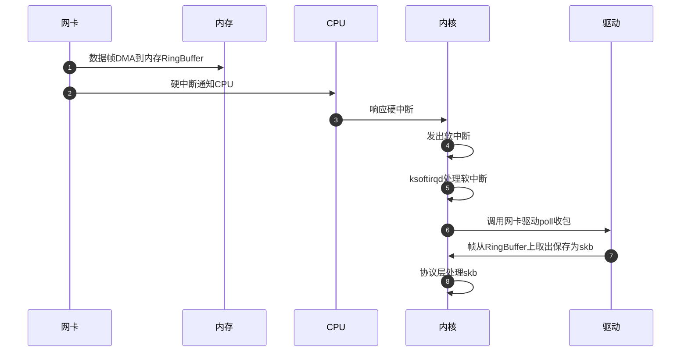

# Linux Bridge源码分析

<show-structure depth="3"/>

> 本文基于Linux kernel v3.10对Bridge工作原理进行分析。

## 1. 创建Bridge

```C
// /Users/kangxiaoning/workspace/linux-3.10/net/bridge/br_if.c

int br_add_bridge(struct net *net, const char *name)
{
	struct net_device *dev;
	int res;

    // 为Bridge设备分配内存，使用`br_dev_setup()`初始化该设备
	dev = alloc_netdev(sizeof(struct net_bridge), name,
			   br_dev_setup);

	if (!dev)
		return -ENOMEM;

    // 设置Bridge的network namespace
	dev_net_set(dev, net);
	// br_link_ops定义了该device上可以执行的操作
	dev->rtnl_link_ops = &br_link_ops;

	res = register_netdev(dev);
	if (res)
		free_netdev(dev);
	return res;
}
```
{collapsible="true" collapsed-title="br_add_bridge()" default-state="collapsed"}

创建Bridge的代码在`br_add_bridge()`函数中，通过`alloc_netdev()`为Bridge分配了内存并通过`br_dev_setup()`对Bridge做了初始化，返回值是一个`net_device`结构体，可见Bridge在Linux中是用`net_device`表示的。实际上这里分配了两个对象，分别是`net_device`和`net_bridge`，相当于通用的device信息加上特殊的bridge信息组合成一个bridge device。

```C
// /Users/kangxiaoning/workspace/linux-3.10/include/linux/netdevice.h

#define alloc_netdev(sizeof_priv, name, setup) \
	alloc_netdev_mqs(sizeof_priv, name, setup, 1, 1)
```

`alloc_netdev()`是个宏，它是通过调用`alloc_netdev_mqs()`函数实现的。

```C
// /Users/kangxiaoning/workspace/linux-3.10/net/core/dev.c

/**
 *	alloc_netdev_mqs - allocate network device
 *	@sizeof_priv:	size of private data to allocate space for
 *	@name:		device name format string
 *	@setup:		callback to initialize device
 *	@txqs:		the number of TX subqueues to allocate
 *	@rxqs:		the number of RX subqueues to allocate
 *
 *	Allocates a struct net_device with private data area for driver use
 *	and performs basic initialization.  Also allocates subquue structs
 *	for each queue on the device.
 */
struct net_device *alloc_netdev_mqs(int sizeof_priv, const char *name,
		void (*setup)(struct net_device *),
		unsigned int txqs, unsigned int rxqs)
{
	struct net_device *dev;
	size_t alloc_size;
	struct net_device *p;

	BUG_ON(strlen(name) >= sizeof(dev->name));

	if (txqs < 1) {
		pr_err("alloc_netdev: Unable to allocate device with zero queues\n");
		return NULL;
	}

#ifdef CONFIG_RPS
	if (rxqs < 1) {
		pr_err("alloc_netdev: Unable to allocate device with zero RX queues\n");
		return NULL;
	}
#endif

	alloc_size = sizeof(struct net_device);
	if (sizeof_priv) {
		/* ensure 32-byte alignment of private area */
		alloc_size = ALIGN(alloc_size, NETDEV_ALIGN);
		alloc_size += sizeof_priv;
	}
	/* ensure 32-byte alignment of whole construct */
	alloc_size += NETDEV_ALIGN - 1;

	p = kzalloc(alloc_size, GFP_KERNEL);
	if (!p)
		return NULL;

	dev = PTR_ALIGN(p, NETDEV_ALIGN);
	dev->padded = (char *)dev - (char *)p;

	dev->pcpu_refcnt = alloc_percpu(int);
	if (!dev->pcpu_refcnt)
		goto free_p;

	if (dev_addr_init(dev))
		goto free_pcpu;

	dev_mc_init(dev);
	dev_uc_init(dev);

	dev_net_set(dev, &init_net);

	dev->gso_max_size = GSO_MAX_SIZE;
	dev->gso_max_segs = GSO_MAX_SEGS;

	INIT_LIST_HEAD(&dev->napi_list);
	INIT_LIST_HEAD(&dev->unreg_list);
	INIT_LIST_HEAD(&dev->link_watch_list);
	INIT_LIST_HEAD(&dev->upper_dev_list);
	dev->priv_flags = IFF_XMIT_DST_RELEASE;
	setup(dev);

	dev->num_tx_queues = txqs;
	dev->real_num_tx_queues = txqs;
	if (netif_alloc_netdev_queues(dev))
		goto free_all;

#ifdef CONFIG_RPS
	dev->num_rx_queues = rxqs;
	dev->real_num_rx_queues = rxqs;
	if (netif_alloc_rx_queues(dev))
		goto free_all;
#endif

	strcpy(dev->name, name);
	dev->group = INIT_NETDEV_GROUP;
	if (!dev->ethtool_ops)
		dev->ethtool_ops = &default_ethtool_ops;
	return dev;

free_all:
	free_netdev(dev);
	return NULL;

free_pcpu:
	free_percpu(dev->pcpu_refcnt);
	kfree(dev->_tx);
#ifdef CONFIG_RPS
	kfree(dev->_rx);
#endif

free_p:
	kfree(p);
	return NULL;
}
```
{collapsible="true" collapsed-title="alloc_netdev_mqs()" default-state="collapsed"}

`alloc_netdev_mqs()`对新建的Bridge设备做了如下初始化。
1. 为Bridge分配MAC地址。
2. 为Bridge执行Ethernet初始化，也就是将这个设备初始化为Ethernet网络设备。
3. 将该设备的操作关联到`br_netdev_ops`定义的操作，这里通过函数指针实现，后面对该设备的操作就指向了Bridge定义的操作，具体代码如下。

```C
static const struct net_device_ops br_netdev_ops = {
	.ndo_open		 = br_dev_open,
	.ndo_stop		 = br_dev_stop,
	.ndo_init		 = br_dev_init,
	.ndo_start_xmit		 = br_dev_xmit,
	.ndo_get_stats64	 = br_get_stats64,
	.ndo_set_mac_address	 = br_set_mac_address,
	.ndo_set_rx_mode	 = br_dev_set_multicast_list,
	.ndo_change_mtu		 = br_change_mtu,
	.ndo_do_ioctl		 = br_dev_ioctl,
#ifdef CONFIG_NET_POLL_CONTROLLER
	.ndo_netpoll_setup	 = br_netpoll_setup,
	.ndo_netpoll_cleanup	 = br_netpoll_cleanup,
	.ndo_poll_controller	 = br_poll_controller,
#endif
	.ndo_add_slave		 = br_add_slave,
	.ndo_del_slave		 = br_del_slave,
	.ndo_fix_features        = br_fix_features,
	.ndo_fdb_add		 = br_fdb_add,
	.ndo_fdb_del		 = br_fdb_delete,
	.ndo_fdb_dump		 = br_fdb_dump,
	.ndo_bridge_getlink	 = br_getlink,
	.ndo_bridge_setlink	 = br_setlink,
	.ndo_bridge_dellink	 = br_dellink,
};
```
{collapsible="true" collapsed-title="br_netdev_ops" default-state="collapsed"}

在bridge的结构中有一个port_list字段，它是个双链表指针，维护了接入到bridge上的所有网卡/设备，比如`veth pair`等设备。
```C
// /Users/kangxiaoning/workspace/linux-3.10/net/bridge/br_private.h

struct net_bridge
{
	spinlock_t			lock;
	struct list_head		port_list;
	struct net_device		*dev;

	struct br_cpu_netstats __percpu *stats;
	spinlock_t			hash_lock;
	struct hlist_head		hash[BR_HASH_SIZE];
#ifdef CONFIG_BRIDGE_NETFILTER
	struct rtable 			fake_rtable;
	bool				nf_call_iptables;
	bool				nf_call_ip6tables;
	bool				nf_call_arptables;
#endif
	u16				group_fwd_mask;

	/* STP */
	bridge_id			designated_root;
	bridge_id			bridge_id;
	u32				root_path_cost;
	unsigned long			max_age;
	unsigned long			hello_time;
	unsigned long			forward_delay;
	unsigned long			bridge_max_age;
	unsigned long			ageing_time;
	unsigned long			bridge_hello_time;
	unsigned long			bridge_forward_delay;

	u8				group_addr[ETH_ALEN];
	u16				root_port;

	enum {
		BR_NO_STP, 		/* no spanning tree */
		BR_KERNEL_STP,		/* old STP in kernel */
		BR_USER_STP,		/* new RSTP in userspace */
	} stp_enabled;

	unsigned char			topology_change;
	unsigned char			topology_change_detected;

#ifdef CONFIG_BRIDGE_IGMP_SNOOPING
	unsigned char			multicast_router;

	u8				multicast_disabled:1;
	u8				multicast_querier:1;

	u32				hash_elasticity;
	u32				hash_max;

	u32				multicast_last_member_count;
	u32				multicast_startup_queries_sent;
	u32				multicast_startup_query_count;

	unsigned long			multicast_last_member_interval;
	unsigned long			multicast_membership_interval;
	unsigned long			multicast_querier_interval;
	unsigned long			multicast_query_interval;
	unsigned long			multicast_query_response_interval;
	unsigned long			multicast_startup_query_interval;

	spinlock_t			multicast_lock;
	struct net_bridge_mdb_htable __rcu *mdb;
	struct hlist_head		router_list;

	struct timer_list		multicast_router_timer;
	struct timer_list		multicast_querier_timer;
	struct timer_list		multicast_query_timer;
#endif

	struct timer_list		hello_timer;
	struct timer_list		tcn_timer;
	struct timer_list		topology_change_timer;
	struct timer_list		gc_timer;
	struct kobject			*ifobj;
#ifdef CONFIG_BRIDGE_VLAN_FILTERING
	u8				vlan_enabled;
	struct net_port_vlans __rcu	*vlan_info;
#endif
};
```
{collapsible="true" collapsed-title="struct net_bridge" default-state="collapsed"}

## 2. Bridge添加网络接口

这个函数的作用是在bridge上添加一个网络接口，比如添加`veth pair`等。

```C
// /Users/kangxiaoning/workspace/linux-3.10/net/bridge/br_if.c

int br_add_if(struct net_bridge *br, struct net_device *dev)
{
	struct net_bridge_port *p;
	int err = 0;
	bool changed_addr;

	/* Don't allow bridging non-ethernet like devices */
	if ((dev->flags & IFF_LOOPBACK) ||
	    dev->type != ARPHRD_ETHER || dev->addr_len != ETH_ALEN ||
	    !is_valid_ether_addr(dev->dev_addr))
		return -EINVAL;

	/* No bridging of bridges */
	if (dev->netdev_ops->ndo_start_xmit == br_dev_xmit)
		return -ELOOP;

	/* Device is already being bridged */
	if (br_port_exists(dev))
		return -EBUSY;

	/* No bridging devices that dislike that (e.g. wireless) */
	if (dev->priv_flags & IFF_DONT_BRIDGE)
		return -EOPNOTSUPP;

	p = new_nbp(br, dev);
	if (IS_ERR(p))
		return PTR_ERR(p);

	call_netdevice_notifiers(NETDEV_JOIN, dev);

	err = dev_set_promiscuity(dev, 1);
	if (err)
		goto put_back;

	err = kobject_init_and_add(&p->kobj, &brport_ktype, &(dev->dev.kobj),
				   SYSFS_BRIDGE_PORT_ATTR);
	if (err)
		goto err1;

	err = br_sysfs_addif(p);
	if (err)
		goto err2;

	if (br_netpoll_info(br) && ((err = br_netpoll_enable(p, GFP_KERNEL))))
		goto err3;

	err = netdev_master_upper_dev_link(dev, br->dev);
	if (err)
		goto err4;

	err = netdev_rx_handler_register(dev, br_handle_frame, p);
	if (err)
		goto err5;

	dev->priv_flags |= IFF_BRIDGE_PORT;

	dev_disable_lro(dev);

	list_add_rcu(&p->list, &br->port_list);

	netdev_update_features(br->dev);

	spin_lock_bh(&br->lock);
	changed_addr = br_stp_recalculate_bridge_id(br);

	if (netif_running(dev) && netif_oper_up(dev) &&
	    (br->dev->flags & IFF_UP))
		br_stp_enable_port(p);
	spin_unlock_bh(&br->lock);

	br_ifinfo_notify(RTM_NEWLINK, p);

	if (changed_addr)
		call_netdevice_notifiers(NETDEV_CHANGEADDR, br->dev);

	dev_set_mtu(br->dev, br_min_mtu(br));

	if (br_fdb_insert(br, p, dev->dev_addr, 0))
		netdev_err(dev, "failed insert local address bridge forwarding table\n");

	kobject_uevent(&p->kobj, KOBJ_ADD);

	return 0;

err5:
	netdev_upper_dev_unlink(dev, br->dev);
err4:
	br_netpoll_disable(p);
err3:
	sysfs_remove_link(br->ifobj, p->dev->name);
err2:
	kobject_put(&p->kobj);
	p = NULL; /* kobject_put frees */
err1:
	dev_set_promiscuity(dev, -1);
put_back:
	dev_put(dev);
	kfree(p);
	return err;
}
```
{collapsible="true" collapsed-title="br_add_if()" default-state="collapsed"}

在这个函数中，有下面这么一行代码，它注册了这个网络接口的`rx_handler`为`br_handle_frame`，kernel在skb(可以理解为kernel中数据包的结构)的处理过程中会用到各种函数指针，因此会有很多注册逻辑，这里先记住注册了这个处理函数。

```C
	err = netdev_rx_handler_register(dev, br_handle_frame, p);
```

- net_device结构

也就是网络设备结构。

```C
// /Users/kangxiaoning/workspace/linux-3.10/include/linux/netdevice.h

struct net_device {

	/*
	 * This is the first field of the "visible" part of this structure
	 * (i.e. as seen by users in the "Space.c" file).  It is the name
	 * of the interface.
	 */
	char			name[IFNAMSIZ];

	/* device name hash chain, please keep it close to name[] */
	struct hlist_node	name_hlist;

	/* snmp alias */
	char 			*ifalias;

	/*
	 *	I/O specific fields
	 *	FIXME: Merge these and struct ifmap into one
	 */
	unsigned long		mem_end;	/* shared mem end	*/
	unsigned long		mem_start;	/* shared mem start	*/
	unsigned long		base_addr;	/* device I/O address	*/
	unsigned int		irq;		/* device IRQ number	*/

	/*
	 *	Some hardware also needs these fields, but they are not
	 *	part of the usual set specified in Space.c.
	 */

	unsigned long		state;

	struct list_head	dev_list;
	struct list_head	napi_list;
	struct list_head	unreg_list;
	struct list_head	upper_dev_list; /* List of upper devices */


	/* currently active device features */
	netdev_features_t	features;
	/* user-changeable features */
	netdev_features_t	hw_features;
	/* user-requested features */
	netdev_features_t	wanted_features;
	/* mask of features inheritable by VLAN devices */
	netdev_features_t	vlan_features;
	/* mask of features inherited by encapsulating devices
	 * This field indicates what encapsulation offloads
	 * the hardware is capable of doing, and drivers will
	 * need to set them appropriately.
	 */
	netdev_features_t	hw_enc_features;

	/* Interface index. Unique device identifier	*/
	int			ifindex;
	int			iflink;

	struct net_device_stats	stats;
	atomic_long_t		rx_dropped; /* dropped packets by core network
					     * Do not use this in drivers.
					     */

#ifdef CONFIG_WIRELESS_EXT
	/* List of functions to handle Wireless Extensions (instead of ioctl).
	 * See <net/iw_handler.h> for details. Jean II */
	const struct iw_handler_def *	wireless_handlers;
	/* Instance data managed by the core of Wireless Extensions. */
	struct iw_public_data *	wireless_data;
#endif
	/* Management operations */
	const struct net_device_ops *netdev_ops;
	const struct ethtool_ops *ethtool_ops;

	/* Hardware header description */
	const struct header_ops *header_ops;

	unsigned int		flags;	/* interface flags (a la BSD)	*/
	unsigned int		priv_flags; /* Like 'flags' but invisible to userspace.
					     * See if.h for definitions. */
	unsigned short		gflags;
	unsigned short		padded;	/* How much padding added by alloc_netdev() */

	unsigned char		operstate; /* RFC2863 operstate */
	unsigned char		link_mode; /* mapping policy to operstate */

	unsigned char		if_port;	/* Selectable AUI, TP,..*/
	unsigned char		dma;		/* DMA channel		*/

	unsigned int		mtu;	/* interface MTU value		*/
	unsigned short		type;	/* interface hardware type	*/
	unsigned short		hard_header_len;	/* hardware hdr length	*/

	/* extra head- and tailroom the hardware may need, but not in all cases
	 * can this be guaranteed, especially tailroom. Some cases also use
	 * LL_MAX_HEADER instead to allocate the skb.
	 */
	unsigned short		needed_headroom;
	unsigned short		needed_tailroom;

	/* Interface address info. */
	unsigned char		perm_addr[MAX_ADDR_LEN]; /* permanent hw address */
	unsigned char		addr_assign_type; /* hw address assignment type */
	unsigned char		addr_len;	/* hardware address length	*/
	unsigned char		neigh_priv_len;
	unsigned short          dev_id;		/* for shared network cards */

	spinlock_t		addr_list_lock;
	struct netdev_hw_addr_list	uc;	/* Unicast mac addresses */
	struct netdev_hw_addr_list	mc;	/* Multicast mac addresses */
	struct netdev_hw_addr_list	dev_addrs; /* list of device
						    * hw addresses
						    */
#ifdef CONFIG_SYSFS
	struct kset		*queues_kset;
#endif

	bool			uc_promisc;
	unsigned int		promiscuity;
	unsigned int		allmulti;


	/* Protocol specific pointers */

#if IS_ENABLED(CONFIG_VLAN_8021Q)
	struct vlan_info __rcu	*vlan_info;	/* VLAN info */
#endif
#if IS_ENABLED(CONFIG_NET_DSA)
	struct dsa_switch_tree	*dsa_ptr;	/* dsa specific data */
#endif
	void 			*atalk_ptr;	/* AppleTalk link 	*/
	struct in_device __rcu	*ip_ptr;	/* IPv4 specific data	*/
	struct dn_dev __rcu     *dn_ptr;        /* DECnet specific data */
	struct inet6_dev __rcu	*ip6_ptr;       /* IPv6 specific data */
	void			*ax25_ptr;	/* AX.25 specific data */
	struct wireless_dev	*ieee80211_ptr;	/* IEEE 802.11 specific data,
						   assign before registering */

/*
 * Cache lines mostly used on receive path (including eth_type_trans())
 */
	unsigned long		last_rx;	/* Time of last Rx
						 * This should not be set in
						 * drivers, unless really needed,
						 * because network stack (bonding)
						 * use it if/when necessary, to
						 * avoid dirtying this cache line.
						 */

	/* Interface address info used in eth_type_trans() */
	unsigned char		*dev_addr;	/* hw address, (before bcast
						   because most packets are
						   unicast) */


#ifdef CONFIG_RPS
	struct netdev_rx_queue	*_rx;

	/* Number of RX queues allocated at register_netdev() time */
	unsigned int		num_rx_queues;

	/* Number of RX queues currently active in device */
	unsigned int		real_num_rx_queues;

#endif

	rx_handler_func_t __rcu	*rx_handler;
	void __rcu		*rx_handler_data;

	struct netdev_queue __rcu *ingress_queue;
	unsigned char		broadcast[MAX_ADDR_LEN];	/* hw bcast add	*/


/*
 * Cache lines mostly used on transmit path
 */
	struct netdev_queue	*_tx ____cacheline_aligned_in_smp;

	/* Number of TX queues allocated at alloc_netdev_mq() time  */
	unsigned int		num_tx_queues;

	/* Number of TX queues currently active in device  */
	unsigned int		real_num_tx_queues;

	/* root qdisc from userspace point of view */
	struct Qdisc		*qdisc;

	unsigned long		tx_queue_len;	/* Max frames per queue allowed */
	spinlock_t		tx_global_lock;

#ifdef CONFIG_XPS
	struct xps_dev_maps __rcu *xps_maps;
#endif
#ifdef CONFIG_RFS_ACCEL
	/* CPU reverse-mapping for RX completion interrupts, indexed
	 * by RX queue number.  Assigned by driver.  This must only be
	 * set if the ndo_rx_flow_steer operation is defined. */
	struct cpu_rmap		*rx_cpu_rmap;
#endif

	/* These may be needed for future network-power-down code. */

	/*
	 * trans_start here is expensive for high speed devices on SMP,
	 * please use netdev_queue->trans_start instead.
	 */
	unsigned long		trans_start;	/* Time (in jiffies) of last Tx	*/

	int			watchdog_timeo; /* used by dev_watchdog() */
	struct timer_list	watchdog_timer;

	/* Number of references to this device */
	int __percpu		*pcpu_refcnt;

	/* delayed register/unregister */
	struct list_head	todo_list;
	/* device index hash chain */
	struct hlist_node	index_hlist;

	struct list_head	link_watch_list;

	/* register/unregister state machine */
	enum { NETREG_UNINITIALIZED=0,
	       NETREG_REGISTERED,	/* completed register_netdevice */
	       NETREG_UNREGISTERING,	/* called unregister_netdevice */
	       NETREG_UNREGISTERED,	/* completed unregister todo */
	       NETREG_RELEASED,		/* called free_netdev */
	       NETREG_DUMMY,		/* dummy device for NAPI poll */
	} reg_state:8;

	bool dismantle; /* device is going do be freed */

	enum {
		RTNL_LINK_INITIALIZED,
		RTNL_LINK_INITIALIZING,
	} rtnl_link_state:16;

	/* Called from unregister, can be used to call free_netdev */
	void (*destructor)(struct net_device *dev);

#ifdef CONFIG_NETPOLL
	struct netpoll_info __rcu	*npinfo;
#endif

#ifdef CONFIG_NET_NS
	/* Network namespace this network device is inside */
	struct net		*nd_net;
#endif

	/* mid-layer private */
	union {
		void				*ml_priv;
		struct pcpu_lstats __percpu	*lstats; /* loopback stats */
		struct pcpu_tstats __percpu	*tstats; /* tunnel stats */
		struct pcpu_dstats __percpu	*dstats; /* dummy stats */
		struct pcpu_vstats __percpu	*vstats; /* veth stats */
	};
	/* GARP */
	struct garp_port __rcu	*garp_port;
	/* MRP */
	struct mrp_port __rcu	*mrp_port;

	/* class/net/name entry */
	struct device		dev;
	/* space for optional device, statistics, and wireless sysfs groups */
	const struct attribute_group *sysfs_groups[4];

	/* rtnetlink link ops */
	const struct rtnl_link_ops *rtnl_link_ops;

	/* for setting kernel sock attribute on TCP connection setup */
#define GSO_MAX_SIZE		65536
	unsigned int		gso_max_size;
#define GSO_MAX_SEGS		65535
	u16			gso_max_segs;

#ifdef CONFIG_DCB
	/* Data Center Bridging netlink ops */
	const struct dcbnl_rtnl_ops *dcbnl_ops;
#endif
	u8 num_tc;
	struct netdev_tc_txq tc_to_txq[TC_MAX_QUEUE];
	u8 prio_tc_map[TC_BITMASK + 1];

#if IS_ENABLED(CONFIG_FCOE)
	/* max exchange id for FCoE LRO by ddp */
	unsigned int		fcoe_ddp_xid;
#endif
#if IS_ENABLED(CONFIG_NETPRIO_CGROUP)
	struct netprio_map __rcu *priomap;
#endif
	/* phy device may attach itself for hardware timestamping */
	struct phy_device *phydev;

	struct lock_class_key *qdisc_tx_busylock;

	/* group the device belongs to */
	int group;

	struct pm_qos_request	pm_qos_req;
};
```
{collapsible="true" collapsed-title="struct net_device" default-state="collapsed"}

## 3. Linux数据帧处理过程

在继续分析Bridge之前，有必要先介绍下内核对数据包的处理过程，因为大概过程基本一致，只是Bridge设备有特殊逻辑。

### 3.1 Linux收包概览



当网卡上有数据到达时，Linux处理数据包的路径如上图。
1. **网卡**以**DMA**的方式把数据帧写入内存。
2. **网卡**向**CPU**发起一个硬中断，通知CPU有数据到达，要紧急处理。
3. **CPU**调用**内核**中网络驱动注册的中断处理函数。
4. 中断处理函数发出**软中断**。
5. **ksoftirqd**处理软中断。
6. **ksoftirqd**调用网卡驱动的`poll()`函数处理数据帧。
7. 网卡驱动的`poll()`从RingBuffer上取出数据包，保存为`skb`结构。
8. 内核对`skb`进行处理，比如设备层处理，协议层处理等，对于TCP包来说，最后会放到用户空间的`socket`等待队列中。

> **中断**：当网卡上有数据到来时，会给CPU的相关引脚上触发一个电压变化，以通知CPU来处理数据。对于网络模块来说，由于处理过程比较复杂和耗时，如果在中断函数中完成所有的处理，将会导致中断处理函数(优先级过高)过度占据CPU，使得CPU无法响应其它设备，例如鼠标和键盘的消息。因此Linux中断处理函数是分**上半部**和**下半部**的。上半部是只进行最简单的工作，快速处理然后释放CPU，接着CPU就可以允许其它中断进来。剩下将绝大部分的工作都放到下半部中，可以慢慢从容处理。在Linux 2.4版本以后的内核版本采用的下半部实现方式是**软中断**，由**ksoftirqd**内核线程处理。**硬中断**是通过给CPU物理引脚施加电压变化，而软中断是通过给内存中的一个变量的二进制值以标记有软中断发生。

### 3.2 Linux网络初始化

Linux kernel在启动的过程中，需要执行一系列操作，以做好接收网络数据的准备。

#### 3.2.1 创建ksoftirqd

通过`early_initcall(spawn_ksoftirqd)`创建ksoftirqd内核线程，用来处理软中断，有几个CPU核心就有几个`softirqd`进程。
```C
static __init int spawn_ksoftirqd(void)
{
	register_cpu_notifier(&cpu_nfb);

	BUG_ON(smpboot_register_percpu_thread(&softirq_threads));

	return 0;
}
early_initcall(spawn_ksoftirqd);
```
{collapsible="true" collapsed-title="early_initcall(spawn_ksoftirqd)" default-state="collapsed"}

```C
static struct smp_hotplug_thread softirq_threads = {
	.store			= &ksoftirqd,
	.thread_should_run	= ksoftirqd_should_run,
	.thread_fn		= run_ksoftirqd,
	.thread_comm		= "ksoftirqd/%u",
};
```
{collapsible="true" collapsed-title="softirq_threads" default-state="collapsed"}

```C
int smpboot_register_percpu_thread(struct smp_hotplug_thread *plug_thread)
{
	unsigned int cpu;
	int ret = 0;

	mutex_lock(&smpboot_threads_lock);
	for_each_online_cpu(cpu) {
		ret = __smpboot_create_thread(plug_thread, cpu);
		if (ret) {
			smpboot_destroy_threads(plug_thread);
			goto out;
		}
		smpboot_unpark_thread(plug_thread, cpu);
	}
	list_add(&plug_thread->list, &hotplug_threads);
out:
	mutex_unlock(&smpboot_threads_lock);
	return ret;
}
EXPORT_SYMBOL_GPL(smpboot_register_percpu_thread);
```
{collapsible="true" collapsed-title="smpboot_register_percpu_thread()" default-state="collapsed"}

#### 3.2.2 初始化网络设备

通过`subsys_initcall(net_dev_init)`执行网络设备初始化。
- 初始化`softnet_data`等per cpu数据结构，网卡驱动的`pool()`函数后面会注册到`softnet_data`结构体中的`poll_list`字段。
- 调用`open_softirq()`注册**RX_SOFTIRQ**和**TX_SOFTIRQ**对应的中断处理函数。
- 初始化`packet_type`哈希表，为所有可能的协议类型创建并初始化哈希表（`ptype_all`和`ptype_base`），这些哈希表用于快速查找特定协议的数据包处理器。

```C

static int __init net_dev_init(void)
{
	int i, rc = -ENOMEM;

	BUG_ON(!dev_boot_phase);

	if (dev_proc_init())
		goto out;

	if (netdev_kobject_init())
		goto out;

	INIT_LIST_HEAD(&ptype_all);
	for (i = 0; i < PTYPE_HASH_SIZE; i++)
		INIT_LIST_HEAD(&ptype_base[i]);

	INIT_LIST_HEAD(&offload_base);

	if (register_pernet_subsys(&netdev_net_ops))
		goto out;

	/*
	 *	Initialise the packet receive queues.
	 */

	for_each_possible_cpu(i) {
		struct softnet_data *sd = &per_cpu(softnet_data, i);

		memset(sd, 0, sizeof(*sd));
		skb_queue_head_init(&sd->input_pkt_queue);
		skb_queue_head_init(&sd->process_queue);
		sd->completion_queue = NULL;
		INIT_LIST_HEAD(&sd->poll_list);
		sd->output_queue = NULL;
		sd->output_queue_tailp = &sd->output_queue;
#ifdef CONFIG_RPS
		sd->csd.func = rps_trigger_softirq;
		sd->csd.info = sd;
		sd->csd.flags = 0;
		sd->cpu = i;
#endif

		sd->backlog.poll = process_backlog;
		sd->backlog.weight = weight_p;
		sd->backlog.gro_list = NULL;
		sd->backlog.gro_count = 0;
	}

	dev_boot_phase = 0;

	/* The loopback device is special if any other network devices
	 * is present in a network namespace the loopback device must
	 * be present. Since we now dynamically allocate and free the
	 * loopback device ensure this invariant is maintained by
	 * keeping the loopback device as the first device on the
	 * list of network devices.  Ensuring the loopback devices
	 * is the first device that appears and the last network device
	 * that disappears.
	 */
	if (register_pernet_device(&loopback_net_ops))
		goto out;

	if (register_pernet_device(&default_device_ops))
		goto out;

	open_softirq(NET_TX_SOFTIRQ, net_tx_action);
	open_softirq(NET_RX_SOFTIRQ, net_rx_action);

	hotcpu_notifier(dev_cpu_callback, 0);
	dst_init();
	rc = 0;
out:
	return rc;
}
```
{collapsible="true" collapsed-title="net_dev_init()" default-state="collapsed"}

#### 3.2.3 注册协议栈

协议栈注册，比如IP，TCP，UDP等协议，对应的实现函数为`ip_rcv()`，`tcp_v4_rcv()`和`udp_rcv()`，将这些函数注册到了`inet_protos`和`ptype_base`数据结构中了。

```C
	if (inet_add_protocol(&icmp_protocol, IPPROTO_ICMP) < 0)
		pr_crit("%s: Cannot add ICMP protocol\n", __func__);
	if (inet_add_protocol(&udp_protocol, IPPROTO_UDP) < 0)
		pr_crit("%s: Cannot add UDP protocol\n", __func__);
	if (inet_add_protocol(&tcp_protocol, IPPROTO_TCP) < 0)
		pr_crit("%s: Cannot add TCP protocol\n", __func__);
	/* 省略 */
	
	dev_add_pack(&ip_packet_type);
```
`inet_init()`完整代码如下。
```C
static int __init inet_init(void)
{
	struct inet_protosw *q;
	struct list_head *r;
	int rc = -EINVAL;

	BUILD_BUG_ON(sizeof(struct inet_skb_parm) > FIELD_SIZEOF(struct sk_buff, cb));

	sysctl_local_reserved_ports = kzalloc(65536 / 8, GFP_KERNEL);
	if (!sysctl_local_reserved_ports)
		goto out;

	rc = proto_register(&tcp_prot, 1);
	if (rc)
		goto out_free_reserved_ports;

	rc = proto_register(&udp_prot, 1);
	if (rc)
		goto out_unregister_tcp_proto;

	rc = proto_register(&raw_prot, 1);
	if (rc)
		goto out_unregister_udp_proto;

	rc = proto_register(&ping_prot, 1);
	if (rc)
		goto out_unregister_raw_proto;

	/*
	 *	Tell SOCKET that we are alive...
	 */

	(void)sock_register(&inet_family_ops);

#ifdef CONFIG_SYSCTL
	ip_static_sysctl_init();
#endif

	tcp_prot.sysctl_mem = init_net.ipv4.sysctl_tcp_mem;

	/*
	 *	Add all the base protocols.
	 */

	if (inet_add_protocol(&icmp_protocol, IPPROTO_ICMP) < 0)
		pr_crit("%s: Cannot add ICMP protocol\n", __func__);
	if (inet_add_protocol(&udp_protocol, IPPROTO_UDP) < 0)
		pr_crit("%s: Cannot add UDP protocol\n", __func__);
	if (inet_add_protocol(&tcp_protocol, IPPROTO_TCP) < 0)
		pr_crit("%s: Cannot add TCP protocol\n", __func__);
#ifdef CONFIG_IP_MULTICAST
	if (inet_add_protocol(&igmp_protocol, IPPROTO_IGMP) < 0)
		pr_crit("%s: Cannot add IGMP protocol\n", __func__);
#endif

	/* Register the socket-side information for inet_create. */
	for (r = &inetsw[0]; r < &inetsw[SOCK_MAX]; ++r)
		INIT_LIST_HEAD(r);

	for (q = inetsw_array; q < &inetsw_array[INETSW_ARRAY_LEN]; ++q)
		inet_register_protosw(q);

	/*
	 *	Set the ARP module up
	 */

	arp_init();

	/*
	 *	Set the IP module up
	 */

	ip_init();

	tcp_v4_init();

	/* Setup TCP slab cache for open requests. */
	tcp_init();

	/* Setup UDP memory threshold */
	udp_init();

	/* Add UDP-Lite (RFC 3828) */
	udplite4_register();

	ping_init();

	/*
	 *	Set the ICMP layer up
	 */

	if (icmp_init() < 0)
		panic("Failed to create the ICMP control socket.\n");

	/*
	 *	Initialise the multicast router
	 */
#if defined(CONFIG_IP_MROUTE)
	if (ip_mr_init())
		pr_crit("%s: Cannot init ipv4 mroute\n", __func__);
#endif
	/*
	 *	Initialise per-cpu ipv4 mibs
	 */

	if (init_ipv4_mibs())
		pr_crit("%s: Cannot init ipv4 mibs\n", __func__);

	ipv4_proc_init();

	ipfrag_init();

	dev_add_pack(&ip_packet_type);

	rc = 0;
out:
	return rc;
out_unregister_raw_proto:
	proto_unregister(&raw_prot);
out_unregister_udp_proto:
	proto_unregister(&udp_prot);
out_unregister_tcp_proto:
	proto_unregister(&tcp_prot);
out_free_reserved_ports:
	kfree(sysctl_local_reserved_ports);
	goto out;
}

fs_initcall(inet_init);
```
{collapsible="true" collapsed-title="fs_initcall(inet_init)" default-state="collapsed"}

- `inet_protos`记录着UDP，TCP的处理函数`udp_rcv()`，`tcp_v4_rcv()`的地址
```C
int inet_add_protocol(const struct net_protocol *prot, unsigned char protocol)
{
	if (!prot->netns_ok) {
		pr_err("Protocol %u is not namespace aware, cannot register.\n",
			protocol);
		return -EINVAL;
	}

	return !cmpxchg((const struct net_protocol **)&inet_protos[protocol],
			NULL, prot) ? 0 : -1;
}
```
{collapsible="true" collapsed-title="inet_add_protocol()" default-state="collapsed"}

- `ptype_base`存储着IP的处理函数`ip_rcv()`的地址
```C
void dev_add_pack(struct packet_type *pt)
{
	struct list_head *head = ptype_head(pt);

	spin_lock(&ptype_lock);
	list_add_rcu(&pt->list, head);
	spin_unlock(&ptype_lock);
}
```
{collapsible="true" collapsed-title="dev_add_pack()" default-state="collapsed"}

```C
static inline struct list_head *ptype_head(const struct packet_type *pt)
{
	if (pt->type == htons(ETH_P_ALL))
		return &ptype_all;
	else
		return &ptype_base[ntohs(pt->type) & PTYPE_HASH_MASK];
}
```
{collapsible="true" collapsed-title="ptype_head()" default-state="collapsed"}

#### 3.2.4 注册网卡驱动

通过`module_init(igb_init_module)`向内核注册网卡驱动初始化函数，不同网卡的初始化函数不一样，这里举例的是`igb`网卡驱动。

```C
static struct pci_driver igb_driver = {
	.name     = igb_driver_name,
	.id_table = igb_pci_tbl,
	.probe    = igb_probe,
	.remove   = igb_remove,
#ifdef CONFIG_PM
	.driver.pm = &igb_pm_ops,
#endif
	.shutdown = igb_shutdown,
	.sriov_configure = igb_pci_sriov_configure,
	.err_handler = &igb_err_handler
};

static int __init igb_init_module(void)
{
	int ret;
	pr_info("%s - version %s\n",
	       igb_driver_string, igb_driver_version);

	pr_info("%s\n", igb_copyright);

#ifdef CONFIG_IGB_DCA
	dca_register_notify(&dca_notifier);
#endif
	ret = pci_register_driver(&igb_driver);
	return ret;
}

module_init(igb_init_module);
```
{collapsible="true" collapsed-title="module_init(igb_init_module)" default-state="collapsed"}

```C
// /Users/kangxiaoning/workspace/linux-3.10/include/linux/pci.h

/*
 * pci_register_driver must be a macro so that KBUILD_MODNAME can be expanded
 */
#define pci_register_driver(driver)		\
	__pci_register_driver(driver, THIS_MODULE, KBUILD_MODNAME)
```
{collapsible="true" collapsed-title="pci_register_driver()" default-state="collapsed"}

```C
/**
 * __pci_register_driver - register a new pci driver
 * @drv: the driver structure to register
 * @owner: owner module of drv
 * @mod_name: module name string
 * 
 * Adds the driver structure to the list of registered drivers.
 * Returns a negative value on error, otherwise 0. 
 * If no error occurred, the driver remains registered even if 
 * no device was claimed during registration.
 */
int __pci_register_driver(struct pci_driver *drv, struct module *owner,
			  const char *mod_name)
{
	/* initialize common driver fields */
	drv->driver.name = drv->name;
	drv->driver.bus = &pci_bus_type;
	drv->driver.owner = owner;
	drv->driver.mod_name = mod_name;

	spin_lock_init(&drv->dynids.lock);
	INIT_LIST_HEAD(&drv->dynids.list);

	/* register with core */
	return driver_register(&drv->driver);
}
```
{collapsible="true" collapsed-title="__pci_register_driver()" default-state="collapsed"}

`pci_register_driver()`执行完成后，Linux就知道了驱动的信息，接下来就会调用驱动的`probe()`方法，igb的`probe`函数是`igb_probe`，这个函数非常长，贴部分代码理解下。

```C
	/* ... */
	
	// 设置MAC
	hw->hw_addr = ioremap(mmio_start, mmio_len);
	if (!hw->hw_addr)
		goto err_ioremap;

    // netdev_ops的类型为net_device_ops，使用igb_netdev_ops进行了设置
	netdev->netdev_ops = &igb_netdev_ops;
	// 设置ethtool对应的操作，具体操作在igb_ethtool_ops结构体中
	igb_set_ethtool_ops(netdev);
	netdev->watchdog_timeo = 5 * HZ;
	
	/* ... */
	
	/* setup the private structure */
	// MTU，RingBuffer初始化等
	err = igb_sw_init(adapter);
	if (err)
		goto err_sw_init;
		
	/* ... */
	
	// 册网络设备，会触发一系列注册过程，包括调用网络设备的注册回调函数、分配和配置网络设备的资源
	// 以及将网络设备添加到系统中，使其能够被其他网络相关的子系统使用。
	err = register_netdev(netdev);
	
	/* ... */
```

```C
static const struct ethtool_ops igb_ethtool_ops = {
	.get_settings		= igb_get_settings,
	.set_settings		= igb_set_settings,
	.get_drvinfo		= igb_get_drvinfo,
	.get_regs_len		= igb_get_regs_len,
	.get_regs		= igb_get_regs,
	.get_wol		= igb_get_wol,
	.set_wol		= igb_set_wol,
	.get_msglevel		= igb_get_msglevel,
	.set_msglevel		= igb_set_msglevel,
	.nway_reset		= igb_nway_reset,
	.get_link		= igb_get_link,
	.get_eeprom_len		= igb_get_eeprom_len,
	.get_eeprom		= igb_get_eeprom,
	.set_eeprom		= igb_set_eeprom,
	.get_ringparam		= igb_get_ringparam,
	.set_ringparam		= igb_set_ringparam,
	.get_pauseparam		= igb_get_pauseparam,
	.set_pauseparam		= igb_set_pauseparam,
	.self_test		= igb_diag_test,
	.get_strings		= igb_get_strings,
	.set_phys_id		= igb_set_phys_id,
	.get_sset_count		= igb_get_sset_count,
	.get_ethtool_stats	= igb_get_ethtool_stats,
	.get_coalesce		= igb_get_coalesce,
	.set_coalesce		= igb_set_coalesce,
	.get_ts_info		= igb_get_ts_info,
	.get_rxnfc		= igb_get_rxnfc,
	.set_rxnfc		= igb_set_rxnfc,
	.get_eee		= igb_get_eee,
	.set_eee		= igb_set_eee,
	.get_module_info	= igb_get_module_info,
	.get_module_eeprom	= igb_get_module_eeprom,
	.begin			= igb_ethtool_begin,
	.complete		= igb_ethtool_complete,
};
```
{collapsible="true" collapsed-title="igb_ethtool_ops" default-state="collapsed"}

```C
static const struct net_device_ops igb_netdev_ops = {
	.ndo_open		= igb_open,
	.ndo_stop		= igb_close,
	.ndo_start_xmit		= igb_xmit_frame,
	.ndo_get_stats64	= igb_get_stats64,
	.ndo_set_rx_mode	= igb_set_rx_mode,
	.ndo_set_mac_address	= igb_set_mac,
	.ndo_change_mtu		= igb_change_mtu,
	.ndo_do_ioctl		= igb_ioctl,
	.ndo_tx_timeout		= igb_tx_timeout,
	.ndo_validate_addr	= eth_validate_addr,
	.ndo_vlan_rx_add_vid	= igb_vlan_rx_add_vid,
	.ndo_vlan_rx_kill_vid	= igb_vlan_rx_kill_vid,
	.ndo_set_vf_mac		= igb_ndo_set_vf_mac,
	.ndo_set_vf_vlan	= igb_ndo_set_vf_vlan,
	.ndo_set_vf_tx_rate	= igb_ndo_set_vf_bw,
	.ndo_set_vf_spoofchk	= igb_ndo_set_vf_spoofchk,
	.ndo_get_vf_config	= igb_ndo_get_vf_config,
#ifdef CONFIG_NET_POLL_CONTROLLER
	.ndo_poll_controller	= igb_netpoll,
#endif
	.ndo_fix_features	= igb_fix_features,
	.ndo_set_features	= igb_set_features,
};
```
{collapsible="true" collapsed-title="igb_netdev_ops" default-state="collapsed"}

#### 3.2.5 启动网卡

前面的初始化都完成后，内核就可以调用上面`net_device_ops`结构体中对应的函数执行各种网卡操作，比如启动，关闭，设置MAC等。

在启动网卡的过程中，会调用`igb_open()` -> `__igb_open()` -> `igb_setup_all_tx_resources()`/`igb_setup_all_rx_resources()`。在 `igb_setup_all_rx_resources()`调用中，分配了RingBuffer，建立内存和Rx队列的映射关系。在`igb_request_irq()`中注册了中断处理函数，在发生中断时调用`igb_request_msix()`进行处理。

```C
static int igb_open(struct net_device *netdev)
{
	return __igb_open(netdev, false);
}
```

```C
static int __igb_open(struct net_device *netdev, bool resuming)
{
	struct igb_adapter *adapter = netdev_priv(netdev);
	struct e1000_hw *hw = &adapter->hw;
	struct pci_dev *pdev = adapter->pdev;
	int err;
	int i;

	/* disallow open during test */
	if (test_bit(__IGB_TESTING, &adapter->state)) {
		WARN_ON(resuming);
		return -EBUSY;
	}

	if (!resuming)
		pm_runtime_get_sync(&pdev->dev);

	netif_carrier_off(netdev);

	/* allocate transmit descriptors */
	// 分配传输的descriptors，实际上是RingBuffer队列
	err = igb_setup_all_tx_resources(adapter);
	if (err)
		goto err_setup_tx;

	/* allocate receive descriptors */
	// 分配接收的descriptors，实际上是RingBuffer队列
	err = igb_setup_all_rx_resources(adapter);
	if (err)
		goto err_setup_rx;

	igb_power_up_link(adapter);

	/* before we allocate an interrupt, we must be ready to handle it.
	 * Setting DEBUG_SHIRQ in the kernel makes it fire an interrupt
	 * as soon as we call pci_request_irq, so we have to setup our
	 * clean_rx handler before we do so.
	 */
	igb_configure(adapter);

    // 注册中断处理函数
	err = igb_request_irq(adapter);
	if (err)
		goto err_req_irq;

	/* Notify the stack of the actual queue counts. */
	err = netif_set_real_num_tx_queues(adapter->netdev,
					   adapter->num_tx_queues);
	if (err)
		goto err_set_queues;

	err = netif_set_real_num_rx_queues(adapter->netdev,
					   adapter->num_rx_queues);
	if (err)
		goto err_set_queues;

	/* From here on the code is the same as igb_up() */
	clear_bit(__IGB_DOWN, &adapter->state);

	for (i = 0; i < adapter->num_q_vectors; i++)
		napi_enable(&(adapter->q_vector[i]->napi));

	/* Clear any pending interrupts. */
	rd32(E1000_ICR);

	igb_irq_enable(adapter);

	/* notify VFs that reset has been completed */
	if (adapter->vfs_allocated_count) {
		u32 reg_data = rd32(E1000_CTRL_EXT);
		reg_data |= E1000_CTRL_EXT_PFRSTD;
		wr32(E1000_CTRL_EXT, reg_data);
	}

	netif_tx_start_all_queues(netdev);

	if (!resuming)
		pm_runtime_put(&pdev->dev);

	/* start the watchdog. */
	hw->mac.get_link_status = 1;
	schedule_work(&adapter->watchdog_task);

	return 0;

err_set_queues:
	igb_free_irq(adapter);
err_req_irq:
	igb_release_hw_control(adapter);
	igb_power_down_link(adapter);
	igb_free_all_rx_resources(adapter);
err_setup_rx:
	igb_free_all_tx_resources(adapter);
err_setup_tx:
	igb_reset(adapter);
	if (!resuming)
		pm_runtime_put(&pdev->dev);

	return err;
}
```
{collapsible="true" collapsed-title="__igb_open()" default-state="collapsed"}

从`igb_setup_all_rx_resources()`中可以看到，一个循环中创建了多个队列。
```C
static int igb_setup_all_rx_resources(struct igb_adapter *adapter)
{
	struct pci_dev *pdev = adapter->pdev;
	int i, err = 0;

	for (i = 0; i < adapter->num_rx_queues; i++) {
		err = igb_setup_rx_resources(adapter->rx_ring[i]);
		if (err) {
			dev_err(&pdev->dev,
				"Allocation for Rx Queue %u failed\n", i);
			for (i--; i >= 0; i--)
				igb_free_rx_resources(adapter->rx_ring[i]);
			break;
		}
	}

	return err;
}
```
{collapsible="true" collapsed-title="igb_setup_all_rx_resources()" default-state="collapsed"}

经过上述处理后，Linux就做好了接收数据包的准备。当数据帧从网线到达网卡后，经过网卡驱动执行DMA，发出硬中断，内核执行硬中断处理函数，再发出软中断，最后触发ksoftirqd执行软中断处理函数`net_rx_action()`，接着执行网卡驱动注册的`poll()`方法，把数据帧从RingBuffer上取下来，然后进入GRO(Generic Receive Offload)处理逻辑，最后会进入`netif_receive_skb()`函数进行处理，这个函数是设备层进入协议层前的处理逻辑，二层相关的处理会在这里体现。

## 4. 进入Bridge处理逻辑

```C
// /Users/kangxiaoning/workspace/linux-3.10/net/core/dev.c

int netif_receive_skb(struct sk_buff *skb)
{
	net_timestamp_check(netdev_tstamp_prequeue, skb);

	if (skb_defer_rx_timestamp(skb))
		return NET_RX_SUCCESS;

#ifdef CONFIG_RPS
	if (static_key_false(&rps_needed)) {
		struct rps_dev_flow voidflow, *rflow = &voidflow;
		int cpu, ret;

		rcu_read_lock();

		cpu = get_rps_cpu(skb->dev, skb, &rflow);

		if (cpu >= 0) {
			ret = enqueue_to_backlog(skb, cpu, &rflow->last_qtail);
			rcu_read_unlock();
			return ret;
		}
		rcu_read_unlock();
	}
#endif
	return __netif_receive_skb(skb);
}
```
{collapsible="true" collapsed-title="netif_receive_skb()" default-state="collapsed"}

`netif_receive_skb()`逻辑比较简单，主要是对数据包进行了RPS的处理，然后调用了`__netif_receive_skb()`。

```C
// /Users/kangxiaoning/workspace/linux-3.10/net/core/dev.c
static int __netif_receive_skb(struct sk_buff *skb)
{
	int ret;

	if (sk_memalloc_socks() && skb_pfmemalloc(skb)) {
		unsigned long pflags = current->flags;

		/*
		 * PFMEMALLOC skbs are special, they should
		 * - be delivered to SOCK_MEMALLOC sockets only
		 * - stay away from userspace
		 * - have bounded memory usage
		 *
		 * Use PF_MEMALLOC as this saves us from propagating the allocation
		 * context down to all allocation sites.
		 */
		current->flags |= PF_MEMALLOC;
		ret = __netif_receive_skb_core(skb, true);
		tsk_restore_flags(current, pflags, PF_MEMALLOC);
	} else
		ret = __netif_receive_skb_core(skb, false);

	return ret;
}
```
{collapsible="true" collapsed-title="__netif_receive_skb()" default-state="collapsed"}

`__netif_receive_skb()`做了个特殊类型判断后就调用了`__netif_receive_skb_core()`。

```C
// /Users/kangxiaoning/workspace/linux-3.10/net/core/dev.c
static int __netif_receive_skb_core(struct sk_buff *skb, bool pfmemalloc)
{
	struct packet_type *ptype, *pt_prev;
	rx_handler_func_t *rx_handler;
	struct net_device *orig_dev;
	struct net_device *null_or_dev;
	bool deliver_exact = false;
	int ret = NET_RX_DROP;
	__be16 type;

	net_timestamp_check(!netdev_tstamp_prequeue, skb);

	trace_netif_receive_skb(skb);

	/* if we've gotten here through NAPI, check netpoll */
	if (netpoll_receive_skb(skb))
		goto out;

	orig_dev = skb->dev;

	skb_reset_network_header(skb);
	if (!skb_transport_header_was_set(skb))
		skb_reset_transport_header(skb);
	skb_reset_mac_len(skb);

	pt_prev = NULL;

	rcu_read_lock();

another_round:
	skb->skb_iif = skb->dev->ifindex;

	__this_cpu_inc(softnet_data.processed);

	if (skb->protocol == cpu_to_be16(ETH_P_8021Q) ||
	    skb->protocol == cpu_to_be16(ETH_P_8021AD)) {
		skb = vlan_untag(skb);
		if (unlikely(!skb))
			goto unlock;
	}

#ifdef CONFIG_NET_CLS_ACT
	if (skb->tc_verd & TC_NCLS) {
		skb->tc_verd = CLR_TC_NCLS(skb->tc_verd);
		goto ncls;
	}
#endif

	if (pfmemalloc)
		goto skip_taps;

	list_for_each_entry_rcu(ptype, &ptype_all, list) {
		if (!ptype->dev || ptype->dev == skb->dev) {
			if (pt_prev)
				ret = deliver_skb(skb, pt_prev, orig_dev);
			pt_prev = ptype;
		}
	}

skip_taps:
#ifdef CONFIG_NET_CLS_ACT
	skb = handle_ing(skb, &pt_prev, &ret, orig_dev);
	if (!skb)
		goto unlock;
ncls:
#endif

	if (pfmemalloc && !skb_pfmemalloc_protocol(skb))
		goto drop;

	if (vlan_tx_tag_present(skb)) {
		if (pt_prev) {
			ret = deliver_skb(skb, pt_prev, orig_dev);
			pt_prev = NULL;
		}
		if (vlan_do_receive(&skb))
			goto another_round;
		else if (unlikely(!skb))
			goto unlock;
	}

	rx_handler = rcu_dereference(skb->dev->rx_handler);
	if (rx_handler) {
		if (pt_prev) {
			ret = deliver_skb(skb, pt_prev, orig_dev);
			pt_prev = NULL;
		}
		switch (rx_handler(&skb)) {
		case RX_HANDLER_CONSUMED:
			ret = NET_RX_SUCCESS;
			goto unlock;
		case RX_HANDLER_ANOTHER:
			goto another_round;
		case RX_HANDLER_EXACT:
			deliver_exact = true;
		case RX_HANDLER_PASS:
			break;
		default:
			BUG();
		}
	}

	if (vlan_tx_nonzero_tag_present(skb))
		skb->pkt_type = PACKET_OTHERHOST;

	/* deliver only exact match when indicated */
	null_or_dev = deliver_exact ? skb->dev : NULL;

	type = skb->protocol;
	list_for_each_entry_rcu(ptype,
			&ptype_base[ntohs(type) & PTYPE_HASH_MASK], list) {
		if (ptype->type == type &&
		    (ptype->dev == null_or_dev || ptype->dev == skb->dev ||
		     ptype->dev == orig_dev)) {
			if (pt_prev)
				ret = deliver_skb(skb, pt_prev, orig_dev);
			pt_prev = ptype;
		}
	}

	if (pt_prev) {
		if (unlikely(skb_orphan_frags(skb, GFP_ATOMIC)))
			goto drop;
		else
			ret = pt_prev->func(skb, skb->dev, pt_prev, orig_dev);
	} else {
drop:
		atomic_long_inc(&skb->dev->rx_dropped);
		kfree_skb(skb);
		/* Jamal, now you will not able to escape explaining
		 * me how you were going to use this. :-)
		 */
		ret = NET_RX_DROP;
	}

unlock:
	rcu_read_unlock();
out:
	return ret;
}
```
{collapsible="true" collapsed-title="__netif_receive_skb_core()" default-state="collapsed"}

在`__netif_receive_skb_core()`函数中，调用`rx_handler()`函数（在`br_add_if()`中注册的），也就是`br_handle_frame()`，这里就和Bridge对数据帧的处理逻辑关联上了，通过如下代码进入了Bridge处理逻辑。
```C
	rx_handler = rcu_dereference(skb->dev->rx_handler);
	if (rx_handler) {
		if (pt_prev) {
			ret = deliver_skb(skb, pt_prev, orig_dev);
			pt_prev = NULL;
		}
		switch (rx_handler(&skb)) {
		case RX_HANDLER_CONSUMED:
			ret = NET_RX_SUCCESS;
			goto unlock;
		case RX_HANDLER_ANOTHER:
			goto another_round;
		case RX_HANDLER_EXACT:
			deliver_exact = true;
		case RX_HANDLER_PASS:
			break;
		default:
			BUG();
		}
	}
```

接下来就要看看Bridge入口函数即`br_handle_frame()`的处理逻辑了。

## 5. Bridge处理入口

```C
// /Users/kangxiaoning/workspace/linux-3.10/net/bridge/br_input.c

rx_handler_result_t br_handle_frame(struct sk_buff **pskb)
{
	struct net_bridge_port *p;
	struct sk_buff *skb = *pskb;
	const unsigned char *dest = eth_hdr(skb)->h_dest;
	br_should_route_hook_t *rhook;

	if (unlikely(skb->pkt_type == PACKET_LOOPBACK))
		return RX_HANDLER_PASS;

	if (!is_valid_ether_addr(eth_hdr(skb)->h_source))
		goto drop;

	skb = skb_share_check(skb, GFP_ATOMIC);
	if (!skb)
		return RX_HANDLER_CONSUMED;

	p = br_port_get_rcu(skb->dev);

	if (unlikely(is_link_local_ether_addr(dest))) {
		/*
		 * See IEEE 802.1D Table 7-10 Reserved addresses
		 *
		 * Assignment		 		Value
		 * Bridge Group Address		01-80-C2-00-00-00
		 * (MAC Control) 802.3		01-80-C2-00-00-01
		 * (Link Aggregation) 802.3	01-80-C2-00-00-02
		 * 802.1X PAE address		01-80-C2-00-00-03
		 *
		 * 802.1AB LLDP 		01-80-C2-00-00-0E
		 *
		 * Others reserved for future standardization
		 */
		switch (dest[5]) {
		case 0x00:	/* Bridge Group Address */
			/* If STP is turned off,
			   then must forward to keep loop detection */
			if (p->br->stp_enabled == BR_NO_STP)
				goto forward;
			break;

		case 0x01:	/* IEEE MAC (Pause) */
			goto drop;

		default:
			/* Allow selective forwarding for most other protocols */
			if (p->br->group_fwd_mask & (1u << dest[5]))
				goto forward;
		}

		/* Deliver packet to local host only */
		if (NF_HOOK(NFPROTO_BRIDGE, NF_BR_LOCAL_IN, skb, skb->dev,
			    NULL, br_handle_local_finish)) {
			return RX_HANDLER_CONSUMED; /* consumed by filter */
		} else {
			*pskb = skb;
			return RX_HANDLER_PASS;	/* continue processing */
		}
	}

forward:
	switch (p->state) {
	case BR_STATE_FORWARDING:
		rhook = rcu_dereference(br_should_route_hook);
		if (rhook) {
			if ((*rhook)(skb)) {
				*pskb = skb;
				return RX_HANDLER_PASS;
			}
			dest = eth_hdr(skb)->h_dest;
		}
		/* fall through */
	case BR_STATE_LEARNING:
		if (ether_addr_equal(p->br->dev->dev_addr, dest))
			skb->pkt_type = PACKET_HOST;

		NF_HOOK(NFPROTO_BRIDGE, NF_BR_PRE_ROUTING, skb, skb->dev, NULL,
			br_handle_frame_finish);
		break;
	default:
drop:
		kfree_skb(skb);
	}
	return RX_HANDLER_CONSUMED;
}
```
{collapsible="true" collapsed-title="br_handle_frame()" default-state="collapsed"}

`br_handle_frame()`的作用，可以理解为“**在Bridge的port收到frame时调用这个函数进行处理**”，逻辑大概如下。

1. 如果是loopback的packet，返回**RX_HANDLER_PASS**，表示应该由上层处理。
2. 检查二层源MAC，如果无效则drop。
3. 从Bridge上获取结构为`net_bridge_port`的port信息。
4. 特殊MAC处理，这里不分析。
5. **转发处理**，根据网桥端口状态（br_state_forwarding或br_state_learning）来决定如何处理数据包。
   - **BR_STATE_FORWARDING**：如果端口处于转发状态并且存在自定义hook则交给hook处理，否则继续交给BR_STATE_LEARNING逻辑处理，因为这里没有`break`。
   - **BR_STATE_LEARNING**： 如果**目标MAC地址与网桥设备MAC地址相同**，将数据包标记为发往本地主机（PACKET_HOST类型）。调用Netfilter的NF_HOOK宏，执行NFPROTO_BRIDGE协议族的NF_BR_PRE_ROUTING钩子链，最后会调用**br_handle_frame_finish**函数。
6. 默认情况（即不满足上述条件时）：丢弃数据包并释放内存资源，返回RX_HANDLER_CONSUMED。

正常情况下都会执行到`br_handle_frame_finish()`。

## 6. br_handle_frame_finish()

```C
// /Users/kangxiaoning/workspace/linux-3.10/net/bridge/br_input.c

int br_handle_frame_finish(struct sk_buff *skb)
{
	const unsigned char *dest = eth_hdr(skb)->h_dest;
	struct net_bridge_port *p = br_port_get_rcu(skb->dev);
	struct net_bridge *br;
	struct net_bridge_fdb_entry *dst;
	struct net_bridge_mdb_entry *mdst;
	struct sk_buff *skb2;
	u16 vid = 0;

	if (!p || p->state == BR_STATE_DISABLED)
		goto drop;

	if (!br_allowed_ingress(p->br, nbp_get_vlan_info(p), skb, &vid))
		goto drop;

	/* insert into forwarding database after filtering to avoid spoofing */
	br = p->br;
	br_fdb_update(br, p, eth_hdr(skb)->h_source, vid);

	if (!is_broadcast_ether_addr(dest) && is_multicast_ether_addr(dest) &&
	    br_multicast_rcv(br, p, skb))
		goto drop;

	if (p->state == BR_STATE_LEARNING)
		goto drop;

	BR_INPUT_SKB_CB(skb)->brdev = br->dev;

	/* The packet skb2 goes to the local host (NULL to skip). */
	skb2 = NULL;

	if (br->dev->flags & IFF_PROMISC)
		skb2 = skb;

	dst = NULL;

	if (is_broadcast_ether_addr(dest))
		skb2 = skb;
	else if (is_multicast_ether_addr(dest)) {
		mdst = br_mdb_get(br, skb, vid);
		if (mdst || BR_INPUT_SKB_CB_MROUTERS_ONLY(skb)) {
			if ((mdst && mdst->mglist) ||
			    br_multicast_is_router(br))
				skb2 = skb;
			br_multicast_forward(mdst, skb, skb2);
			skb = NULL;
			if (!skb2)
				goto out;
		} else
			skb2 = skb;

		br->dev->stats.multicast++;
	} else if ((dst = __br_fdb_get(br, dest, vid)) &&
			dst->is_local) {
		skb2 = skb;
		/* Do not forward the packet since it's local. */
		skb = NULL;
	}

	if (skb) {
		if (dst) {
			dst->used = jiffies;
			br_forward(dst->dst, skb, skb2);
		} else
			br_flood_forward(br, skb, skb2);
	}

	if (skb2)
		return br_pass_frame_up(skb2);

out:
	return 0;
drop:
	kfree_skb(skb);
	goto out;
}
```
{collapsible="true" collapsed-title="br_handle_frame_finish()" default-state="collapsed"}

这个函数主要对以太网数据帧执行进一步的决策和执行，主要逻辑如下。
1. 获取当前接收设备对应的网桥端口结构体，并检查端口是否启用。若未启用，则丢弃数据包并返回。
2. 调用`br_allowed_ingress()`检查数据包是否满足入站过滤规则，即是否允许其进入网桥设备。如果不满足，则丢弃数据包。
3. **更新MAC地址学习表**，将源MAC地址与当前端口关联起来，以便后续的数据包可以基于MAC地址表进行快速转发，避免MAC地址欺骗。
4. 根据目标MAC地址进行广播，多播，单播等操作：
  - 如果目标MAC地址为**广播**地址，则创建skb2指向原始skb，并准备将其传递给本地主机。
  - 如果目标MAC地址为**多播**地址，则查找多播数据库条目，并根据配置判断是否需要转发至多播组或本地主机。同时增加多播统计计数。
  - 如果目标MAC地址为**单播**地址且存在于**本地**（通过`__br_fdb_get()`查询），则同样创建skb2指向原始skb，并**跳过转发**，因为该数据包应发送到本地主机。
5. 对于需要**转发**的数据包（即skb非空）进行处理：
  - 若存在对应的目标单播MAC地址条目dst，则更新条目的最后使用时间，并调用`br_forward(dst->dst, skb, skb2)`函数**直接转发**至相应端口。
  - 若**不存在目标单播MAC地址条目**，则调用`br_flood_forward(br, skb, skb2)`对数据包进行**泛洪转发**，即将数据包转发至除接收端口之外的所有端口。
6. 如果此时skb2还存在（即需要发送给本地主机的数据包），则调用`br_pass_frame_up(skb2)`将数据包传递给上层协议栈。
7. 在所有情况结束后，清理资源并返回相应的结果状态。

在容器环境中，Bridge上会接入很多`veth pair`，经过`veth pair`的单播数据帧要么通过第5步转发给另一个`veth pair`，要么通过第6步送到上层协议栈处理，接下来分析看一下。

## 7. 送到上层协议栈

```C
// /Users/kangxiaoning/workspace/linux-3.10/net/bridge/br_input.c
static int br_pass_frame_up(struct sk_buff *skb)
{
	struct net_device *indev, *brdev = BR_INPUT_SKB_CB(skb)->brdev;
	struct net_bridge *br = netdev_priv(brdev);
	struct br_cpu_netstats *brstats = this_cpu_ptr(br->stats);

	u64_stats_update_begin(&brstats->syncp);
	brstats->rx_packets++;
	brstats->rx_bytes += skb->len;
	u64_stats_update_end(&brstats->syncp);

	/* Bridge is just like any other port.  Make sure the
	 * packet is allowed except in promisc modue when someone
	 * may be running packet capture.
	 */
	if (!(brdev->flags & IFF_PROMISC) &&
	    !br_allowed_egress(br, br_get_vlan_info(br), skb)) {
		kfree_skb(skb);
		return NET_RX_DROP;
	}

	skb = br_handle_vlan(br, br_get_vlan_info(br), skb);
	if (!skb)
		return NET_RX_DROP;

	indev = skb->dev;
	skb->dev = brdev;

	return NF_HOOK(NFPROTO_BRIDGE, NF_BR_LOCAL_IN, skb, indev, NULL,
		       netif_receive_skb);
}
```
{collapsible="true" collapsed-title="br_pass_frame_up()" default-state="collapsed"}

根据前面的分析，单播frame会通过`br_pass_frame_up()`将skb传递给上层网络协议栈处理。这个函数主要执行如下操作：
- 更新Bridge统计信息。
- 更新skb的dev为bridge设备，作用是避免再次进入bridge处理逻辑。因为bridge设备的rx_handler函数没有被设置，所以就不会再次进入bridge逻辑，而是直接进入上层协议栈处理，在TCP/IP网络中就是送给IP协议处理。

## 8. 转发

有空再补充。


## 参考
- 深入理解Linux网络
- Linux Kernel Development Third Edition