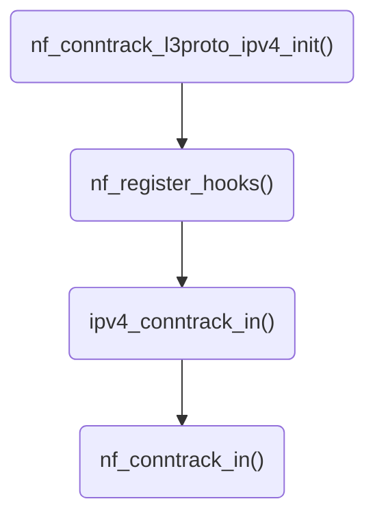
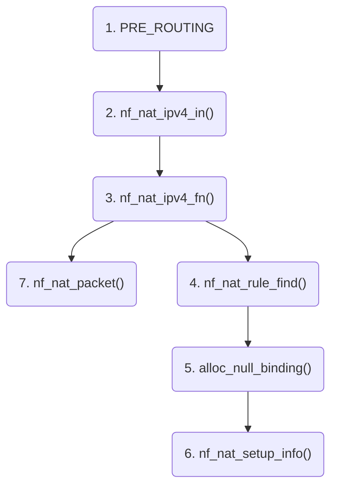

# ConnTrack与NAT源码分析

<show-structure depth="3"/>

> 本文基于Linux kernel v3.10对ConnTrack及NAT工作原理进行分析。

## 1. Netfilter Packet Flow

<procedure>

</procedure>

关注上图中conntrack的位置，包含了很多设计上的考虑。

1. 要跟踪**有效**连接，有效性要求数据包在**进入应用之前**或者**离开网卡之前**要**通过所有检查**。
2. 要**尽可能早**的跟踪连接，越早介入干扰越小。

要达成这些目的，必须确保数据包**通过所有检查**，并且**尽可能早**生成跟踪信息，因此这里涉及一个**开始生成**和**最终确认**的过程。
- **开始生成**
  - `PRE_ROUTING`是**接收方向**的数据包最先到达的地方，因此要在这个点生成跟踪信息。
  - `LOCAL_OUT`是**发送方向**的数据包最先开始的地方，因此要在这个点生成跟踪信息。
- **最终确认**
  - `LOCAL_IN`是数据包**通过所有检查**，**到达应用之前**的最后一个hook点，因此要在这个点确认。
  - `POST_ROUTING`是数据包**通过所有检查**，**离开主机之前**的最后一个hook点，因此要在这个点确认。

## 2. 注册IPv4的conntrack 

### 2.1 nf_conntrack_l3proto_ipv4_init()

`nf_conntrack_l3proto_ipv4_init()`是一个内核模块初始化函数，负责初始化IPv4协议的conntrack支持。具体步骤如下：

```C

static int __init nf_conntrack_l3proto_ipv4_init(void)
{
	int ret = 0;

	need_conntrack();
	nf_defrag_ipv4_enable();

	ret = nf_register_sockopt(&so_getorigdst);
	if (ret < 0) {
		printk(KERN_ERR "Unable to register netfilter socket option\n");
		return ret;
	}

	ret = register_pernet_subsys(&ipv4_net_ops);
	if (ret < 0) {
		pr_err("nf_conntrack_ipv4: can't register pernet ops\n");
		goto cleanup_sockopt;
	}

	ret = nf_register_hooks(ipv4_conntrack_ops,
				ARRAY_SIZE(ipv4_conntrack_ops));
	if (ret < 0) {
		pr_err("nf_conntrack_ipv4: can't register hooks.\n");
		goto cleanup_pernet;
	}

	ret = nf_ct_l4proto_register(&nf_conntrack_l4proto_tcp4);
	if (ret < 0) {
		pr_err("nf_conntrack_ipv4: can't register tcp4 proto.\n");
		goto cleanup_hooks;
	}

	ret = nf_ct_l4proto_register(&nf_conntrack_l4proto_udp4);
	if (ret < 0) {
		pr_err("nf_conntrack_ipv4: can't register udp4 proto.\n");
		goto cleanup_tcp4;
	}

	ret = nf_ct_l4proto_register(&nf_conntrack_l4proto_icmp);
	if (ret < 0) {
		pr_err("nf_conntrack_ipv4: can't register icmpv4 proto.\n");
		goto cleanup_udp4;
	}

	ret = nf_ct_l3proto_register(&nf_conntrack_l3proto_ipv4);
	if (ret < 0) {
		pr_err("nf_conntrack_ipv4: can't register ipv4 proto.\n");
		goto cleanup_icmpv4;
	}

#if defined(CONFIG_PROC_FS) && defined(CONFIG_NF_CONNTRACK_PROC_COMPAT)
	ret = nf_conntrack_ipv4_compat_init();
	if (ret < 0)
		goto cleanup_proto;
#endif
	return ret;
#if defined(CONFIG_PROC_FS) && defined(CONFIG_NF_CONNTRACK_PROC_COMPAT)
 cleanup_proto:
	nf_ct_l3proto_unregister(&nf_conntrack_l3proto_ipv4);
#endif
 cleanup_icmpv4:
	nf_ct_l4proto_unregister(&nf_conntrack_l4proto_icmp);
 cleanup_udp4:
	nf_ct_l4proto_unregister(&nf_conntrack_l4proto_udp4);
 cleanup_tcp4:
	nf_ct_l4proto_unregister(&nf_conntrack_l4proto_tcp4);
 cleanup_hooks:
	nf_unregister_hooks(ipv4_conntrack_ops, ARRAY_SIZE(ipv4_conntrack_ops));
 cleanup_pernet:
	unregister_pernet_subsys(&ipv4_net_ops);
 cleanup_sockopt:
	nf_unregister_sockopt(&so_getorigdst);
	return ret;
}
```
{collapsible="true" collapsed-title="nf_conntrack_l3proto_ipv4_init()" default-state="collapsed"}

1. **调用`need_conntrack()`**：表示该功能需要连接跟踪的支持。
2. **启用IPv4分片重组（defragmentation）**：通过调用`nf_defrag_ipv4_enable()`开启对IPv4数据包分片的重组功能。
3. **注册获取原始目的地地址的套接字选项**：调用`nf_register_sockopt(&so_getorigdst)`允许用户空间程序通过套接字选项获取经过NAT转换后数据包的原始目的地地址。
4. **注册网络命名空间子系统操作**：调用`register_pernet_subsys(&ipv4_net_ops)`将IPv4连接跟踪的相关操作注册到网络命名空间子系统中。
5. **注册Netfilter钩子**：调用`nf_register_hooks(ipv4_conntrack_ops, ARRAY_SIZE(ipv4_conntrack_ops))`，将IPv4连接跟踪的处理函数注册到Netfilter框架的不同钩子点上。
6. **注册四层协议处理模块**：分别注册TCP、UDP和ICMPv4的四层协议处理模块，这些模块用于在连接跟踪过程中处理不同类型的IPv4数据包。
7. **注册三层协议处理模块**：最后注册三层协议处理模块，即IPv4协议本身。
8. 若配置支持，初始化proc文件系统兼容接口。
9. 如果上述任何一步失败，则按照反向顺序进行清理，如取消注册已注册的模块、钩子以及sockopt等。

整个过程确保了IPv4协议及其常用上层协议（TCP、UDP、ICMP）的连接跟踪功能能够正确地初始化并集成到Linux内核的Netfilter子系统中。

### 2.2. conntrack相关逻辑

从`nf_conntrack_l3proto_ipv4_init()`追踪，可以得出如下调用关系。




```C

/* Connection tracking may drop packets, but never alters them, so
   make it the first hook. */
static struct nf_hook_ops ipv4_conntrack_ops[] __read_mostly = {
	{
		.hook		= ipv4_conntrack_in,
		.owner		= THIS_MODULE,
		.pf		= NFPROTO_IPV4,
		.hooknum	= NF_INET_PRE_ROUTING,
		.priority	= NF_IP_PRI_CONNTRACK,
	},
	{
		.hook		= ipv4_conntrack_local,
		.owner		= THIS_MODULE,
		.pf		= NFPROTO_IPV4,
		.hooknum	= NF_INET_LOCAL_OUT,
		.priority	= NF_IP_PRI_CONNTRACK,
	},
	{
		.hook		= ipv4_helper,
		.owner		= THIS_MODULE,
		.pf		= NFPROTO_IPV4,
		.hooknum	= NF_INET_POST_ROUTING,
		.priority	= NF_IP_PRI_CONNTRACK_HELPER,
	},
	{
		.hook		= ipv4_confirm,
		.owner		= THIS_MODULE,
		.pf		= NFPROTO_IPV4,
		.hooknum	= NF_INET_POST_ROUTING,
		.priority	= NF_IP_PRI_CONNTRACK_CONFIRM,
	},
	{
		.hook		= ipv4_helper,
		.owner		= THIS_MODULE,
		.pf		= NFPROTO_IPV4,
		.hooknum	= NF_INET_LOCAL_IN,
		.priority	= NF_IP_PRI_CONNTRACK_HELPER,
	},
	{
		.hook		= ipv4_confirm,
		.owner		= THIS_MODULE,
		.pf		= NFPROTO_IPV4,
		.hooknum	= NF_INET_LOCAL_IN,
		.priority	= NF_IP_PRI_CONNTRACK_CONFIRM,
	},
};
```
{collapsible="true" collapsed-title="ipv4_conntrack_ops[]" default-state="collapsed"}

```C
// /Users/kangxiaoning/workspace/linux-3.10/net/netfilter/nf_conntrack_core.c

// nf_conntrack_in是网络连接跟踪模块的核心函数，它处理进入的数据包并决定是否跟踪其连接状态。
unsigned int nf_conntrack_in(struct net *net, u_int8_t pf, unsigned int hooknum,
		struct sk_buff *skb)
{
    // 定义局部变量，包括待处理的nf_conn结构体指针(ct)、可能存在的模板结构体指针(tmpl)、连接跟踪信息枚举(ctinfo)等。
    struct nf_conn *ct, *tmpl = NULL;
    enum ip_conntrack_info ctinfo;
    // 获取三层协议（如IPv4/6）和四层协议（如TCP/UDP）处理模块。
    struct nf_conntrack_l3proto *l3proto;
    struct nf_conntrack_l4proto *l4proto;
    // 定义超时策略数组指针(timeouts)，用于存储不同连接阶段的超时时间。
    unsigned int *timeouts;
    // 数据偏移量(dataoff)和协议号(protonum)初始化为0。
    unsigned int dataoff;
    u_int8_t protonum;
    // set_reply标志，表示是否已接收到连接的回复数据包。
    int set_reply = 0;
    // 定义返回值ret，表示对数据包的处理结果。

    // 检查skb是否已关联nf_conn结构体，若已关联且不是模板，则忽略此数据包，并统计ignore计数器。
    if (skb->nfct) {
        tmpl = (struct nf_conn *)skb->nfct;
        if (!nf_ct_is_template(tmpl)) {
            NF_CT_STAT_INC_ATOMIC(net, ignore);
            return NF_ACCEPT;
        }
        skb->nfct = NULL; // 清除skb中关联的nf_conn指针，准备重新处理。
    }

    // 获取当前协议族对应的三层协议处理模块，并尝试获取四层协议相关信息。
    l3proto = __nf_ct_l3proto_find(pf);
    ret = l3proto->get_l4proto(skb, skb_network_offset(skb),
                               &dataoff, &protonum);
    // 如果获取失败（例如不支持的协议或错误发生），打印调试信息并更新统计计数器，然后根据错误码返回处理结果。
    if (ret <= 0) {
        pr_debug("not prepared to track yet or error occurred\n");
        NF_CT_STAT_INC_ATOMIC(net, error);
        NF_CT_STAT_INC_ATOMIC(net, invalid);
        ret = -ret;
        goto out;
    }

    // 获取四层协议处理模块。
    l4proto = __nf_ct_l4proto_find(pf, protonum);

    // 若四层协议处理模块提供了错误回调函数，调用该函数处理可能的错误或特殊类型的数据包。
    if (l4proto->error != NULL) {
        ret = l4proto->error(net, tmpl, skb, dataoff, &ctinfo,
                             pf, hooknum);
        // 如果处理返回负数或零，说明无法正常跟踪或需要丢弃数据包，更新统计计数器并返回处理结果。
        if (ret <= 0) {
            NF_CT_STAT_INC_ATOMIC(net, error);
            NF_CT_STAT_INC_ATOMIC(net, invalid);
            ret = -ret;
            goto out;
        }
        // 若ICMP[v6]等协议处理模块已为数据包分配了nf_conn，则跳转到out标签进行后续处理。
        if (skb->nfct)
            goto out;
    }

    // 尝试解析或创建一个正常的nf_conn结构体来跟踪此次连接交互。
    ct = resolve_normal_ct(net, tmpl, skb, dataoff, pf, protonum,
                           l3proto, l4proto, &set_reply, &ctinfo);
    // 如果无法创建有效的nf_conn结构体，说明数据包不属于任何已知连接，更新invalid计数器并接受数据包。
    if (!ct) {
        NF_CT_STAT_INC_ATOMIC(net, invalid);
        ret = NF_ACCEPT;
        goto out;
    }

    // 如果resolve_normal_ct返回的是错误（通过IS_ERR宏判断），则表明系统资源紧张无法处理，丢弃数据包并更新drop计数器。
    if (IS_ERR(ct)) {
        NF_CT_STAT_INC_ATOMIC(net, drop);
        ret = NF_DROP;
        goto out;
    }

    // 确保skb已关联nf_conn结构体。
    NF_CT_ASSERT(skb->nfct);

    // 根据协议及连接状态查找并获取适用于当前连接的超时策略数组。
    timeouts = nf_ct_timeout_lookup(net, ct, l4proto);

    // 调用四层协议处理模块的packet函数深度处理数据包内容，更新连接状态等信息。
    ret = l4proto->packet(ct, skb, dataoff, ctinfo, pf, hooknum, timeouts);
    // 如果处理失败，释放nf_conn引用，清空skb中的nf_conn指针，并更新统计计数器，最后返回处理结果。
    if (ret <= 0) {
        pr_debug("nf_conntrack_in: Can't track with proto module\n");
        nf_conntrack_put(skb->nfct);
        skb->nfct = NULL;
        NF_CT_STAT_INC_ATOMIC(net, invalid);
        if (ret == -NF_DROP)
            NF_CT_STAT_INC_ATOMIC(net, drop);
        ret = -ret;
        goto out;
    }

    // 如果这是连接的回复数据包并且之前未标记过，则更新连接状态并触发事件通知。
    if (set_reply && !test_and_set_bit(IPS_SEEN_REPLY_BIT, &ct->status))
        nf_conntrack_event_cache(IPCT_REPLY, ct);

out:
    // 清理模板引用。如果需要重复处理该数据包（nf_repeat），则重新将tmpl赋值给skb；否则释放tmpl引用。
    if (tmpl) {
        if (ret == NF_REPEAT)
            skb->nfct = (struct nf_conntrack *)tmpl;
        else
            nf_ct_put(tmpl);
    }

    // 返回处理结果。
    return ret;
}
```
{collapsible="true" collapsed-title="nf_conntrack_in()" default-state="collapsed"}

`nf_conntrack_in()`的主要作用是对进入的数据包进行连接跟踪处理，以实现对网络连接状态的维护和控制。


```C
// /Users/kangxiaoning/workspace/linux-3.10/net/netfilter/nf_conntrack_core.c

// resolve_normal_ct函数用于根据给定的数据包信息查找或创建一个新的nf_conn结构体，用于连接跟踪。若成功，返回nf_conn指针，并将连接跟踪信息设置到skb和ctinfo中。

static inline struct nf_conn * // 返回类型为nf_conn结构体指针
resolve_normal_ct(struct net *net, // 当前网络子系统结构体
		  struct nf_conn *tmpl, // 可选的模板连接跟踪结构体（如SNAT/DNAT）
		  struct sk_buff *skb, // 数据包结构体
		  unsigned int dataoff, // 四层协议头部偏移量
		  u_int16_t l3num, // 三层协议号（例如IPPROTO_IP、IPPROTO_IPV6等）
		  u_int8_t protonum, // 四层协议号（例如TCP、UDP等）
		  struct nf_conntrack_l3proto *l3proto, // 三层协议处理模块
		  struct nf_conntrack_l4proto *l4proto, // 四层协议处理模块
		  int *set_reply, // 指示是否是回复方向数据包的标志
		  enum ip_conntrack_info *ctinfo) // 连接跟踪信息枚举值

{
    // 创建一个nf_conntrack_tuple结构体来存储当前数据包的关键信息。
    struct nf_conntrack_tuple tuple;
    // 定义指向nf_conntrack_tuple_hash结构体的指针，该结构体包含连接跟踪元组及nf_conn引用。
    struct nf_conntrack_tuple_hash *h;
    // 定义nf_conn结构体指针。
    struct nf_conn *ct;

    // 获取用于确定区域的zone值，如果tmpl存在，则使用tmpl关联的区域，否则使用默认区域。
    u16 zone = tmpl ? nf_ct_zone(tmpl) : NF_CT_DEFAULT_ZONE;
    // 计算连接跟踪元组的哈希值。
    u32 hash;

    // 根据skb中的数据获取并填充nf_conntrack_tuple结构体，若失败则打印错误信息并返回NULL。
    if (!nf_ct_get_tuple(skb, skb_network_offset(skb),
			     dataoff, l3num, protonum, &tuple, l3proto,
			     l4proto)) {
        pr_debug("resolve_normal_ct: Can't get tuple\n");
        return NULL;
    }

    // 查找与当前元组匹配的nf_conntrack_tuple_hash结构体。
    hash = hash_conntrack_raw(&tuple, zone);
    h = __nf_conntrack_find_get(net, zone, &tuple, hash);

    // 若未找到匹配项，则尝试初始化新的连接跟踪条目。
    if (!h) {
        h = init_conntrack(net, tmpl, &tuple, l3proto, l4proto,
                           skb, dataoff, hash);
        // 初始化失败，返回NULL。
        if (!h)
            return NULL;
        // 如果初始化过程中出现错误，转换为错误指针并返回。
        if (IS_ERR(h))
            return (void *)h;
    }
    // 将找到或新建的nf_conntrack_tuple_hash结构体转换为nf_conn结构体指针。
    ct = nf_ct_tuplehash_to_ctrack(h);

    // 已经找到了对应的连接跟踪条目，对数据包的方向进行判断：
    if (NF_CT_DIRECTION(h) == IP_CT_DIR_REPLY) {
        // 若为回复方向数据包，则设置连接跟踪信息为已建立的回复状态。
        *ctinfo = IP_CT_ESTABLISHED_REPLY;
        // 请求在后续处理中设置回复位（如果此数据包有效）。
        *set_reply = 1;
    } else {
        // 若双向通信已完成（即已收到回复），始终认为是已建立状态。
        if (test_bit(IPS_SEEN_REPLY_BIT, &ct->status)) {
            pr_debug("nf_conntrack_in: normal packet for %p\n", ct);
            *ctinfo = IP_CT_ESTABLISHED;
        } else if (test_bit(IPS_EXPECTED_BIT, &ct->status)) {
            // 若该数据包属于相关联的连接（如FTP辅助数据流），则设置为相关状态。
            pr_debug("nf_conntrack_in: related packet for %p\n", ct);
            *ctinfo = IP_CT_RELATED;
        } else {
            // 若为新连接的第一个数据包，则设置为新建状态。
            pr_debug("nf_conntrack_in: new packet for %p\n", ct);
            *ctinfo = IP_CT_NEW;
        }
        // 非回复方向数据包，默认设置set_reply为0。
        *set_reply = 0;
    }

    // 将nf_conn结构体地址赋值给skb的nfct字段，便于后续引用。
    skb->nfct = &ct->ct_general;
    // 设置skb的nfctinfo字段，记录当前数据包在连接中的状态。
    skb->nfctinfo = *ctinfo;

    // 最后返回nf_conn结构体指针。
    return ct;
}
```
{collapsible="true" collapsed-title="resolve_normal_ct()" default-state="collapsed"}

## 4. NAT原理

### 4.1 NAT hook点及处理函数

```C
// /Users/kangxiaoning/workspace/linux-3.10/net/ipv4/netfilter/iptable_nat.c
static struct nf_hook_ops nf_nat_ipv4_ops[] __read_mostly = {
	/* Before packet filtering, change destination */
	{
		.hook		= nf_nat_ipv4_in,
		.owner		= THIS_MODULE,
		.pf		= NFPROTO_IPV4,
		.hooknum	= NF_INET_PRE_ROUTING,
		.priority	= NF_IP_PRI_NAT_DST,
	},
	/* After packet filtering, change source */
	{
		.hook		= nf_nat_ipv4_out,
		.owner		= THIS_MODULE,
		.pf		= NFPROTO_IPV4,
		.hooknum	= NF_INET_POST_ROUTING,
		.priority	= NF_IP_PRI_NAT_SRC,
	},
	/* Before packet filtering, change destination */
	{
		.hook		= nf_nat_ipv4_local_fn,
		.owner		= THIS_MODULE,
		.pf		= NFPROTO_IPV4,
		.hooknum	= NF_INET_LOCAL_OUT,
		.priority	= NF_IP_PRI_NAT_DST,
	},
	/* After packet filtering, change source */
	{
		.hook		= nf_nat_ipv4_fn,
		.owner		= THIS_MODULE,
		.pf		= NFPROTO_IPV4,
		.hooknum	= NF_INET_LOCAL_IN,
		.priority	= NF_IP_PRI_NAT_SRC,
	},
};
```
{collapsible="true" collapsed-title="nf_nat_ipv4_ops[]" default-state="collapsed"}

这段代码是`nf_nat_ipv4_ops`的定义，包了四个`nf_hook_ops`结构体实例，用于在Netfilter框架中注册钩子函数，以便在网络数据包处理的不同阶段执行相应的NAT操作。

`nf_hook_ops`解释如下：
- `.hook`：指向一个函数指针，当数据包到达对应的网络过滤点时会调用此函数。这里分别定义了四种不同的处理函数：
  - `nf_nat_ipv4_in`：在数据包进入本地网络之前进行目标IP地址的DNAT转换，即改变目的地址。
  - `nf_nat_ipv4_out`：在数据包离开本地网络后进行源IP地址的SNAT转换，即改变源地址。
  - `nf_nat_ipv4_local_fn`：对于本地生成并即将离开主机的数据包，在输出前执行目标IP地址的DNAT转换。
  - `nf_nat_ipv4_fn`：对于进入本地主机的数据包，在输入后执行源IP地址的SNAT转换。
- `.owner`：标识当前模块，这里是`THIS_MODULE`，表示这些钩子函数属于当前正在初始化的内核模块。
- `.pf`：定义了协议族，这里是`NFPROTO_IPV4`，表明这些钩子函数适用于IPv4协议的数据包。
- `.hooknum`：指定了Netfilter框架中的特定钩子点位置，包括：
  - `NF_INET_PRE_ROUTING`：预路由阶段，数据包刚进入系统还未进行路由决策时。
  - `NF_INET_POST_ROUTING`：后路由阶段，数据包已确定路由准备离开本地网络时。
  - `NF_INET_LOCAL_OUT`：本地输出阶段，数据包由本地进程生成并准备发送出去时。
  - `NF_INET_LOCAL_IN`：本地输入阶段，数据包已经到达本地主机，并经过初步处理后。
- `.priority`：定义了钩子函数在对应钩子点上的优先级，这里设置为与NAT相关的优先级值`NF_IP_PRI_NAT_DST`和`NF_IP_PRI_NAT_SRC`，确保这些NAT操作能够按照预期顺序执行。

通过注册一系列的Netfilter钩子函数，实现了在IPv4网络数据包的不同处理阶段执行必要的NAT转换功能，具体注册代码如下。

```C
// /Users/kangxiaoning/workspace/linux-3.10/net/ipv4/netfilter/iptable_nat.c

static int __init iptable_nat_init(void)
{
	int err;

	err = register_pernet_subsys(&iptable_nat_net_ops);
	if (err < 0)
		goto err1;

	err = nf_register_hooks(nf_nat_ipv4_ops, ARRAY_SIZE(nf_nat_ipv4_ops));
	if (err < 0)
		goto err2;
	return 0;

err2:
	unregister_pernet_subsys(&iptable_nat_net_ops);
err1:
	return err;
}
```
{collapsible="true" collapsed-title="iptable_nat_init()" default-state="collapsed"}

### 4.2 Iptables NAT初始化
Linux内核模块初始化时会执行`iptable_nat_init()`，用于初始化iptables的NAT功能，这个函数会在Netfilter框架中注册钩子函数，这样就可以捕获数据包并对其进行修。

- Netfilter hooks注册

Netfilter钩子注册的代码如下，可以看到除了NF_INET_FORWARD外其他挂载点都注册了钩子函数。

```C
nf_register_hooks(nf_nat_ipv4_ops, ARRAY_SIZE(nf_nat_ipv4_ops));
```
它将一组Netfilter钩子函数`nf_nat_ipv4_ops`注册到内核的Netfilter框架中。`nf_nat_ipv4_ops`是一个包含多个Netfilter钩子处理函数指针的数组，这些函数在数据包通过不同阶段时执行，负责实现IPv4协议下的DNAT、SNAT等功能。`ARRAY_SIZE(nf_nat_ipv4_ops)`用来获取这个数组中的元素个数，确保正确注册所有钩子函数。

### 4.3 DNAT实现逻辑

根据`nf_nat_ipv4_ops`可以找到对应hook点要执行的函数，对于DNAT，有如下两条路，最终都会调用到`nf_nat_ipv4_fn()`函数。


```C
// 定义一个静态函数nf_nat_ipv4_fn，用于处理IPv4的NAT转换
static unsigned int nf_nat_ipv4_fn(unsigned int hooknum,
    // 参数hooknum表示Netfilter框架中的钩子点编号（如预路由、后路由等）
    struct sk_buff *skb, // 参数skb指向要处理的数据包结构体
    const struct net_device *in, // 参数in指向数据包进入的网络设备
    const struct net_device *out, // 参数out指向数据包离开的网络设备
    int (*okfn)(struct sk_buff *)) // 参数okfn是一个指向回调函数的指针，在处理完成后调用该函数

{
    // 获取与当前数据包关联的连接跟踪信息及其状态
    struct nf_conn *ct = nf_ct_get(skb, &ctinfo);

    // 如果无法获取到连接跟踪信息，则说明此数据包无需进行NAT，直接接受该数据包
    if (!ct)
        return NF_ACCEPT;

    // 检查连接是否被标记为未追踪，如果是则不执行NAT操作
    if (nf_ct_is_untracked(ct))
        return NF_ACCEPT;

    // 获取或初始化与连接相关的NAT扩展结构体
    struct nf_conn_nat *nat = nfct_nat(ct);
    if (!nat) {
        if (nf_ct_is_confirmed(ct)) // 如果连接已被确认，则接受该数据包
            return NF_ACCEPT;
        nat = nf_ct_ext_add(ct, NF_CT_EXT_NAT, GFP_ATOMIC); // 添加NAT扩展结构体
        if (!nat) { // 添加失败时，打印错误并接受数据包
            pr_debug("failed to add NAT extension\n");
            return NF_ACCEPT;
        }
    }

    // 根据连接跟踪的状态信息进行不同的处理
    switch (ctinfo) {
    case IP_CT_RELATED:
    case IP_CT_RELATED_REPLY:
        // 对于ICMP协议，执行特定的回复报文翻译处理
        if (ip_hdr(skb)->protocol == IPPROTO_ICMP) {
            if (!nf_nat_icmp_reply_translation(skb, ct, ctinfo, hooknum))
                return NF_DROP; // 翻译失败时丢弃数据包
            else
                return NF_ACCEPT; // 翻译成功则接受数据包
        }
        // 非ICMP协议，继续处理其他相关/相关回复类型的数据包
        /* Fall thru... (Only ICMPs can be IP_CT_IS_REPLY) */

    case IP_CT_NEW: // 新建连接
        // 如果NAT还未初始化，则查找和应用相应的NAT规则
        if (!nf_nat_initialized(ct, HOOK2MANIP(hooknum))) {
            unsigned int ret = nf_nat_rule_find(skb, hooknum, in, out, ct);
            if (ret != NF_ACCEPT)
                return ret; // 如果查找规则失败，返回相应的错误结果
        } else {
            // 如果NAT已初始化，检查输出接口是否发生变化
            pr_debug("Already setup manip %s for ct %p\n",
                    HOOK2MANIP(hooknum) == NF_NAT_MANIP_SRC ? "SRC" : "DST", ct);
            if (nf_nat_oif_changed(hooknum, ctinfo, nat, out))
                goto oif_changed; // 输出接口变化时跳转到oif_changed标签处
        }
        break;

    default:
        // 已建立的连接
        NF_CT_ASSERT(ctinfo == IP_CT_ESTABLISHED ||
                     ctinfo == IP_CT_ESTABLISHED_REPLY);
        // 检查输出接口是否发生变化
        if (nf_nat_oif_changed(hooknum, ctinfo, nat, out))
            goto oif_changed;
    }

    // 执行具体的NAT转换操作
    return nf_nat_packet(ct, ctinfo, hooknum, skb);

// 输出接口发生改变时的处理部分
oif_changed:
    // 终止连接跟踪并清理统计信息
    nf_ct_kill_acct(ct, ctinfo, skb);
    // 丢弃数据包
    return NF_DROP;
}
```
{collapsible="true" collapsed-title="nf_nat_ipv4_fn()" default-state="collapsed"}

```C
// nf_nat_packet函数负责根据nf_nat_setup_info设置的信息对网络数据包进行操作（如源NAT或目标NAT）。
unsigned int nf_nat_packet(struct nf_conn *ct, // 当前连接跟踪条目指针
			   enum ip_conntrack_info ctinfo, // 连接跟踪信息，包括数据包方向等
			   unsigned int hooknum, // Netfilter钩子点编号，用于判断是SNAT还是DNAT
			   struct sk_buff *skb) // 待处理的数据包结构体

{
    const struct nf_nat_l3proto *l3proto; // 指向三层协议（如IPv4/IPv6）的NAT处理模块
    const struct nf_nat_l4proto *l4proto; // 指向四层协议（如TCP/UDP）的NAT处理模块
    enum ip_conntrack_dir dir = CTINFO2DIR(ctinfo); // 获取数据包在连接中的方向
    unsigned long statusbit; // 标记是否需要执行NAT转换
    enum nf_nat_manip_type mtype = HOOK2MANIP(hooknum); // 获取NAT类型（源地址转换或目标地址转换）

    // 根据hooknum确定是否为源NAT，并计算相应的状态位
    if (mtype == NF_NAT_MANIP_SRC)
        statusbit = IPS_SRC_NAT;
    else
        statusbit = IPS_DST_NAT;

    // 如果是回复方向的数据包，则反转NAT类型的状态位
    if (dir == IP_CT_DIR_REPLY)
        statusbit ^= IPS_NAT_MASK;

    // 非原子操作：检查连接状态中是否有需要执行的NAT标记
    if (ct->status & statusbit) {

        // 获取当前数据包反向（即初始方向）的连接跟踪元组
        struct nf_conntrack_tuple target;
        nf_ct_invert_tuplepr(&target, &ct->tuplehash[!dir].tuple);

        // 查找对应的三层和四层协议NAT处理模块
        l3proto = __nf_nat_l3proto_find(target.src.l3num);
        l4proto = __nf_nat_l4proto_find(target.src.l3num, target.dst.protonum);

        // 调用三层协议的manip_pkt函数来实际修改数据包内容，使其符合NAT规则
        if (!l3proto->manip_pkt(skb, 0, l4proto, &target, mtype))
            return NF_DROP; // 若修改失败，则丢弃该数据包
    }

    // 数据包成功通过NAT处理，返回NF_ACCEPT
    return NF_ACCEPT;
}
```
{collapsible="true" collapsed-title="nf_nat_packet()" default-state="collapsed"}

`nf_nat_packet()`是Linux内核Netfilter子系统中NAT的核心逻辑。它负责检查和执行对经过特定钩子点的数据包进行源或目标地址的转换。
1. 首先，根据传入的`hooknum`参数确定需要执行的NAT类型（SNAT或DNAT），并计算相应的状态位标志。
2. 根据数据包的方向信息调整状态位标志，因为对于连接回复方向的数据包，需要做的可能是相反类型的NAT（例如，如果原始数据包做了SNAT，则其响应数据包应做DNAT）。
3. 检查当前连接跟踪条目(`ct`)的状态是否包含需要进行NAT转换的标志。如果有，则继续执行NAT转换操作；否则，直接接受该数据包。
4. 获取数据包反向（即初始方向）的连接跟踪元组，这将作为NAT的目标参考。
5. 查找适用于该数据包三层协议（如IPv4/IPv6）和四层协议（如TCP/UDP）的NAT处理模块。
6. 调用三层协议处理模块提供的`manip_pkt`函数来实际修改数据包的内容，使其符合目标NAT规则。这个函数会根据四层协议处理模块和目标NAT规则更新数据包中的IP地址和端口号等信息。
7. 如果`manip_pkt`函数成功执行（返回非零值），说明数据包已成功进行了NAT转换，所以返回`NF_ACCEPT`，表示允许数据包通过。如果`manip_pkt`失败（返回0），则表示无法正确地进行NAT处理，因此返回`NF_DROP`，表明应该丢弃该数据包。


### 4.4 根据iptables规则设置conntrack

从PRE_ROUTING开始，分析下iptables规则是如何执行的。



```C
// 定义nf_nat_setup_info函数，用于设置给定连接（ct）的NAT信息，并根据指定的范围(range)和操纵类型(maniptype)进行转换。
unsigned int nf_nat_setup_info(struct nf_conn *ct,
                              const struct nf_nat_range *range,
                              enum nf_nat_manip_type maniptype)

{
    // 获取当前网络命名空间结构体指针
    struct net *net = nf_ct_net(ct);

    // 初始化当前连接的元组（curr_tuple），其内容是回复方向的反向元组
    struct nf_conntrack_tuple curr_tuple, new_tuple;
    struct nf_conn_nat *nat;

    // 检查是否已存在NAT扩展结构体。如果没有，则尝试添加一个
    nat = nfct_nat(ct);
    if (!nat) {
        nat = nf_ct_ext_add(ct, NF_CT_EXT_NAT, GFP_ATOMIC);
        if (nat == NULL) {
            pr_debug("failed to add NAT extension\n");
            return NF_ACCEPT; // 如果添加失败，返回NF_ACCEPT表示继续处理
        }
    }

    // 确保操纵类型正确（源地址或目标地址）
    NF_CT_ASSERT(maniptype == NF_NAT_MANIP_SRC || maniptype == NF_NAT_MANIP_DST);
    BUG_ON(nf_nat_initialized(ct, maniptype)); // 若已初始化过该类型的NAT则报错

    // 反转回复方向的元组以获取原始方向的元组
    nf_ct_invert_tuplepr(&curr_tuple, &ct->tuplehash[IP_CT_DIR_REPLY].tuple);

    // 根据提供的范围、连接及操纵类型计算新的转换后的元组
    get_unique_tuple(&new_tuple, &curr_tuple, range, ct, maniptype);

    // 如果新旧元组不相等（需要进行NAT转换）
    if (!nf_ct_tuple_equal(&new_tuple, &curr_tuple)) {

        // 计算并更新连接跟踪表中用于识别回复数据包的新回复元组
        struct nf_conntrack_tuple reply;
        nf_ct_invert_tuplepr(&reply, &new_tuple);
        nf_conntrack_alter_reply(ct, &reply);

        // 更新连接状态标志，记录已经执行了SRC_NAT或DST_NAT操作
        if (maniptype == NF_NAT_MANIP_SRC)
            ct->status |= IPS_SRC_NAT;
        else
            ct->status |= IPS_DST_NAT;
    }

    // 对于源地址转换(SNAT)，将新建的NAT结构体加入到按源IP哈希的链表中
    if (maniptype == NF_NAT_MANIP_SRC) {
        unsigned int srchash;
        srchash = hash_by_src(net, nf_ct_zone(ct),
                              &ct->tuplehash[IP_CT_DIR_ORIGINAL].tuple);
        spin_lock_bh(&nf_nat_lock);
        /* 由于nf_conntrack_alter_reply可能重新分配了扩展区域，因此再次获取NAT结构体 */
        nat = nfct_nat(ct);
        nat->ct = ct;
        hlist_add_head_rcu(&nat->bysource, &net->ct.nat_bysource[srchash]);
        spin_unlock_bh(&nf_nat_lock);
    }

    // 设置相应类型的NAT操作已完成
    if (maniptype == NF_NAT_MANIP_DST)
        ct->status |= IPS_DST_NAT_DONE;
    else
        ct->status |= IPS_SRC_NAT_DONE;

    // 函数成功执行后返回NF_ACCEPT，表示允许数据包通过
    return NF_ACCEPT;
}
```
{collapsible="true" collapsed-title="nf_nat_setup_info()" default-state="collapsed"}

问题：DNAT信息是从iptables规则来的还是从conntrack记录来的？

答：从上述分析可以看出，Linux内核中处理NAT的函数是根据iptables规则确定的DNAT信息，并结合conntrack记录来执行实际的网络地址转换。
- 当数据包经过Netfilter框架时，iptables规则首先在相应的钩子点上被应用。如果一个数据包与DNAT规则匹配，则会在conntrack中创建或更新一个条目，该条目记录了用于NAT转换的目标IP地址和端口号等信息。
- 然后，在后续的数据包处理过程中，如`nf_nat_packet()`这样的函数会使用之前由iptables规则生成并存储在conntrack表中的NAT配置信息来修改数据包的内容，实现NAT。

总结一下，iptables规则定义了NAT应该如何发生，而conntrack则责维护这些规则应用后的状态，并确保双向通信过程中的地址一致性。两者紧密结合共同完成了Linux内核中的NAT功能。

## 5. UDP的conntrack

在Linux内核的Netfilter连接跟踪子系统中，`nf_conntrack_tuple`结构体用于存储网络数据包的关键信息以唯一标识一个网络连接的方向。对于UDP协议，`nf_conntrack_tuple`结构通常包含以下信息：

- **源IP地址**（sip）：发送方IP地址。
- **目标IP地址**（dip）：接收方IP地址。
- **源端口号**（sport）：发送方使用的UDP端口号。
- **目的端口号**（dport）：接收方监听的UDP端口号。
- **协议号**（proto）：在网络层通常是IPPROTO_UDP。

根据上术信息，得出如下结论
1. 如果上述tuple的所有信息都相同，那么会命中同一个conntrack记录。
 
## 6. 案例分析

在kubernetes环境中，使用UDP协议解析域名，`coreDNS`异常重启，出现如下情况。
1. 应用POD的`resolv.conf`文件中的nameserver配置相同的VIP，因此`nf_conntrack_tuple`中的`dip/dport/proto`都相同。
2. 如果应用IP和端口号不变，也就是`nf_conntrack_tuple`中的`sip/sport`也相同，那发送方向的`nf_conntrack_tuple`的所有元素都相同了。
3. 此时`coreDNS`重启。
4. 如果上述应用持续向`coreDNS`发送请求，可能会命中kernel bug，导致无效conntrack记录未删除。
5. 因为发送方向上`nf_conntrack_tuple`的所有元素都相同，新的DNS解析数据包，命中无效的conntrack记录。

此时会导致什么问题？

答：根据上述分析，此时会导致DNAT出错，比如将数据包的目标地址修改为POD重启前的IP。

