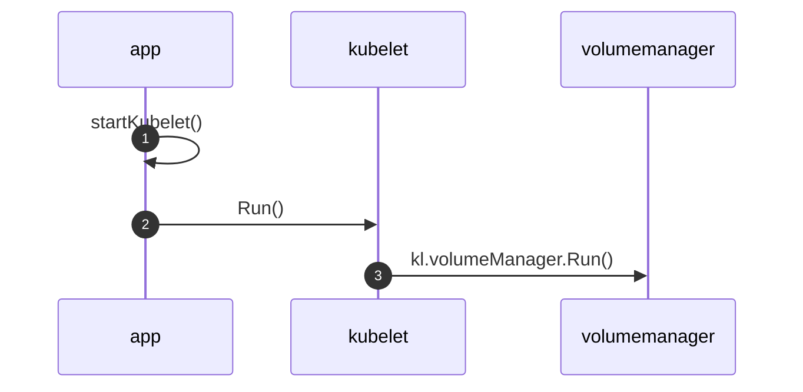
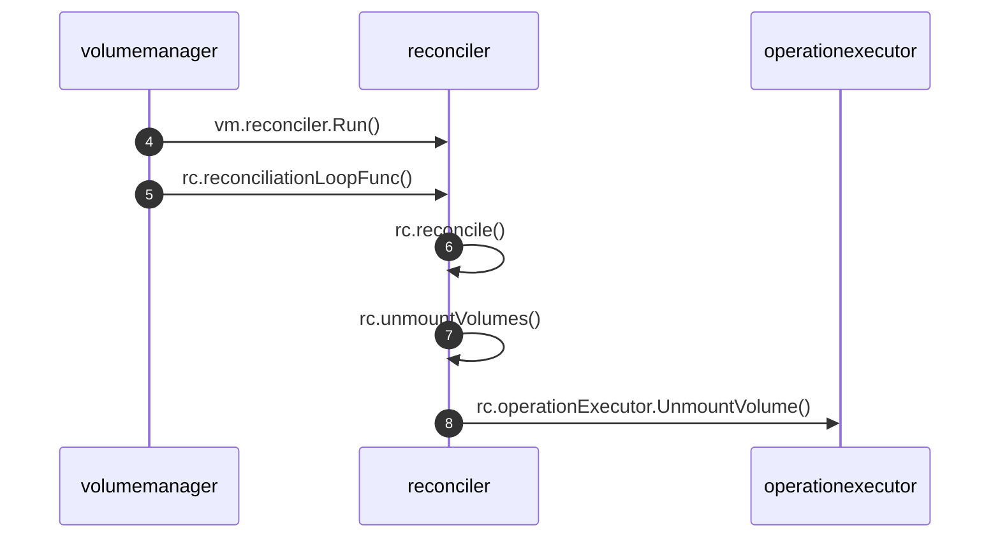
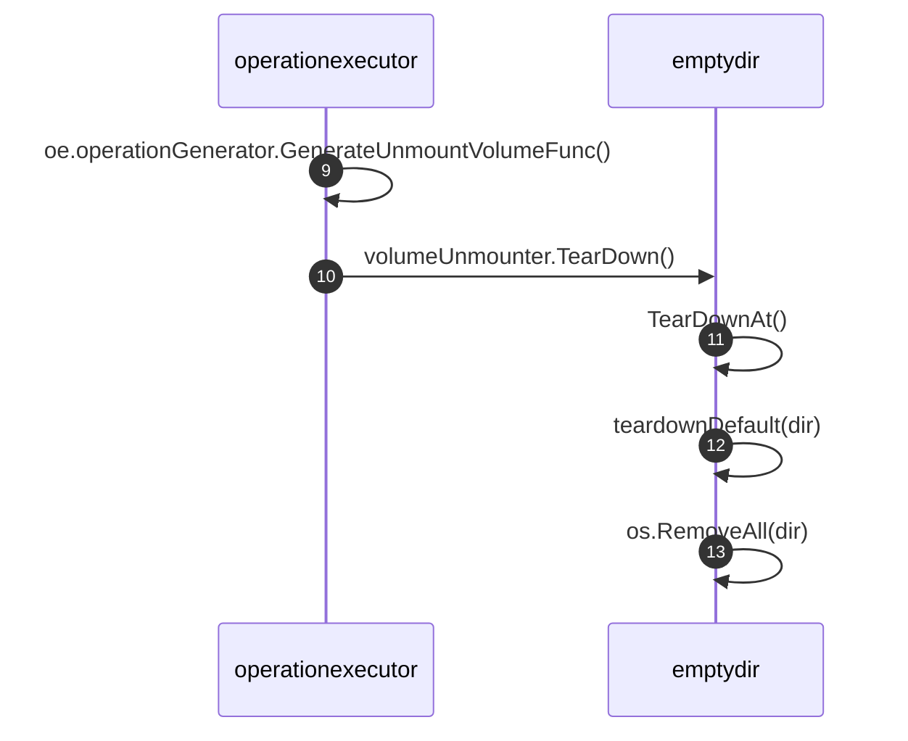

# EmptyDir的生命周期

<show-structure depth="2"/>

## 1. 创建过程

略。

## 2. 删除过程

Kubelet在启动过程中，会单独运行一个goroutine执行**volumeManager.Run()**，从名字也能看出来，它负责该节点上的volume管理。如果是新建Pod，它就准备Pod中定义的存储设备，挂载存储设备到Pod所在的节点上，最后挂载到容器指定的目录中。如果是删除Pod，它会通过Volume Plugins来实现存储卷的管理操作，比如卸载不再使用的存储，删除EmptyDir目录等。


### 2.1 启动kubelet

`startKubelet()`调用`go k.Run(podCfg.Updates())`启动kubelet。

```Go
func startKubelet(k kubelet.Bootstrap, podCfg *config.PodConfig, kubeCfg *kubeletconfiginternal.KubeletConfiguration, kubeDeps *kubelet.Dependencies, enableCAdvisorJSONEndpoints, enableServer bool) {
	// start the kubelet
	go k.Run(podCfg.Updates())

	// start the kubelet server
	if enableServer {
		go k.ListenAndServe(net.ParseIP(kubeCfg.Address), uint(kubeCfg.Port), kubeDeps.TLSOptions, kubeDeps.Auth,
			enableCAdvisorJSONEndpoints, kubeCfg.EnableDebuggingHandlers, kubeCfg.EnableContentionProfiling, kubeCfg.EnableSystemLogHandler)

	}
	if kubeCfg.ReadOnlyPort > 0 {
		go k.ListenAndServeReadOnly(net.ParseIP(kubeCfg.Address), uint(kubeCfg.ReadOnlyPort), enableCAdvisorJSONEndpoints)
	}
	if utilfeature.DefaultFeatureGate.Enabled(features.KubeletPodResources) {
		go k.ListenAndServePodResources()
	}
}
```

### 2.2 启动volumeManager

`kubelet.Run()`中调用`go kl.volumeManager.Run()`启动volue manager，它作为一个单独的goroutine运行，并且不会停止，除非kubelet异常。
 
```Go
// Run starts the kubelet reacting to config updates
func (kl *Kubelet) Run(updates <-chan kubetypes.PodUpdate) {
	if kl.logServer == nil {
		kl.logServer = http.StripPrefix("/logs/", http.FileServer(http.Dir("/var/log/")))
	}
	if kl.kubeClient == nil {
		klog.Warning("No api server defined - no node status update will be sent.")
	}

	// Start the cloud provider sync manager
	if kl.cloudResourceSyncManager != nil {
		go kl.cloudResourceSyncManager.Run(wait.NeverStop)
	}

	if err := kl.initializeModules(); err != nil {
		kl.recorder.Eventf(kl.nodeRef, v1.EventTypeWarning, events.KubeletSetupFailed, err.Error())
		klog.Fatal(err)
	}

	// Start volume manager
	go kl.volumeManager.Run(kl.sourcesReady, wait.NeverStop)

	if kl.kubeClient != nil {
		// Start syncing node status immediately, this may set up things the runtime needs to run.
		go wait.Until(kl.syncNodeStatus, kl.nodeStatusUpdateFrequency, wait.NeverStop)
		go kl.fastStatusUpdateOnce()

		// start syncing lease
		go kl.nodeLeaseController.Run(wait.NeverStop)
	}
	go wait.Until(kl.updateRuntimeUp, 5*time.Second, wait.NeverStop)

	// Set up iptables util rules
	if kl.makeIPTablesUtilChains {
		kl.initNetworkUtil()
	}

	// Start a goroutine responsible for killing pods (that are not properly
	// handled by pod workers).
	go wait.Until(kl.podKiller.PerformPodKillingWork, 1*time.Second, wait.NeverStop)

	// Start component sync loops.
	kl.statusManager.Start()
	kl.probeManager.Start()

	// Start syncing RuntimeClasses if enabled.
	if kl.runtimeClassManager != nil {
		kl.runtimeClassManager.Start(wait.NeverStop)
	}

	// Start the pod lifecycle event generator.
	kl.pleg.Start()
	kl.syncLoop(updates, kl)
}
```

### 2.3 volumeManager调协volume
volume manager也会启动一个goroutine运行**reconciler.Run()**，它负责执行volume实际状态与期望状态的调协工作，具体会运行`rc.reconcile()`与`rc.sync()`两个重要的方法，这两个方法最终都会执行`rc.operationExecutor.UnmountVolume()`，用来清理不再使用的volume。

下图只展示了`rc.reconcile()`到`rc.operationExecutor.UnmountVolume()`的代码路径，原理是先获取实际的volume列表，然后执行for循环，每个volume都会与期望状态对比，根据对比结果判断是否要执行后续的unmount操作，对于emptydir来说这个unmount操作最终也会删除对应的目录。



```Go
func (vm *volumeManager) Run(sourcesReady config.SourcesReady, stopCh <-chan struct{}) {
	defer runtime.HandleCrash()

	go vm.desiredStateOfWorldPopulator.Run(sourcesReady, stopCh)
	klog.V(2).Infof("The desired_state_of_world populator starts")

	klog.Infof("Starting Kubelet Volume Manager")
	go vm.reconciler.Run(stopCh)

	metrics.Register(vm.actualStateOfWorld, vm.desiredStateOfWorld, vm.volumePluginMgr)

	if vm.kubeClient != nil {
		// start informer for CSIDriver
		vm.volumePluginMgr.Run(stopCh)
	}

	<-stopCh
	klog.Infof("Shutting down Kubelet Volume Manager")
}
```
{collapsible="true" collapsed-title="volumeManager.Run()" default-state="collapsed"}

```Go
func (rc *reconciler) Run(stopCh <-chan struct{}) {
	wait.Until(rc.reconciliationLoopFunc(), rc.loopSleepDuration, stopCh)
}
```

```Go
func (rc *reconciler) reconciliationLoopFunc() func() {
	return func() {
		rc.reconcile()

		// Sync the state with the reality once after all existing pods are added to the desired state from all sources.
		// Otherwise, the reconstruct process may clean up pods' volumes that are still in use because
		// desired state of world does not contain a complete list of pods.
		if rc.populatorHasAddedPods() && !rc.StatesHasBeenSynced() {
			klog.Infof("Reconciler: start to sync state")
			rc.sync()
		}
	}
}
```

```Go
func (rc *reconciler) reconcile() {
	// Unmounts are triggered before mounts so that a volume that was
	// referenced by a pod that was deleted and is now referenced by another
	// pod is unmounted from the first pod before being mounted to the new
	// pod.
	rc.unmountVolumes()

	// Next we mount required volumes. This function could also trigger
	// attach if kubelet is responsible for attaching volumes.
	// If underlying PVC was resized while in-use then this function also handles volume
	// resizing.
	rc.mountAttachVolumes()

	// Ensure devices that should be detached/unmounted are detached/unmounted.
	rc.unmountDetachDevices()
}
```

```Go
func (rc *reconciler) unmountVolumes() {
	// Ensure volumes that should be unmounted are unmounted.
	for _, mountedVolume := range rc.actualStateOfWorld.GetAllMountedVolumes() {
		if !rc.desiredStateOfWorld.PodExistsInVolume(mountedVolume.PodName, mountedVolume.VolumeName) {
			// Volume is mounted, unmount it
			klog.V(5).Infof(mountedVolume.GenerateMsgDetailed("Starting operationExecutor.UnmountVolume", ""))
			err := rc.operationExecutor.UnmountVolume(
				mountedVolume.MountedVolume, rc.actualStateOfWorld, rc.kubeletPodsDir)
			if err != nil &&
				!nestedpendingoperations.IsAlreadyExists(err) &&
				!exponentialbackoff.IsExponentialBackoff(err) {
				// Ignore nestedpendingoperations.IsAlreadyExists and exponentialbackoff.IsExponentialBackoff errors, they are expected.
				// Log all other errors.
				klog.Errorf(mountedVolume.GenerateErrorDetailed(fmt.Sprintf("operationExecutor.UnmountVolume failed (controllerAttachDetachEnabled %v)", rc.controllerAttachDetachEnabled), err).Error())
			}
			if err == nil {
				klog.Infof(mountedVolume.GenerateMsgDetailed("operationExecutor.UnmountVolume started", ""))
			}
		}
	}
}
```

```Go
func (oe *operationExecutor) UnmountVolume(
	volumeToUnmount MountedVolume,
	actualStateOfWorld ActualStateOfWorldMounterUpdater,
	podsDir string) error {
	fsVolume, err := util.CheckVolumeModeFilesystem(volumeToUnmount.VolumeSpec)
	if err != nil {
		return err
	}
	var generatedOperations volumetypes.GeneratedOperations
	if fsVolume {
		// Filesystem volume case
		// Unmount a volume if a volume is mounted
		generatedOperations, err = oe.operationGenerator.GenerateUnmountVolumeFunc(
			volumeToUnmount, actualStateOfWorld, podsDir)
	} else {
		// Block volume case
		// Unmap a volume if a volume is mapped
		generatedOperations, err = oe.operationGenerator.GenerateUnmapVolumeFunc(
			volumeToUnmount, actualStateOfWorld)
	}
	if err != nil {
		return err
	}
	// All volume plugins can execute unmount/unmap for multiple pods referencing the
	// same volume in parallel
	podName := volumetypes.UniquePodName(volumeToUnmount.PodUID)

	return oe.pendingOperations.Run(
		volumeToUnmount.VolumeName, podName, "" /* nodeName */, generatedOperations)
}
```

`GenerateUnmountVolumeFunc()`中会获取volume plugin，执行`unmount`操作。

```Go
func (og *operationGenerator) GenerateUnmountVolumeFunc(
	volumeToUnmount MountedVolume,
	actualStateOfWorld ActualStateOfWorldMounterUpdater,
	podsDir string) (volumetypes.GeneratedOperations, error) {
	// Get mountable plugin
	volumePlugin, err := og.volumePluginMgr.FindPluginByName(volumeToUnmount.PluginName)
	if err != nil || volumePlugin == nil {
		return volumetypes.GeneratedOperations{}, volumeToUnmount.GenerateErrorDetailed("UnmountVolume.FindPluginByName failed", err)
	}
	volumeUnmounter, newUnmounterErr := volumePlugin.NewUnmounter(
		volumeToUnmount.InnerVolumeSpecName, volumeToUnmount.PodUID)
	if newUnmounterErr != nil {
		return volumetypes.GeneratedOperations{}, volumeToUnmount.GenerateErrorDetailed("UnmountVolume.NewUnmounter failed", newUnmounterErr)
	}

	unmountVolumeFunc := func() (error, error) {
		subpather := og.volumePluginMgr.Host.GetSubpather()

		// Remove all bind-mounts for subPaths
		podDir := filepath.Join(podsDir, string(volumeToUnmount.PodUID))
		if err := subpather.CleanSubPaths(podDir, volumeToUnmount.InnerVolumeSpecName); err != nil {
			return volumeToUnmount.GenerateError("error cleaning subPath mounts", err)
		}

		// Execute unmount
		unmountErr := volumeUnmounter.TearDown()
		if unmountErr != nil {
			// On failure, return error. Caller will log and retry.
			return volumeToUnmount.GenerateError("UnmountVolume.TearDown failed", unmountErr)
		}

		klog.Infof(
			"UnmountVolume.TearDown succeeded for volume %q (OuterVolumeSpecName: %q) pod %q (UID: %q). InnerVolumeSpecName %q. PluginName %q, VolumeGidValue %q",
			volumeToUnmount.VolumeName,
			volumeToUnmount.OuterVolumeSpecName,
			volumeToUnmount.PodName,
			volumeToUnmount.PodUID,
			volumeToUnmount.InnerVolumeSpecName,
			volumeToUnmount.PluginName,
			volumeToUnmount.VolumeGidValue)

		// Update actual state of world
		markVolMountedErr := actualStateOfWorld.MarkVolumeAsUnmounted(
			volumeToUnmount.PodName, volumeToUnmount.VolumeName)
		if markVolMountedErr != nil {
			// On failure, just log and exit
			klog.Errorf(volumeToUnmount.GenerateErrorDetailed("UnmountVolume.MarkVolumeAsUnmounted failed", markVolMountedErr).Error())
		}

		return nil, nil
	}

	return volumetypes.GeneratedOperations{
		OperationName:     "volume_unmount",
		OperationFunc:     unmountVolumeFunc,
		CompleteFunc:      util.OperationCompleteHook(util.GetFullQualifiedPluginNameForVolume(volumePlugin.GetPluginName(), volumeToUnmount.VolumeSpec), "volume_unmount"),
		EventRecorderFunc: nil, // nil because we do not want to generate event on error
	}, nil
}
```
{collapsible="true" collapsed-title="operationGenerator.GenerateUnmountVolumeFunc()" default-state="collapsed"}

### 2.4 Emptydir插件删除目录
如果使用的是EmptyDir类型，那最终会执行到emptydir包中的`TearDown()`方法。



在unmount时调用`TearDown()`并不需要传递目录，因此要删除的目录是插件自己拼接的。

```Go
// TearDown simply discards everything in the directory.
func (ed *emptyDir) TearDown() error {
	return ed.TearDownAt(ed.GetPath())
}
```

如下可以目录看到接到过程涉及`pod.UID`，`volName`，`plugin.host`等信息，这个过程会将“/”替换为“\~”，这也是emptydir目录中有“\~”的原因。

```Go
const (
	emptyDirPluginName           = "kubernetes.io/empty-dir"
	hugePagesPageSizeMountOption = "pagesize"
)
```

```Go
func (ed *emptyDir) GetPath() string {
	return getPath(ed.pod.UID, ed.volName, ed.plugin.host)
}
```

```Go
fnc getPath(uid types.UID, volName string, host volume.VolumeHost) string {
	return host.GetPodVolumeDir(uid, utilstrings.EscapeQualifiedName(emptyDirPluginName), volName)
}
```

```Go
func EscapeQualifiedName(in string) string {
	return strings.Replace(in, "/", "~", -1)
}
```

在`TearDownAt()`对不同medium做了相应处理，默认是`teardownDefault(dir)`处理的。

```Go
// TearDownAt simply discards everything in the directory.
func (ed *emptyDir) TearDownAt(dir string) error {
	// First remove ready dir which created in SetUp func
	readyDir := ed.getMetaDir()
	if removeErr := os.RemoveAll(readyDir); removeErr != nil && !os.IsNotExist(removeErr) {
		return fmt.Errorf("failed to remove ready dir [%s]: %v", readyDir, removeErr)
	}

	if pathExists, pathErr := mount.PathExists(dir); pathErr != nil {
		return fmt.Errorf("Error checking if path exists: %v", pathErr)
	} else if !pathExists {
		klog.Warningf("Warning: Unmount skipped because path does not exist: %v", dir)
		return nil
	}

	// Figure out the medium.
	medium, isMnt, _, err := ed.mountDetector.GetMountMedium(dir, ed.medium)
	if err != nil {
		return err
	}
	if isMnt {
		if medium == v1.StorageMediumMemory {
			ed.medium = v1.StorageMediumMemory
			return ed.teardownTmpfsOrHugetlbfs(dir)
		} else if medium == v1.StorageMediumHugePages {
			ed.medium = v1.StorageMediumHugePages
			return ed.teardownTmpfsOrHugetlbfs(dir)
		}
	}
	// assume StorageMediumDefault
	return ed.teardownDefault(dir)
}
```

这个函数处理非常简单粗暴，可以认为直接执行了`os.RemoveAll(dir)`，在v1.19.10版本的代码中`fsquota.ClearQuota()`是未实现状态，因此执行到这个函数一定会报错，但是不影响后面的删除操作。

```Go
func (ed *emptyDir) teardownDefault(dir string) error {
	// Remove any quota
	err := fsquota.ClearQuota(ed.mounter, dir)
	if err != nil {
		klog.Warningf("Warning: Failed to clear quota on %s: %v", dir, err)
	}
	// Renaming the directory is not required anymore because the operation executor
	// now handles duplicate operations on the same volume
	err = os.RemoveAll(dir)
	if err != nil {
		return err
	}
	return nil
}
```

```Go
// ClearQuota -- dummy implementation
func ClearQuota(_ mount.Interface, _ string) error {
	return errNotImplemented
}
```

### 2.5 如何触发删除

从如上解析，基本理解了EmptyDir的删除过程，那什么时候会触发执行EmptyDir的清理操作呢？

答案是定时触发，每隔1秒执行一次，从如下代码可以得出这个结论。

```Go
func (rc *reconciler) Run(stopCh <-chan struct{}) {
	wait.Until(rc.reconciliationLoopFunc(), rc.loopSleepDuration, stopCh)
}
```

```Go
const (
	// loopSleepDuration is the amount of time the reconciler loop waits
	// between successive executions
	loopSleepDuration = 1 * time.Second
)
```

从如上解析可知，EmptyDir中的数据是没有任何保护措施的，只要Pod删除了，对应的volume就会被清理，清理前也不会对EmptyDir中的目录做任何检查或者umount操作，即使EmptyDir中挂载了持久化存储(比如NAS)，数据也会被删除掉。