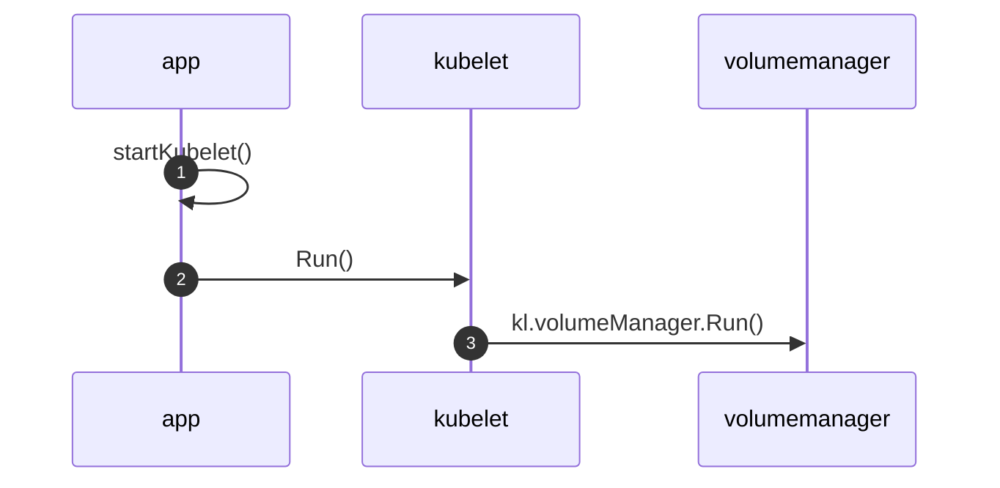
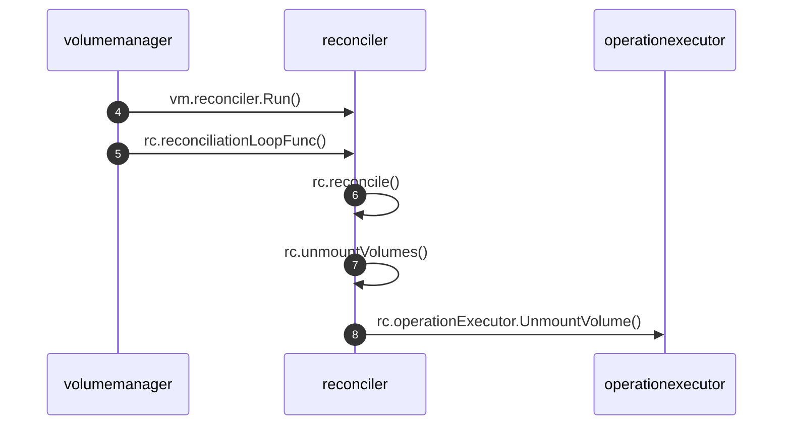
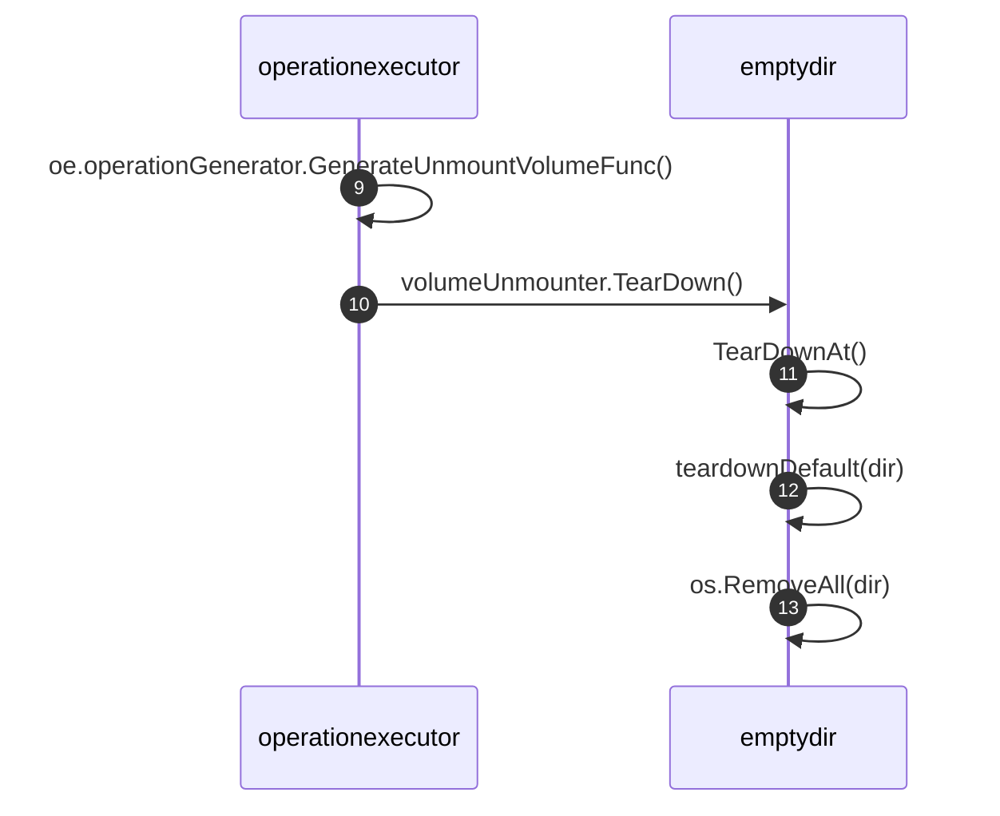
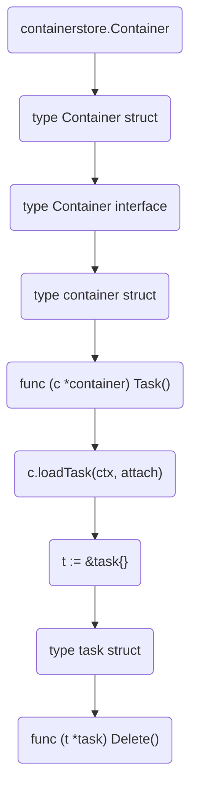

# EmptyDir的生命周期

<show-structure depth="2"/>

## 1. 创建过程

略。

## 2. 删除过程

Kubelet在启动过程中，会单独运行一个goroutine执行**volumeManager.Run()**，从名字也能看出来，它负责该节点上的volume管理。如果是新建Pod，它就准备Pod中定义的存储设备，挂载存储设备到Pod所在的节点上，最后挂载到容器指定的目录中。如果是删除Pod，它会通过Volume Plugins来实现存储卷的管理操作，比如卸载不再使用的存储，删除EmptyDir目录等。


### 2.1 启动kubelet

`startKubelet()`调用`go k.Run(podCfg.Updates())`启动kubelet。

```Go
func startKubelet(k kubelet.Bootstrap, podCfg *config.PodConfig, kubeCfg *kubeletconfiginternal.KubeletConfiguration, kubeDeps *kubelet.Dependencies, enableCAdvisorJSONEndpoints, enableServer bool) {
	// start the kubelet
	go k.Run(podCfg.Updates())

	// start the kubelet server
	if enableServer {
		go k.ListenAndServe(net.ParseIP(kubeCfg.Address), uint(kubeCfg.Port), kubeDeps.TLSOptions, kubeDeps.Auth,
			enableCAdvisorJSONEndpoints, kubeCfg.EnableDebuggingHandlers, kubeCfg.EnableContentionProfiling, kubeCfg.EnableSystemLogHandler)

	}
	if kubeCfg.ReadOnlyPort > 0 {
		go k.ListenAndServeReadOnly(net.ParseIP(kubeCfg.Address), uint(kubeCfg.ReadOnlyPort), enableCAdvisorJSONEndpoints)
	}
	if utilfeature.DefaultFeatureGate.Enabled(features.KubeletPodResources) {
		go k.ListenAndServePodResources()
	}
}
```

### 2.2 启动volumeManager

`kubelet.Run()`中调用`go kl.volumeManager.Run()`启动volue manager，它作为一个单独的goroutine运行，并且不会停止，除非kubelet异常。
 
```Go
// Run starts the kubelet reacting to config updates
func (kl *Kubelet) Run(updates <-chan kubetypes.PodUpdate) {
	if kl.logServer == nil {
		kl.logServer = http.StripPrefix("/logs/", http.FileServer(http.Dir("/var/log/")))
	}
	if kl.kubeClient == nil {
		klog.Warning("No api server defined - no node status update will be sent.")
	}

	// Start the cloud provider sync manager
	if kl.cloudResourceSyncManager != nil {
		go kl.cloudResourceSyncManager.Run(wait.NeverStop)
	}

	if err := kl.initializeModules(); err != nil {
		kl.recorder.Eventf(kl.nodeRef, v1.EventTypeWarning, events.KubeletSetupFailed, err.Error())
		klog.Fatal(err)
	}

	// Start volume manager
	go kl.volumeManager.Run(kl.sourcesReady, wait.NeverStop)

	if kl.kubeClient != nil {
		// Start syncing node status immediately, this may set up things the runtime needs to run.
		go wait.Until(kl.syncNodeStatus, kl.nodeStatusUpdateFrequency, wait.NeverStop)
		go kl.fastStatusUpdateOnce()

		// start syncing lease
		go kl.nodeLeaseController.Run(wait.NeverStop)
	}
	go wait.Until(kl.updateRuntimeUp, 5*time.Second, wait.NeverStop)

	// Set up iptables util rules
	if kl.makeIPTablesUtilChains {
		kl.initNetworkUtil()
	}

	// Start a goroutine responsible for killing pods (that are not properly
	// handled by pod workers).
	go wait.Until(kl.podKiller.PerformPodKillingWork, 1*time.Second, wait.NeverStop)

	// Start component sync loops.
	kl.statusManager.Start()
	kl.probeManager.Start()

	// Start syncing RuntimeClasses if enabled.
	if kl.runtimeClassManager != nil {
		kl.runtimeClassManager.Start(wait.NeverStop)
	}

	// Start the pod lifecycle event generator.
	kl.pleg.Start()
	kl.syncLoop(updates, kl)
}
```

### 2.3 volumeManager调协volume
volume manager也会启动一个goroutine运行**reconciler.Run()**，它负责执行volume实际状态与期望状态的调协工作，具体会运行`rc.reconcile()`与`rc.sync()`两个重要的方法，这两个方法最终都会执行`rc.operationExecutor.UnmountVolume()`，用来清理不再使用的volume。

下图只展示了`rc.reconcile()`到`rc.operationExecutor.UnmountVolume()`的代码路径，原理是先获取实际的volume列表，然后执行for循环，每个volume都会与期望状态对比，根据对比结果判断是否要执行后续的unmount操作，对于emptydir来说这个unmount操作最终也会删除对应的目录。



```Go
func (vm *volumeManager) Run(sourcesReady config.SourcesReady, stopCh <-chan struct{}) {
	defer runtime.HandleCrash()

	go vm.desiredStateOfWorldPopulator.Run(sourcesReady, stopCh)
	klog.V(2).Infof("The desired_state_of_world populator starts")

	klog.Infof("Starting Kubelet Volume Manager")
	go vm.reconciler.Run(stopCh)

	metrics.Register(vm.actualStateOfWorld, vm.desiredStateOfWorld, vm.volumePluginMgr)

	if vm.kubeClient != nil {
		// start informer for CSIDriver
		vm.volumePluginMgr.Run(stopCh)
	}

	<-stopCh
	klog.Infof("Shutting down Kubelet Volume Manager")
}
```
{collapsible="true" collapsed-title="volumeManager.Run()" default-state="collapsed"}

```Go
func (rc *reconciler) Run(stopCh <-chan struct{}) {
	wait.Until(rc.reconciliationLoopFunc(), rc.loopSleepDuration, stopCh)
}
```

```Go
func (rc *reconciler) reconciliationLoopFunc() func() {
	return func() {
		rc.reconcile()

		// Sync the state with the reality once after all existing pods are added to the desired state from all sources.
		// Otherwise, the reconstruct process may clean up pods' volumes that are still in use because
		// desired state of world does not contain a complete list of pods.
		if rc.populatorHasAddedPods() && !rc.StatesHasBeenSynced() {
			klog.Infof("Reconciler: start to sync state")
			rc.sync()
		}
	}
}
```

```Go
func (rc *reconciler) reconcile() {
	// Unmounts are triggered before mounts so that a volume that was
	// referenced by a pod that was deleted and is now referenced by another
	// pod is unmounted from the first pod before being mounted to the new
	// pod.
	rc.unmountVolumes()

	// Next we mount required volumes. This function could also trigger
	// attach if kubelet is responsible for attaching volumes.
	// If underlying PVC was resized while in-use then this function also handles volume
	// resizing.
	rc.mountAttachVolumes()

	// Ensure devices that should be detached/unmounted are detached/unmounted.
	rc.unmountDetachDevices()
}
```

```Go
func (rc *reconciler) unmountVolumes() {
	// Ensure volumes that should be unmounted are unmounted.
	for _, mountedVolume := range rc.actualStateOfWorld.GetAllMountedVolumes() {
		if !rc.desiredStateOfWorld.PodExistsInVolume(mountedVolume.PodName, mountedVolume.VolumeName) {
			// Volume is mounted, unmount it
			klog.V(5).Infof(mountedVolume.GenerateMsgDetailed("Starting operationExecutor.UnmountVolume", ""))
			err := rc.operationExecutor.UnmountVolume(
				mountedVolume.MountedVolume, rc.actualStateOfWorld, rc.kubeletPodsDir)
			if err != nil &&
				!nestedpendingoperations.IsAlreadyExists(err) &&
				!exponentialbackoff.IsExponentialBackoff(err) {
				// Ignore nestedpendingoperations.IsAlreadyExists and exponentialbackoff.IsExponentialBackoff errors, they are expected.
				// Log all other errors.
				klog.Errorf(mountedVolume.GenerateErrorDetailed(fmt.Sprintf("operationExecutor.UnmountVolume failed (controllerAttachDetachEnabled %v)", rc.controllerAttachDetachEnabled), err).Error())
			}
			if err == nil {
				klog.Infof(mountedVolume.GenerateMsgDetailed("operationExecutor.UnmountVolume started", ""))
			}
		}
	}
}
```

```Go
func (oe *operationExecutor) UnmountVolume(
	volumeToUnmount MountedVolume,
	actualStateOfWorld ActualStateOfWorldMounterUpdater,
	podsDir string) error {
	fsVolume, err := util.CheckVolumeModeFilesystem(volumeToUnmount.VolumeSpec)
	if err != nil {
		return err
	}
	var generatedOperations volumetypes.GeneratedOperations
	if fsVolume {
		// Filesystem volume case
		// Unmount a volume if a volume is mounted
		generatedOperations, err = oe.operationGenerator.GenerateUnmountVolumeFunc(
			volumeToUnmount, actualStateOfWorld, podsDir)
	} else {
		// Block volume case
		// Unmap a volume if a volume is mapped
		generatedOperations, err = oe.operationGenerator.GenerateUnmapVolumeFunc(
			volumeToUnmount, actualStateOfWorld)
	}
	if err != nil {
		return err
	}
	// All volume plugins can execute unmount/unmap for multiple pods referencing the
	// same volume in parallel
	podName := volumetypes.UniquePodName(volumeToUnmount.PodUID)

	return oe.pendingOperations.Run(
		volumeToUnmount.VolumeName, podName, "" /* nodeName */, generatedOperations)
}
```

`GenerateUnmountVolumeFunc()`中会获取volume plugin，执行`unmount`操作。

```Go
func (og *operationGenerator) GenerateUnmountVolumeFunc(
	volumeToUnmount MountedVolume,
	actualStateOfWorld ActualStateOfWorldMounterUpdater,
	podsDir string) (volumetypes.GeneratedOperations, error) {
	// Get mountable plugin
	volumePlugin, err := og.volumePluginMgr.FindPluginByName(volumeToUnmount.PluginName)
	if err != nil || volumePlugin == nil {
		return volumetypes.GeneratedOperations{}, volumeToUnmount.GenerateErrorDetailed("UnmountVolume.FindPluginByName failed", err)
	}
	volumeUnmounter, newUnmounterErr := volumePlugin.NewUnmounter(
		volumeToUnmount.InnerVolumeSpecName, volumeToUnmount.PodUID)
	if newUnmounterErr != nil {
		return volumetypes.GeneratedOperations{}, volumeToUnmount.GenerateErrorDetailed("UnmountVolume.NewUnmounter failed", newUnmounterErr)
	}

	unmountVolumeFunc := func() (error, error) {
		subpather := og.volumePluginMgr.Host.GetSubpather()

		// Remove all bind-mounts for subPaths
		podDir := filepath.Join(podsDir, string(volumeToUnmount.PodUID))
		if err := subpather.CleanSubPaths(podDir, volumeToUnmount.InnerVolumeSpecName); err != nil {
			return volumeToUnmount.GenerateError("error cleaning subPath mounts", err)
		}

		// Execute unmount
		unmountErr := volumeUnmounter.TearDown()
		if unmountErr != nil {
			// On failure, return error. Caller will log and retry.
			return volumeToUnmount.GenerateError("UnmountVolume.TearDown failed", unmountErr)
		}

		klog.Infof(
			"UnmountVolume.TearDown succeeded for volume %q (OuterVolumeSpecName: %q) pod %q (UID: %q). InnerVolumeSpecName %q. PluginName %q, VolumeGidValue %q",
			volumeToUnmount.VolumeName,
			volumeToUnmount.OuterVolumeSpecName,
			volumeToUnmount.PodName,
			volumeToUnmount.PodUID,
			volumeToUnmount.InnerVolumeSpecName,
			volumeToUnmount.PluginName,
			volumeToUnmount.VolumeGidValue)

		// Update actual state of world
		markVolMountedErr := actualStateOfWorld.MarkVolumeAsUnmounted(
			volumeToUnmount.PodName, volumeToUnmount.VolumeName)
		if markVolMountedErr != nil {
			// On failure, just log and exit
			klog.Errorf(volumeToUnmount.GenerateErrorDetailed("UnmountVolume.MarkVolumeAsUnmounted failed", markVolMountedErr).Error())
		}

		return nil, nil
	}

	return volumetypes.GeneratedOperations{
		OperationName:     "volume_unmount",
		OperationFunc:     unmountVolumeFunc,
		CompleteFunc:      util.OperationCompleteHook(util.GetFullQualifiedPluginNameForVolume(volumePlugin.GetPluginName(), volumeToUnmount.VolumeSpec), "volume_unmount"),
		EventRecorderFunc: nil, // nil because we do not want to generate event on error
	}, nil
}
```
{collapsible="true" collapsed-title="operationGenerator.GenerateUnmountVolumeFunc()" default-state="collapsed"}

### 2.4 Emptydir插件删除目录
如果使用的是EmptyDir类型，那最终会执行到emptydir包中的`TearDown()`方法。



在unmount时调用`TearDown()`并不需要传递目录，因此要删除的目录是插件自己拼接的。

```Go
// TearDown simply discards everything in the directory.
func (ed *emptyDir) TearDown() error {
	return ed.TearDownAt(ed.GetPath())
}
```

如下可以目录看到接到过程涉及`pod.UID`，`volName`，`plugin.host`等信息，这个过程会将“/”替换为“\~”，这也是emptydir目录中有“\~”的原因。

```Go
const (
	emptyDirPluginName           = "kubernetes.io/empty-dir"
	hugePagesPageSizeMountOption = "pagesize"
)
```

```Go
func (ed *emptyDir) GetPath() string {
	return getPath(ed.pod.UID, ed.volName, ed.plugin.host)
}
```

```Go
fnc getPath(uid types.UID, volName string, host volume.VolumeHost) string {
	return host.GetPodVolumeDir(uid, utilstrings.EscapeQualifiedName(emptyDirPluginName), volName)
}
```

```Go
func EscapeQualifiedName(in string) string {
	return strings.Replace(in, "/", "~", -1)
}
```

在`TearDownAt()`对不同medium做了相应处理，默认是`teardownDefault(dir)`处理的。

```Go
// TearDownAt simply discards everything in the directory.
func (ed *emptyDir) TearDownAt(dir string) error {
	// First remove ready dir which created in SetUp func
	readyDir := ed.getMetaDir()
	if removeErr := os.RemoveAll(readyDir); removeErr != nil && !os.IsNotExist(removeErr) {
		return fmt.Errorf("failed to remove ready dir [%s]: %v", readyDir, removeErr)
	}

	if pathExists, pathErr := mount.PathExists(dir); pathErr != nil {
		return fmt.Errorf("Error checking if path exists: %v", pathErr)
	} else if !pathExists {
		klog.Warningf("Warning: Unmount skipped because path does not exist: %v", dir)
		return nil
	}

	// Figure out the medium.
	medium, isMnt, _, err := ed.mountDetector.GetMountMedium(dir, ed.medium)
	if err != nil {
		return err
	}
	if isMnt {
		if medium == v1.StorageMediumMemory {
			ed.medium = v1.StorageMediumMemory
			return ed.teardownTmpfsOrHugetlbfs(dir)
		} else if medium == v1.StorageMediumHugePages {
			ed.medium = v1.StorageMediumHugePages
			return ed.teardownTmpfsOrHugetlbfs(dir)
		}
	}
	// assume StorageMediumDefault
	return ed.teardownDefault(dir)
}
```

这个函数处理非常简单粗暴，可以认为直接执行了`os.RemoveAll(dir)`，在v1.19.10版本的代码中`fsquota.ClearQuota()`是未实现状态，因此执行到这个函数一定会报错，但是不影响后面的删除操作。

```Go
func (ed *emptyDir) teardownDefault(dir string) error {
	// Remove any quota
	err := fsquota.ClearQuota(ed.mounter, dir)
	if err != nil {
		klog.Warningf("Warning: Failed to clear quota on %s: %v", dir, err)
	}
	// Renaming the directory is not required anymore because the operation executor
	// now handles duplicate operations on the same volume
	err = os.RemoveAll(dir)
	if err != nil {
		return err
	}
	return nil
}
```

```Go
// ClearQuota -- dummy implementation
func ClearQuota(_ mount.Interface, _ string) error {
	return errNotImplemented
}
```

### 2.5 如何触发删除

从如上解析，基本理解了EmptyDir的删除过程，那什么时候会触发执行EmptyDir的清理操作呢？

答案是定时触发，每隔1秒执行一次，从如下代码可以得出这个结论。

```Go
func (rc *reconciler) Run(stopCh <-chan struct{}) {
	wait.Until(rc.reconciliationLoopFunc(), rc.loopSleepDuration, stopCh)
}
```

```Go
const (
	// loopSleepDuration is the amount of time the reconciler loop waits
	// between successive executions
	loopSleepDuration = 1 * time.Second
)
```

从如上解析可知，EmptyDir中的数据是没有任何保护措施的，只要Pod删除了，对应的volume就会被清理，清理前也不会对EmptyDir中的目录做任何检查或者umount操作，即使EmptyDir中挂载了持久化存储(比如NAS)，数据也会被删除掉。

## 3. 案例分析

在kubernetes删除pod后，containerd中存在一个UNKNOWN状态的task，此时执行`ctr task delete`后，触发了emptydir被kubelet删除。

如下根据当时看到的异常日志做一些分析。

### 3.1 context deadline exceeded

- 日志信息
```
msg="get state for xxx" error="context deadline exceeded: unknown"
```

- 关联代码
```Go
// /Users/kangxiaoning/workspace/containerd/integration/client/daemon.go

func (d *daemon) waitForStart(ctx context.Context) (*Client, error) {
	var (
		client  *Client
		serving bool
		err     error
		ticker  = time.NewTicker(500 * time.Millisecond)
	)
	defer ticker.Stop()

	for {
		select {
		case <-ticker.C:
			client, err = New(d.addr)
			if err != nil {
				continue
			}
			serving, err = client.IsServing(ctx)
			if !serving {
				client.Close()
				if err == nil {
					err = errors.New("connection was successful but service is not available")
				}
				continue
			}
			return client, err
		case <-ctx.Done():
			return nil, fmt.Errorf("context deadline exceeded: %w", err)
		}
	}
}
```
{collapsible="true" collapsed-title="daemon.waitForStart()" default-state="collapsed"}

- 分析结论

无明确线索，从关联代码判断该日志是在启动容器过程中打印的，与场景不匹配。

### 3.2 Failed to handle backOff event

- 日志信息

```Shell
msg="Failed to handle backOff event &TaskExit{ContainerID:xxx,ID:xxx,Pid:xxx,ExitStatus:255,ExitedAt:xxx,XXX_unrecognized:[],} for xxx" error="failed to handle container TaskExit event: failed to stop container: context deadline exceeded: unknown"
```

- 关联代码

```Go
// /Users/kangxiaoning/workspace/containerd/pkg/cri/server/events.go

// start starts the event monitor which monitors and handles all subscribed events.
// It returns an error channel for the caller to wait for stop errors from the
// event monitor.
//
// NOTE:
//  1. start must be called after subscribe.
//  2. The task exit event has been handled in individual startSandboxExitMonitor
//     or startContainerExitMonitor goroutine at the first. If the goroutine fails,
//     it puts the event into backoff retry queue and event monitor will handle
//     it later.
func (em *eventMonitor) start() <-chan error {
	errCh := make(chan error)
	if em.ch == nil || em.errCh == nil {
		panic("event channel is nil")
	}
	backOffCheckCh := em.backOff.start()
	go func() {
		defer close(errCh)
		for {
			select {
			case e := <-em.ch:
				log.L.Debugf("Received containerd event timestamp - %v, namespace - %q, topic - %q", e.Timestamp, e.Namespace, e.Topic)
				if e.Namespace != constants.K8sContainerdNamespace {
					log.L.Debugf("Ignoring events in namespace - %q", e.Namespace)
					break
				}
				id, evt, err := convertEvent(e.Event)
				if err != nil {
					log.L.WithError(err).Errorf("Failed to convert event %+v", e)
					break
				}
				if em.backOff.isInBackOff(id) {
					log.L.Infof("Events for %q is in backoff, enqueue event %+v", id, evt)
					em.backOff.enBackOff(id, evt)
					break
				}
				if err := em.handleEvent(evt); err != nil {
					log.L.WithError(err).Errorf("Failed to handle event %+v for %s", evt, id)
					em.backOff.enBackOff(id, evt)
				}
			case err := <-em.errCh:
				// Close errCh in defer directly if there is no error.
				if err != nil {
					log.L.WithError(err).Error("Failed to handle event stream")
					errCh <- err
				}
				return
			case <-backOffCheckCh:
				ids := em.backOff.getExpiredIDs()
				for _, id := range ids {
					queue := em.backOff.deBackOff(id)
					for i, evt := range queue.events {
						if err := em.handleEvent(evt); err != nil {
							log.L.WithError(err).Errorf("Failed to handle backOff event %+v for %s", evt, id)
							em.backOff.reBackOff(id, queue.events[i:], queue.duration)
							break
						}
					}
				}
			}
		}
	}()
	return errCh
}
```
{collapsible="true" collapsed-title="eventMonitor.start()" default-state="collapsed"}

```Go

// handleEvent handles a containerd event.
func (em *eventMonitor) handleEvent(any interface{}) error {
	ctx := ctrdutil.NamespacedContext()
	ctx, cancel := context.WithTimeout(ctx, handleEventTimeout)
	defer cancel()

	switch e := any.(type) {
	case *eventtypes.TaskExit:
		log.L.Infof("TaskExit event %+v", e)
		// Use ID instead of ContainerID to rule out TaskExit event for exec.
		cntr, err := em.c.containerStore.Get(e.ID)
		if err == nil {
			if err := handleContainerExit(ctx, e, cntr, cntr.SandboxID, em.c); err != nil {
				return fmt.Errorf("failed to handle container TaskExit event: %w", err)
			}
			return nil
		} else if !errdefs.IsNotFound(err) {
			return fmt.Errorf("can't find container for TaskExit event: %w", err)
		}
		sb, err := em.c.sandboxStore.Get(e.ID)
		if err == nil {
			if err := handleSandboxExit(ctx, sb, e.ExitStatus, e.ExitedAt.AsTime(), em.c); err != nil {
				return fmt.Errorf("failed to handle sandbox TaskExit event: %w", err)
			}
			return nil
		} else if !errdefs.IsNotFound(err) {
			return fmt.Errorf("can't find sandbox for TaskExit event: %w", err)
		}
		return nil
	case *eventtypes.SandboxExit:
		log.L.Infof("SandboxExit event %+v", e)
		sb, err := em.c.sandboxStore.Get(e.GetSandboxID())
		if err == nil {
			if err := handleSandboxExit(ctx, sb, e.ExitStatus, e.ExitedAt.AsTime(), em.c); err != nil {
				return fmt.Errorf("failed to handle sandbox TaskExit event: %w", err)
			}
			return nil
		} else if !errdefs.IsNotFound(err) {
			return fmt.Errorf("can't find sandbox for TaskExit event: %w", err)
		}
		return nil
	case *eventtypes.TaskOOM:
		log.L.Infof("TaskOOM event %+v", e)
		// For TaskOOM, we only care which container it belongs to.
		cntr, err := em.c.containerStore.Get(e.ContainerID)
		if err != nil {
			if !errdefs.IsNotFound(err) {
				return fmt.Errorf("can't find container for TaskOOM event: %w", err)
			}
			return nil
		}
		err = cntr.Status.UpdateSync(func(status containerstore.Status) (containerstore.Status, error) {
			status.Reason = oomExitReason
			return status, nil
		})
		if err != nil {
			return fmt.Errorf("failed to update container status for TaskOOM event: %w", err)
		}
	// TODO: ImageService should handle these events directly
	case *eventtypes.ImageCreate:
		log.L.Infof("ImageCreate event %+v", e)
		return em.c.UpdateImage(ctx, e.Name)
	case *eventtypes.ImageUpdate:
		log.L.Infof("ImageUpdate event %+v", e)
		return em.c.UpdateImage(ctx, e.Name)
	case *eventtypes.ImageDelete:
		log.L.Infof("ImageDelete event %+v", e)
		return em.c.UpdateImage(ctx, e.Name)
	}

	return nil
}
```
{collapsible="true" collapsed-title="eventMonitor.handleEvent()" default-state="collapsed"}

```Go

// handleContainerExit handles TaskExit event for container.
func handleContainerExit(ctx context.Context, e *eventtypes.TaskExit, cntr containerstore.Container, sandboxID string, c *criService) error {
	// Attach container IO so that `Delete` could cleanup the stream properly.
	task, err := cntr.Container.Task(ctx,
		func(*containerdio.FIFOSet) (containerdio.IO, error) {
			// We can't directly return cntr.IO here, because
			// even if cntr.IO is nil, the cio.IO interface
			// is not.
			// See https://tour.golang.org/methods/12:
			//   Note that an interface value that holds a nil
			//   concrete value is itself non-nil.
			if cntr.IO != nil {
				return cntr.IO, nil
			}
			return nil, nil
		},
	)
	if err != nil {
		if !errdefs.IsNotFound(err) && !errdefs.IsUnavailable(err) {
			return fmt.Errorf("failed to load task for container: %w", err)
		}
	} else {
		// TODO(random-liu): [P1] This may block the loop, we may want to spawn a worker
		if _, err = task.Delete(ctx, c.nri.WithContainerExit(&cntr), containerd.WithProcessKill); err != nil {
			if !errdefs.IsNotFound(err) {
				return fmt.Errorf("failed to stop container: %w", err)
			}
			// Move on to make sure container status is updated.
		}
	}

	// NOTE: Both sb.Container.Task and task.Delete interface always ensures
	// that the status of target task. However, the interfaces return
	// ErrNotFound, which doesn't mean that the shim instance doesn't exist.
	//
	// There are two caches for task in containerd:
	//
	//   1. io.containerd.service.v1.tasks-service
	//   2. io.containerd.runtime.v2.task
	//
	// First one is to maintain the shim connection and shutdown the shim
	// in Delete API. And the second one is to maintain the lifecycle of
	// task in shim server.
	//
	// So, if the shim instance is running and task has been deleted in shim
	// server, the sb.Container.Task and task.Delete will receive the
	// ErrNotFound. If we don't delete the shim instance in io.containerd.service.v1.tasks-service,
	// shim will be leaky.
	//
	// Based on containerd/containerd#7496 issue, when host is under IO
	// pressure, the umount2 syscall will take more than 10 seconds so that
	// the CRI plugin will cancel this task.Delete call. However, the shim
	// server isn't aware about this. After return from umount2 syscall, the
	// shim server continue delete the task record. And then CRI plugin
	// retries to delete task and retrieves ErrNotFound and marks it as
	// stopped. Therefore, The shim is leaky.
	//
	// It's hard to handle the connection lost or request canceled cases in
	// shim server. We should call Delete API to io.containerd.service.v1.tasks-service
	// to ensure that shim instance is shutdown.
	//
	// REF:
	// 1. https://github.com/containerd/containerd/issues/7496#issuecomment-1671100968
	// 2. https://github.com/containerd/containerd/issues/8931
	if errdefs.IsNotFound(err) {
		_, err = c.client.TaskService().Delete(ctx, &apitasks.DeleteTaskRequest{ContainerID: cntr.Container.ID()})
		if err != nil {
			err = errdefs.FromGRPC(err)
			if !errdefs.IsNotFound(err) {
				return fmt.Errorf("failed to cleanup container %s in task-service: %w", cntr.Container.ID(), err)
			}
		}
		log.L.Infof("Ensure that container %s in task-service has been cleanup successfully", cntr.Container.ID())
	}

	err = cntr.Status.UpdateSync(func(status containerstore.Status) (containerstore.Status, error) {
		if status.FinishedAt == 0 {
			status.Pid = 0
			status.FinishedAt = protobuf.FromTimestamp(e.ExitedAt).UnixNano()
			status.ExitCode = int32(e.ExitStatus)
		}

		// Unknown state can only transit to EXITED state, so we need
		// to handle unknown state here.
		if status.Unknown {
			log.L.Debugf("Container %q transited from UNKNOWN to EXITED", cntr.ID)
			status.Unknown = false
		}
		return status, nil
	})
	if err != nil {
		return fmt.Errorf("failed to update container state: %w", err)
	}
	// Using channel to propagate the information of container stop
	cntr.Stop()
	c.generateAndSendContainerEvent(ctx, cntr.ID, sandboxID, runtime.ContainerEventType_CONTAINER_STOPPED_EVENT)
	return nil
}
```
{collapsible="true" collapsed-title="cri.server.handleContainerExit()" default-state="collapsed"}

>
> 如何找到和异常日志相关的`task.Delete()`代码？
>
> 根据`handleContainerExit()`的入参`cntr containerstore.Container`一步一步找。



```Go
// /Users/kangxiaoning/workspace/containerd/client/task.go

// Delete deletes the task and its runtime state
// it returns the exit status of the task and any errors that were encountered
// during cleanup
func (t *task) Delete(ctx context.Context, opts ...ProcessDeleteOpts) (*ExitStatus, error) {
	for _, o := range opts {
		if err := o(ctx, t); err != nil {
			return nil, err
		}
	}
	status, err := t.Status(ctx)
	if err != nil && errdefs.IsNotFound(err) {
		return nil, err
	}
	switch status.Status {
	case Stopped, Unknown, "":
	case Created:
		if t.client.runtime == plugins.RuntimePlugin.String()+".windows" {
			// On windows Created is akin to Stopped
			break
		}
		if t.pid == 0 {
			// allow for deletion of created tasks with PID 0
			// https://github.com/containerd/containerd/issues/7357
			break
		}
		fallthrough
	default:
		return nil, fmt.Errorf("task must be stopped before deletion: %s: %w", status.Status, errdefs.ErrFailedPrecondition)
	}
	if t.io != nil {
		// io.Wait locks for restored tasks on Windows unless we call
		// io.Close first (https://github.com/containerd/containerd/issues/5621)
		// in other cases, preserve the contract and let IO finish before closing
		if t.client.runtime == plugins.RuntimePlugin.String()+".windows" {
			t.io.Close()
		}
		// io.Cancel is used to cancel the io goroutine while it is in
		// fifo-opening state. It does not stop the pipes since these
		// should be closed on the shim's side, otherwise we might lose
		// data from the container!
		t.io.Cancel()
		t.io.Wait()
	}
	r, err := t.client.TaskService().Delete(ctx, &tasks.DeleteTaskRequest{
		ContainerID: t.id,
	})
	if err != nil {
		return nil, errdefs.FromGRPC(err)
	}
	// Only cleanup the IO after a successful Delete
	if t.io != nil {
		t.io.Close()
	}
	return &ExitStatus{code: r.ExitStatus, exitedAt: protobuf.FromTimestamp(r.ExitedAt)}, nil
}
```
{collapsible="true" collapsed-title="task.Delete()" default-state="collapsed"}

- 分析结论

从关联代码推测，在`eventMonitor`中经过一系列调用，最终执行了`task.Delete()`，但是执行失败，返回报错信息，返回报错的代码如下。

```Go
	if err != nil {
		return nil, errdefs.FromGRPC(err)
	}
```

失败原因在如下代码中有定义。

```Go
// /Users/kangxiaoning/workspace/containerd/errdefs/grpc.go

// FromGRPC returns the underlying error from a grpc service based on the grpc error code
func FromGRPC(err error) error {
	if err == nil {
		return nil
	}

	var cls error // divide these into error classes, becomes the cause

	switch code(err) {
	case codes.InvalidArgument:
		cls = ErrInvalidArgument
	case codes.AlreadyExists:
		cls = ErrAlreadyExists
	case codes.NotFound:
		cls = ErrNotFound
	case codes.Unavailable:
		cls = ErrUnavailable
	case codes.FailedPrecondition:
		cls = ErrFailedPrecondition
	case codes.Unimplemented:
		cls = ErrNotImplemented
	case codes.Canceled:
		cls = context.Canceled
	case codes.DeadlineExceeded:
		cls = context.DeadlineExceeded
	default:
		cls = ErrUnknown
	}

	msg := rebaseMessage(cls, err)
	if msg != "" {
		err = fmt.Errorf("%s: %w", msg, cls)
	} else {
		err = cls
	}

	return err
}
```
{collapsible="true" collapsed-title="errdefs.FromGRPC()" default-state="collapsed"}

```Go
// /Users/kangxiaoning/workspace/containerd/errdefs/errors.go

var (
	ErrUnknown            = errors.New("unknown") // used internally to represent a missed mapping.
	ErrInvalidArgument    = errors.New("invalid argument")
	ErrNotFound           = errors.New("not found")
	ErrAlreadyExists      = errors.New("already exists")
	ErrFailedPrecondition = errors.New("failed precondition")
	ErrUnavailable        = errors.New("unavailable")
	ErrNotImplemented     = errors.New("not implemented") // represents not supported and unimplemented
)
```
{collapsible="true" collapsed-title="errdefs.FromGRPC()" default-state="collapsed"}

```Go
// /Users/kangxiaoning/workspace/containerd/errdefs/grpc.go

func ToGRPC(err error) error {
	if err == nil {
		return nil
	}

	if isGRPCError(err) {
		// error has already been mapped to grpc
		return err
	}

	switch {
	case IsInvalidArgument(err):
		return status.Errorf(codes.InvalidArgument, err.Error())
	case IsNotFound(err):
		return status.Errorf(codes.NotFound, err.Error())
	case IsAlreadyExists(err):
		return status.Errorf(codes.AlreadyExists, err.Error())
	case IsFailedPrecondition(err):
		return status.Errorf(codes.FailedPrecondition, err.Error())
	case IsUnavailable(err):
		return status.Errorf(codes.Unavailable, err.Error())
	case IsNotImplemented(err):
		return status.Errorf(codes.Unimplemented, err.Error())
	case IsCanceled(err):
		return status.Errorf(codes.Canceled, err.Error())
	case IsDeadlineExceeded(err):
		return status.Errorf(codes.DeadlineExceeded, err.Error())
	}

	return err
}
```
{collapsible="true" collapsed-title="errdefs.ToGRPC()" default-state="collapsed"}

结合上述信息，推测由于**未知原因**，导致containerd删除task失败，因此这种场景下task的状态是**UNKNOWN**，实际并没有在底层删除掉task。

```Go
// /Users/kangxiaoning/workspace/containerd/services/tasks/service.go

func (s *service) Delete(ctx context.Context, r *api.DeleteTaskRequest) (*api.DeleteResponse, error) {
	return s.local.Delete(ctx, r)
}
```

```Go
// /Users/kangxiaoning/workspace/containerd/services/tasks/local.go

func (l *local) Delete(ctx context.Context, r *api.DeleteTaskRequest, _ ...grpc.CallOption) (*api.DeleteResponse, error) {
	container, err := l.getContainer(ctx, r.ContainerID)
	if err != nil {
		return nil, err
	}

	// Get task object
	t, err := l.v2Runtime.Get(ctx, container.ID)
	if err != nil {
		return nil, status.Errorf(codes.NotFound, "task %v not found", container.ID)
	}

	if err := l.monitor.Stop(t); err != nil {
		return nil, err
	}

	exit, err := l.v2Runtime.Delete(ctx, r.ContainerID)
	if err != nil {
		return nil, errdefs.ToGRPC(err)
	}

	return &api.DeleteResponse{
		ExitStatus: exit.Status,
		ExitedAt:   protobuf.ToTimestamp(exit.Timestamp),
		Pid:        exit.Pid,
	}, nil
}
```
{collapsible="true" collapsed-title="local.Delete()" default-state="collapsed"}
