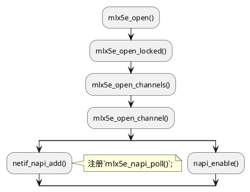
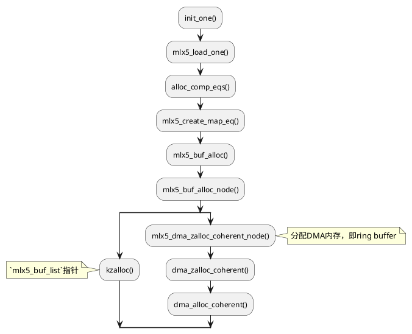

# Time_squeeze和Netdev_budget

<show-structure depth="3"/>

time_squeeze持续增长，说明`softirq`的收包预算用完时`TX/RX queue`中仍然有包等待处理。

只要**TX/RX queue**在下次`softirq`处理之前没有**overflow**，那就不会因为`time_squeeze`增加而导致丢包，但如果`time_squeeze`持续增加，就有`TX/RX queue`溢出导致丢包的可能，需要结合**packet_drop**指标来看。

## 1. /proc/net/softnet_stat

通过如下代码可知对应列的含义。

- Column-01: **packet_process**: the number of frames received by the interrupt handler.
- Column-02: **packet_drop**: the number of frames dropped due to netdev_max_backlog being exceeded.
- Column-03: **time_squeeze**: the number of times ksoftirqd ran out of netdev_budget or CPU time when there was still work to be done.
- Column-09: **cpu_collision**: collision occur while obtaining device lock while transmitting.
- Column-10: **received_rps**: number of times cpu woken up received_rps.
- Column-11: **flow_limit_count**: number of times reached flow limit count.

```C
// /home/kangxiaoning/workspace/kernel-4.19.90-2404.2.0/net/core/net-procfs.c

static int softnet_seq_show(struct seq_file *seq, void *v)
{
	struct softnet_data *sd = v;
	unsigned int flow_limit_count = 0;

#ifdef CONFIG_NET_FLOW_LIMIT
	struct sd_flow_limit *fl;

	rcu_read_lock();
	fl = rcu_dereference(sd->flow_limit);
	if (fl)
		flow_limit_count = fl->count;
	rcu_read_unlock();
#endif

	seq_printf(seq,
		   "%08x %08x %08x %08x %08x %08x %08x %08x %08x %08x %08x\n",
		   sd->processed, sd->dropped, sd->time_squeeze, 0,
		   0, 0, 0, 0, /* was fastroute */
		   0,	/* was cpu_collision */
		   sd->received_rps, flow_limit_count);
	return 0;
}
```

- Each line of `softnet_stat` represents the packets a CPU core has received.
- Upon traffic coming into the NIC, a hard interrupt is generated. An IRQ handler acknowledges the hard interrupt.
- A SoftIRQ is scheduled to pull packets off the NIC at a time when it will not interrupt another process.
- The SoftIRQ runs to pull `net.core.netdev_budget` packets off the NIC
- Normally, packets are processed through network protocols as the packets are received.
- Packets may be stored in a backlog queue of approximate size `net.core.netdev_max_backlog` under certain conditions - such as when RPS is configured or the receiving device is virtual. If the `backlog` is full, the second column of `softnet_stat` will increment.
- If there were packets left when `budget` was over, the third column of `softnet_stat` will increment
- You can view `softnet_stat` in realtime whilst reproducing packet loss to determine if `backlog` and/or `budget` should be incremented
- You can change the `netdev` tunables with `sysctl -w` in realtime

参考：**[How to tune `net.core.netdev_max_backlog` and `net.core.netdev_budget` sysctl kernel tunables?](https://access.redhat.com/solutions/1241943)**

## 2. time_squeeze

### 2.1 time_squeeze含义

If the SoftIRQs do not run for long enough, the rate of incoming data could exceed the kernel's capability to drain the buffer fast enough. As a result, the NIC buffers will overflow and traffic will be lost. Occasionally, it is necessary to increase the time that SoftIRQs are allowed to run on the CPU. This is known as the netdev_budget. The default value of the budget is 300. This will cause the SoftIRQ process to drain 300 messages from the NIC before getting off the CPU:

```Shell
# sysctl net.core.netdev_budget 
net.core.netdev_budget = 300 
```

参考： **[Red Hat Enterprise Linux Network Performance Tuning Guide](https://access.redhat.com/articles/1391433)**

### 2.2 time_squeeze触发代码

通过全局搜索可以发现**time_squeeze**只在`net_rx_action()`这个函数被修改，而这个函数是`NET_RX_SOFTIRQ`中断的处理函数，所以`time_squeeze`的变化可以反映内核处理`NET_RX_SOFTIRQ`中断的效率。

如果在处理过程中预算耗尽或者超时，函数会增加time_squeeze计数器，并退出循环。

```C
// /home/kangxiaoning/workspace/kernel-4.19.90-2404.2.0/net/core/dev.c

static __latent_entropy void net_rx_action(struct softirq_action *h)
{
	struct softnet_data *sd = this_cpu_ptr(&softnet_data);
	unsigned long time_limit = jiffies +
		usecs_to_jiffies(READ_ONCE(netdev_budget_usecs));
	int budget = READ_ONCE(netdev_budget);
	LIST_HEAD(list);
	LIST_HEAD(repoll);

	local_irq_disable();
	list_splice_init(&sd->poll_list, &list);
	local_irq_enable();

	for (;;) {
		struct napi_struct *n;

		if (list_empty(&list)) {
			if (!sd_has_rps_ipi_waiting(sd) && list_empty(&repoll))
				goto out;
			break;
		}

		n = list_first_entry(&list, struct napi_struct, poll_list);
		budget -= napi_poll(n, &repoll);

		/* If softirq window is exhausted then punt.
		 * Allow this to run for 2 jiffies since which will allow
		 * an average latency of 1.5/HZ.
		 */
		if (unlikely(budget <= 0 ||
			     time_after_eq(jiffies, time_limit))) {
			sd->time_squeeze++;
			break;
		}
	}

	local_irq_disable();

	list_splice_tail_init(&sd->poll_list, &list);
	list_splice_tail(&repoll, &list);
	list_splice(&list, &sd->poll_list);
	if (!list_empty(&sd->poll_list))
		__raise_softirq_irqoff(NET_RX_SOFTIRQ);

	net_rps_action_and_irq_enable(sd);
out:
	__kfree_skb_flush();
}
```

## 3. Mellanox驱动处理逻辑

这里主要分析`net_rx_action()`中`budget -= napi_poll(n, &repoll);`这一行涉及到的代码，也就是网卡驱动注册到内核的`poll()`方法的逻辑。

### 3.1 网卡驱动的`poll()`方法

根据网卡驱动定义的`net_device_ops`可知，在Mellanox中`ndo_open`的实现是`mlx5e_open`，up网卡时会调用这个函数，最终会注册`poll()`方法。

```C
const struct net_device_ops mlx5e_netdev_ops = {
	.ndo_open                = mlx5e_open,
	.ndo_stop                = mlx5e_close,
	.ndo_start_xmit          = mlx5e_xmit,
	.ndo_setup_tc            = mlx5e_setup_tc,
	.ndo_select_queue        = mlx5e_select_queue,
	.ndo_get_stats64         = mlx5e_get_stats,
	.ndo_set_rx_mode         = mlx5e_set_rx_mode,
	.ndo_set_mac_address     = mlx5e_set_mac,
	.ndo_vlan_rx_add_vid     = mlx5e_vlan_rx_add_vid,
	.ndo_vlan_rx_kill_vid    = mlx5e_vlan_rx_kill_vid,
	.ndo_set_features        = mlx5e_set_features,
	.ndo_fix_features        = mlx5e_fix_features,
	.ndo_change_mtu          = mlx5e_change_nic_mtu,
	.ndo_do_ioctl            = mlx5e_ioctl,
	.ndo_set_tx_maxrate      = mlx5e_set_tx_maxrate,
	.ndo_udp_tunnel_add      = mlx5e_add_vxlan_port,
	.ndo_udp_tunnel_del      = mlx5e_del_vxlan_port,
	.ndo_features_check      = mlx5e_features_check,
	.ndo_tx_timeout          = mlx5e_tx_timeout,
	.ndo_bpf		 = mlx5e_xdp,
	.ndo_xdp_xmit            = mlx5e_xdp_xmit,
#ifdef CONFIG_MLX5_EN_ARFS
	.ndo_rx_flow_steer	 = mlx5e_rx_flow_steer,
#endif
#ifdef CONFIG_MLX5_ESWITCH
	/* SRIOV E-Switch NDOs */
	.ndo_set_vf_mac          = mlx5e_set_vf_mac,
	.ndo_set_vf_vlan         = mlx5e_set_vf_vlan,
	.ndo_set_vf_spoofchk     = mlx5e_set_vf_spoofchk,
	.ndo_set_vf_trust        = mlx5e_set_vf_trust,
	.ndo_set_vf_rate         = mlx5e_set_vf_rate,
	.ndo_get_vf_config       = mlx5e_get_vf_config,
	.ndo_set_vf_link_state   = mlx5e_set_vf_link_state,
	.ndo_get_vf_stats        = mlx5e_get_vf_stats,
	.ndo_has_offload_stats	 = mlx5e_has_offload_stats,
	.ndo_get_offload_stats	 = mlx5e_get_offload_stats,
#endif
};
```
{collapsible="true" collapsed-title="mlx5e_netdev_ops" default-state="collapsed"}

注册`poll()`的调用过程如下。



注：更简单的方法是在在网卡驱动代码中搜索`netif_napi_add`关键字，即可找到`poll()`方法的具体实现，如下是Mellanox网卡驱动的搜索结果。

```C
	netif_napi_add(netdev, &c->napi, mlx5e_napi_poll, 64);
```

`netif_napi_add()`函数定义如下，查看函数实现了解每个输入参数的含义。
```C
// /home/kangxiaoning/workspace/kernel-4.19.90-2404.2.0/net/core/dev.c

void netif_napi_add(struct net_device *dev, struct napi_struct *napi,
		    int (*poll)(struct napi_struct *, int), int weight)
{
	INIT_LIST_HEAD(&napi->poll_list);
	hrtimer_init(&napi->timer, CLOCK_MONOTONIC, HRTIMER_MODE_REL_PINNED);
	napi->timer.function = napi_watchdog;
	init_gro_hash(napi);
	napi->skb = NULL;
	napi->poll = poll;
	if (weight > NAPI_POLL_WEIGHT)
		pr_err_once("netif_napi_add() called with weight %d on device %s\n",
			    weight, dev->name);
	napi->weight = weight;
	napi->dev = dev;
#ifdef CONFIG_NETPOLL
	napi->poll_owner = -1;
#endif
	set_bit(NAPI_STATE_SCHED, &napi->state);
	set_bit(NAPI_STATE_NPSVC, &napi->state);
	list_add_rcu(&napi->dev_list, &dev->napi_list);
	napi_hash_add(napi);
}
EXPORT_SYMBOL(netif_napi_add);
```
{collapsible="true" collapsed-title="netif_napi_add(struct net_device *dev, struct napi_struct *napi, int (*poll)(struct napi_struct *, int), int weight)" default-state="collapsed"}

### 3.2 mlx5e_napi_poll()

在`net_rx_action()`函数中，`budget -= napi_poll(n, &repoll);`最终会执行到网卡驱动的`poll()`方法，上面分析可知具体是`mlx5e_napi_poll()`方法。

通过下面代码及注释，可以看到主要执行了如下操作。
1. 清理发送队列的ring buffer
2. 处理接收队列的数据包

```C
// /home/kangxiaoning/workspace/kernel-4.19.90-2404.2.0/drivers/net/ethernet/mellanox/mlx5/core/en_txrx.c

int mlx5e_napi_poll(struct napi_struct *napi, int budget)
{
	struct mlx5e_channel *c = container_of(napi, struct mlx5e_channel,
					       napi);
	struct mlx5e_ch_stats *ch_stats = c->stats;
	bool busy = false;
	int work_done = 0;
	int i;

	ch_stats->poll++;

	for (i = 0; i < c->num_tc; i++)
		busy |= mlx5e_poll_tx_cq(&c->sq[i].cq, budget); // 清理发送队列的ring buffer

	busy |= mlx5e_poll_xdpsq_cq(&c->xdpsq.cq);

	if (c->xdp)
		busy |= mlx5e_poll_xdpsq_cq(&c->rq.xdpsq.cq);

	if (likely(budget)) { /* budget=0 means: don't poll rx rings */
		work_done = mlx5e_poll_rx_cq(&c->rq.cq, budget); // 处理接收队列的数据包
		busy |= work_done == budget;
	}

	busy |= c->rq.post_wqes(&c->rq);

	if (busy) {
		if (likely(mlx5e_channel_no_affinity_change(c)))
			return budget;
		ch_stats->aff_change++;
		if (budget && work_done == budget)
			work_done--;
	}

	if (unlikely(!napi_complete_done(napi, work_done)))
		return work_done;

	ch_stats->arm++;

	for (i = 0; i < c->num_tc; i++) {
		mlx5e_handle_tx_dim(&c->sq[i]);
		mlx5e_cq_arm(&c->sq[i].cq);
	}

	mlx5e_handle_rx_dim(&c->rq);

	mlx5e_cq_arm(&c->rq.cq);
	mlx5e_cq_arm(&c->icosq.cq);
	mlx5e_cq_arm(&c->xdpsq.cq);

	return work_done;
}
```

### 3.3 mlx5e_poll_tx_cq()

`mlx5e_poll_tx_cq()`的主要作用是清理ring buffer，在循环中持续运行，直到满足如下条件才退出执行。
1. 超过MLX5E_TX_CQ_POLL_BUDGET预算，默认是128
2. 或者没有更多的CQE(Completion Queue Entry)可用

**注意**：有可能一次`mlx5e_poll_tx_cq()`运行超出预算，但是ring buffer未清理完。如果发送包的速率大于清理ring buffer的速率，可能出现ring buffer溢出。

```C
#define MLX5E_TX_CQ_POLL_BUDGET        128
```

```C
// /home/kangxiaoning/workspace/kernel-4.19.90-2404.2.0/drivers/net/ethernet/mellanox/mlx5/core/en_tx.c

bool mlx5e_poll_tx_cq(struct mlx5e_cq *cq, int napi_budget)
{
    struct mlx5e_sq_stats *stats; // 发送队列统计信息
    struct mlx5e_txqsq *sq;       // 发送队列结构体
    struct mlx5_cqe64 *cqe;       // 完成队列事件
    u32 dma_fifo_cc;              // DMA FIFO计数器
    u32 nbytes;                   // 处理的总字节数
    u16 npkts;                    // 处理的数据包数量
    u16 sqcc;                     // 发送队列计数器
    int i;                        // 循环计数

    // 获取发送队列结构体
    sq = container_of(cq, struct mlx5e_txqsq, cq);

    // 确保发送队列处于启用状态
    if (unlikely(!test_bit(MLX5E_SQ_STATE_ENABLED, &sq->state)))
        return false;

    // 获取完成队列中的完成事件
    cqe = mlx5_cqwq_get_cqe(&cq->wq);
    if (!cqe)
        return false;

    // 初始化统计信息
    stats = sq->stats;

    npkts = 0;
    nbytes = 0;

    // 更新发送队列计数器
    sqcc = sq->cc;

    // 避免频繁更新缓存线
    dma_fifo_cc = sq->dma_fifo_cc;

    // 循环处理完成事件
    i = 0;
    do {
        u16 wqe_counter;           // 工作队列元素计数
        bool last_wqe;             // 是否为最后一个WQE

        // 移除完成事件
        mlx5_cqwq_pop(&cq->wq);

        // 获取工作队列元素计数
        wqe_counter = be16_to_cpu(cqe->wqe_counter);

        // 处理错误事件
        if (unlikely(cqe->op_own >> 4 == MLX5_CQE_REQ_ERR)) {
            if (!test_and_set_bit(MLX5E_SQ_STATE_RECOVERING, &sq->state)) {
                // 处理错误事件并安排恢复工作
                mlx5e_dump_error_cqe(sq, (struct mlx5_err_cqe *)cqe);
                queue_work(cq->channel->priv->wq, &sq->recover.recover_work);
            }
            stats->cqe_err++;      // 统计错误事件数量
        }

        // 遍历WQE中的所有DMA映射
        do {
            struct mlx5e_tx_wqe_info *wi; // WQE信息
            struct sk_buff *skb;          // 数据包
            u16 ci;                       // WQE索引
            int j;                        // 内部循环计数

            // 获取最后一个WQE标志
            last_wqe = (sqcc == wqe_counter);

            // 获取WQE索引
            ci = mlx5_wq_cyc_ctr2ix(&sq->wq, sqcc);
            wi = &sq->db.wqe_info[ci];
            skb = wi->skb;

            // 如果是NOP，则跳过
            if (unlikely(!skb)) {
                sqcc++;
                continue;
            }

            // 如果设置了硬件时间戳，则更新数据包的时间戳
            if (unlikely(skb_shinfo(skb)->tx_flags & SKBTX_HW_TSTAMP)) {
                struct skb_shared_hwtstamps hwts = {};
                hwts.hwtstamp = mlx5_timecounter_cyc2time(sq->clock, get_cqe_ts(cqe));
                skb_tstamp_tx(skb, &hwts);
            }

            // 解映射DMA缓冲区，也就是清理ring buffer
            for (j = 0; j < wi->num_dma; j++) {
                struct mlx5e_sq_dma *dma = mlx5e_dma_get(sq, dma_fifo_cc++);
                mlx5e_tx_dma_unmap(sq->pdev, dma);
            }

            // 更新统计信息
            npkts++;
            nbytes += wi->num_bytes;
            sqcc += wi->num_wqebbs;
            napi_consume_skb(skb, napi_budget);
        } while (!last_wqe); // 直到最后一个wqe完成才结束循环
    } while ((++i < MLX5E_TX_CQ_POLL_BUDGET) && (cqe = mlx5_cqwq_get_cqe(&cq->wq))); // 超过MLX5E_TX_CQ_POLL_BUDGET预算，或者没有更多的cqe则结束循环

    // 更新处理的事件数量
    stats->cqes += i;

    // 更新数据库记录以释放完成队列的空间
    mlx5_cqwq_update_db_record(&cq->wq);

    // 确保完成队列空间被释放
    wmb();

    // 更新DMA FIFO计数器和发送队列计数器
    sq->dma_fifo_cc = dma_fifo_cc;
    sq->cc = sqcc;

    // 唤醒发送队列
    netdev_tx_completed_queue(sq->txq, npkts, nbytes);

    // 如果发送队列被停止且有足够的空间，则唤醒队列
    if (netif_tx_queue_stopped(sq->txq) &&
        mlx5e_wqc_has_room_for(&sq->wq, sq->cc, sq->pc, MLX5E_SQ_STOP_ROOM) &&
        !test_bit(MLX5E_SQ_STATE_RECOVERING, &sq->state)) {
        netif_tx_wake_queue(sq->txq);
        stats->wake++;
    }

    // 返回是否达到处理预算
    return (i == MLX5E_TX_CQ_POLL_BUDGET);
}
```

### 3.4 mlx5e_poll_rx_cq()

`mlx5e_poll_rx_cq()`负责处理接收队列（Receive Queue，简称RQ）中的完成事件（Completion Queue Event，简称CQE），确保数据包被正确接收并处理。

```C
// /home/kangxiaoning/workspace/kernel-4.19.90-2404.2.0/drivers/net/ethernet/mellanox/mlx5/core/en_rx.c

int mlx5e_poll_rx_cq(struct mlx5e_cq *cq, int budget)
{
    struct mlx5e_rq *rq = container_of(cq, struct mlx5e_rq, cq); // 获取与CQ关联的接收队列
    struct mlx5e_xdpsq *xdpsq = &rq->xdpsq;
    struct mlx5_cqe64 *cqe; // 定义CQE指针
    int work_done = 0; // 初始化已处理的工作量

    // 如果接收队列未启用，则直接返回0
    if (unlikely(!test_bit(MLX5E_RQ_STATE_ENABLED, &rq->state)))
        return 0;

    // 如果存在待解压缩的CQ条目
    if (cq->decmprs_left) {
        // 处理解压缩的CQ条目，并更新已处理的工作量
        work_done += mlx5e_decompress_cqes_cont(rq, cq, 0, budget);
        // 如果还有待解压缩的CQ条目或已达到预算限制，则结束处理
        if (cq->decmprs_left || work_done >= budget)
            goto out;
    }

    // 获取CQ中的下一个CQE
    cqe = mlx5_cqwq_get_cqe(&cq->wq);
    // 如果没有CQE，则根据已处理的工作量情况决定是否返回
    if (!cqe) {
        if (unlikely(work_done))
            goto out;
        return 0;
    }

    // 循环处理CQ条目
    do {
        // 如果CQE是压缩格式，则开始解压缩并更新已处理的工作量
        if (mlx5_get_cqe_format(cqe) == MLX5_COMPRESSED) {
            work_done += mlx5e_decompress_cqes_start(rq, cq, budget - work_done);
            continue;
        }

        // 从CQ中移除当前CQE
        mlx5_cqwq_pop(&cq->wq);

        // 调用处理函数处理当前CQE，最终调用的是`mlx5e_handle_rx_cqe()`
        rq->handle_rx_cqe(rq, cqe);
    } while ((++work_done < budget) && (cqe = mlx5_cqwq_get_cqe(&cq->wq))); // 有预算并且有CQE的情况下循环处理

out:
    if (xdpsq->doorbell) {
        mlx5e_xmit_xdp_doorbell(xdpsq);
        xdpsq->doorbell = false;
    }

    if (xdpsq->redirect_flush) {
        xdp_do_flush_map();
        xdpsq->redirect_flush = false;
    }

    mlx5_cqwq_update_db_record(&cq->wq);

    // 确保在释放CQ空间之前更新已完成的工作量
    wmb();

    // 返回已处理的工作量
    return work_done;
}
```

在`mlx5e_alloc_rq()`初始化了`rq->handle_rx_cqe`。

```C
			rq->handle_rx_cqe = c->priv->profile->rx_handlers.handle_rx_cqe;
```

根据`mlx5e_profile`初始化可知，`rq->handle_rx_cqe`最终被初始化为`mlx5e_handle_rx_cqe`。

```C
static const struct mlx5e_profile mlx5e_nic_profile = {
	.init		   = mlx5e_nic_init,
	.cleanup	   = mlx5e_nic_cleanup,
	.init_rx	   = mlx5e_init_nic_rx,
	.cleanup_rx	   = mlx5e_cleanup_nic_rx,
	.init_tx	   = mlx5e_init_nic_tx,
	.cleanup_tx	   = mlx5e_cleanup_nic_tx,
	.enable		   = mlx5e_nic_enable,
	.disable	   = mlx5e_nic_disable,
	.update_stats	   = mlx5e_update_ndo_stats,
	.max_nch	   = mlx5e_get_max_num_channels,
	.update_carrier	   = mlx5e_update_carrier,
	.rx_handlers.handle_rx_cqe       = mlx5e_handle_rx_cqe,
	.rx_handlers.handle_rx_cqe_mpwqe = mlx5e_handle_rx_cqe_mpwrq,
	.max_tc		   = MLX5E_MAX_NUM_TC,
};
```

### 3.5 mlx5e_handle_rx_cqe()

`mlx5e_handle_rx_cqe()`主要作用是处理网络数据包的接收和完成队列的管理，会生成`skb`并送往协议栈进一步处理。

```C
// /home/kangxiaoning/workspace/kernel-4.19.90-2404.2.0/drivers/net/ethernet/mellanox/mlx5/core/en_rx.c

void mlx5e_handle_rx_cqe(struct mlx5e_rq *rq, struct mlx5_cqe64 *cqe)
{
    struct mlx5_wq_cyc *wq = &rq->wqe.wq; // 获取请求队列中的循环工作队列结构
    struct mlx5e_wqe_frag_info *wi;        // 定义工作队列元素片段信息指针
    struct sk_buff *skb;                   // 定义网络缓冲区结构指针
    u32 cqe_bcnt;                          // 定义CQE字节计数值
    u16 ci;                                // 定义工作队列元素计数器索引

    // 从CQE中获取工作队列元素计数器索引
    ci       = mlx5_wq_cyc_ctr2ix(wq, be16_to_cpu(cqe->wqe_counter));
    wi       = get_frag(rq, ci);           // 根据索引获取对应的工作队列元素片段信息
    cqe_bcnt = be32_to_cpu(cqe->byte_cnt); // 从CQE中获取字节计数值

    // 从工作队列元素中重构网络缓冲区skb
    skb = rq->wqe.skb_from_cqe(rq, cqe, wi, cqe_bcnt);
    if (!skb) {                            // 如果skb为空
        /* 处理可能的XDP情况 */
        if (__test_and_clear_bit(MLX5E_RQ_FLAG_XDP_XMIT, rq->flags)) {
            /* 不释放页面，等待XDP_TX完成后释放 */
            goto wq_cyc_pop;
        }
        goto free_wqe;                     // 直接跳转到释放WQE
    }

    // 完成接收CQE的处理，并准备接收skb
    mlx5e_complete_rx_cqe(rq, cqe, cqe_bcnt, skb);
    napi_gro_receive(rq->cq.napi, skb);    // 注册接收skb，后续就一步一步送到协议栈了

free_wqe:                                 // 释放接收WQE
    mlx5e_free_rx_wqe(rq, wi, true);

wq_cyc_pop:                               // 从工作队列中移除已处理的元素
    mlx5_wq_cyc_pop(wq);
}
```

参考：[](https://arthurchiao.art/blog/linux-net-stack-implementation-rx-zh/)

## 4. 性能参数优化

如果遇到`time_squeeze`持续增长，说明存在性能瓶颈，可以尝试调大如下参数，给中断更多的预算来处理网络包，然后继续观察`time_squeeze`变化情况，判断问题是否得以解决。

```C
net.core.netdev_budget = 300
net.core.netdev_budget_usecs = 8000
```

我通过调大上述参数，解决了一个生产环境丢包问题。当然完整的丢包分析，需要覆盖驱动层到协议层的整个链路，找到丢包点再进行优化。

## 5. 内核网络学习

暂时用于记录内核网络其它内容，后续根据脉络再进行整理。

`pci_driver`定义了PCI设备驱动程序所需的所有关键组件和回调函数，以便内核通过驱动程序与硬件设备交互。当内核检测到网卡设备时，会调用`probe`函数进行设备的初始化，在Mellanox驱动中即`init_noe`函数，从这个函数入手可以了解网卡初始化过程，**ring buffer**就是在这个过程中创建的。

```C
static struct pci_driver mlx5_core_driver = {
	.name           = DRIVER_NAME,
	.id_table       = mlx5_core_pci_table,
	.probe          = init_one,
	.remove         = remove_one,
	.shutdown	= shutdown,
	.err_handler	= &mlx5_err_handler,
	.sriov_configure   = mlx5_core_sriov_configure,
};
```

### 5.1 mlx5分配ring buffer




分配**ring buffer**的核心逻辑主要在`alloc_comp_eqs()`中。

1. 为每个完成队列分配一个CPU中断映射表
2. 将中断向量添加到CPU中断映射中
3. 使用snprintf生成完成队列的名称，并调用mlx5_create_map_eq函数创建完成队列

```C
enum {
	MLX5_COMP_EQ_SIZE = 1024,
};
```

```C

static int alloc_comp_eqs(struct mlx5_core_dev *dev)
{
	struct mlx5_eq_table *table = &dev->priv.eq_table;
	char name[MLX5_MAX_IRQ_NAME];
	struct mlx5_eq *eq;
	int ncomp_vec;
	int nent;
	int err;
	int i;

	INIT_LIST_HEAD(&table->comp_eqs_list);
	ncomp_vec = table->num_comp_vectors;
	nent = MLX5_COMP_EQ_SIZE;
#ifdef CONFIG_RFS_ACCEL
	dev->rmap = alloc_irq_cpu_rmap(ncomp_vec);
	if (!dev->rmap)
		return -ENOMEM;
#endif
	for (i = 0; i < ncomp_vec; i++) {
		eq = kzalloc(sizeof(*eq), GFP_KERNEL);
		if (!eq) {
			err = -ENOMEM;
			goto clean;
		}

#ifdef CONFIG_RFS_ACCEL
		irq_cpu_rmap_add(dev->rmap, pci_irq_vector(dev->pdev,
				 MLX5_EQ_VEC_COMP_BASE + i));
#endif
		snprintf(name, MLX5_MAX_IRQ_NAME, "mlx5_comp%d", i);
		err = mlx5_create_map_eq(dev, eq,
					 i + MLX5_EQ_VEC_COMP_BASE, nent, 0,
					 name, MLX5_EQ_TYPE_COMP);
		if (err) {
			kfree(eq);
			goto clean;
		}
		mlx5_core_dbg(dev, "allocated completion EQN %d\n", eq->eqn);
		eq->index = i;
		spin_lock(&table->lock);
		list_add_tail(&eq->list, &table->comp_eqs_list);
		spin_unlock(&table->lock);
	}

	return 0;

clean:
	free_comp_eqs(dev);
	return err;
}
```
{collapsible="true" collapsed-title="alloc_comp_eqs" default-state="collapsed"}

在`alloc_comp_eqs()`中执行了如下代码分配内存，决定了后续函数分配内存的大小。
```C
	nent = MLX5_COMP_EQ_SIZE;
	// 省略
		err = mlx5_create_map_eq(dev, eq,
					 i + MLX5_EQ_VEC_COMP_BASE, nent, 0,
					 name, MLX5_EQ_TYPE_COMP);
```

```C
enum {
	MLX5_NUM_SPARE_EQE	= 0x80, // 十进制为128
	MLX5_NUM_ASYNC_EQE	= 0x1000,
	MLX5_NUM_CMD_EQE	= 32,
	MLX5_NUM_PF_DRAIN	= 64,
};
```

```C
enum {
	MLX5_EQE_SIZE		= sizeof(struct mlx5_eqe),
	MLX5_EQE_OWNER_INIT_VAL	= 0x1,
};
```

```C
union ev_data {
	__be32				raw[7];
	struct mlx5_eqe_cmd		cmd;
	struct mlx5_eqe_comp		comp;
	struct mlx5_eqe_qp_srq		qp_srq;
	struct mlx5_eqe_cq_err		cq_err;
	struct mlx5_eqe_port_state	port;
	struct mlx5_eqe_gpio		gpio;
	struct mlx5_eqe_congestion	cong;
	struct mlx5_eqe_stall_vl	stall_vl;
	struct mlx5_eqe_page_req	req_pages;
	struct mlx5_eqe_page_fault	page_fault;
	struct mlx5_eqe_vport_change	vport_change;
	struct mlx5_eqe_port_module	port_module;
	struct mlx5_eqe_pps		pps;
	struct mlx5_eqe_dct             dct;
	struct mlx5_eqe_temp_warning	temp_warning;
} __packed;
```
{collapsible="true" collapsed-title="ev_data" default-state="collapsed"}

```C
struct mlx5_eqe {
	u8		rsvd0;
	u8		type;
	u8		rsvd1;
	u8		sub_type;
	__be32		rsvd2[7];
	union ev_data	data;
	__be16		rsvd3;
	u8		signature;
	u8		owner;
} __packed;
```
{collapsible="true" collapsed-title="mlx5_eqe" default-state="collapsed"}

```C

int mlx5_create_map_eq(struct mlx5_core_dev *dev, struct mlx5_eq *eq, u8 vecidx,
		       int nent, u64 mask, const char *name,
		       enum mlx5_eq_type type)
{
	struct mlx5_cq_table *cq_table = &eq->cq_table;
	u32 out[MLX5_ST_SZ_DW(create_eq_out)] = {0};
	struct mlx5_priv *priv = &dev->priv;
	irq_handler_t handler;
	__be64 *pas;
	void *eqc;
	int inlen;
	u32 *in;
	int err;

	/* Init CQ table */
	memset(cq_table, 0, sizeof(*cq_table));
	spin_lock_init(&cq_table->lock);
	INIT_RADIX_TREE(&cq_table->tree, GFP_ATOMIC);

	eq->type = type;
	// 1024+128再roundup_pow_of_two后得到2048
	eq->nent = roundup_pow_of_two(nent + MLX5_NUM_SPARE_EQE);
	eq->cons_index = 0;
	// 2048*64=131072字节
	err = mlx5_buf_alloc(dev, eq->nent * MLX5_EQE_SIZE, &eq->buf);
	if (err)
		return err;

#ifdef CONFIG_INFINIBAND_ON_DEMAND_PAGING
	if (type == MLX5_EQ_TYPE_PF)
		handler = mlx5_eq_pf_int;
	else
#endif
		handler = mlx5_eq_int;

	init_eq_buf(eq);

	inlen = MLX5_ST_SZ_BYTES(create_eq_in) +
		MLX5_FLD_SZ_BYTES(create_eq_in, pas[0]) * eq->buf.npages;

	in = kvzalloc(inlen, GFP_KERNEL);
	if (!in) {
		err = -ENOMEM;
		goto err_buf;
	}

	pas = (__be64 *)MLX5_ADDR_OF(create_eq_in, in, pas);
	mlx5_fill_page_array(&eq->buf, pas);

	MLX5_SET(create_eq_in, in, opcode, MLX5_CMD_OP_CREATE_EQ);
	MLX5_SET64(create_eq_in, in, event_bitmask, mask);

	eqc = MLX5_ADDR_OF(create_eq_in, in, eq_context_entry);
	MLX5_SET(eqc, eqc, log_eq_size, ilog2(eq->nent));
	MLX5_SET(eqc, eqc, uar_page, priv->uar->index);
	MLX5_SET(eqc, eqc, intr, vecidx);
	MLX5_SET(eqc, eqc, log_page_size,
		 eq->buf.page_shift - MLX5_ADAPTER_PAGE_SHIFT);

	err = mlx5_cmd_exec(dev, in, inlen, out, sizeof(out));
	if (err)
		goto err_in;

	snprintf(priv->irq_info[vecidx].name, MLX5_MAX_IRQ_NAME, "%s@pci:%s",
		 name, pci_name(dev->pdev));

	eq->eqn = MLX5_GET(create_eq_out, out, eq_number);
	eq->irqn = pci_irq_vector(dev->pdev, vecidx);
	eq->dev = dev;
	eq->doorbell = priv->uar->map + MLX5_EQ_DOORBEL_OFFSET;
	err = request_irq(eq->irqn, handler, 0,
			  priv->irq_info[vecidx].name, eq);
	if (err)
		goto err_eq;

	err = mlx5_debug_eq_add(dev, eq);
	if (err)
		goto err_irq;

#ifdef CONFIG_INFINIBAND_ON_DEMAND_PAGING
	if (type == MLX5_EQ_TYPE_PF) {
		err = init_pf_ctx(&eq->pf_ctx, name);
		if (err)
			goto err_irq;
	} else
#endif
	{
		INIT_LIST_HEAD(&eq->tasklet_ctx.list);
		INIT_LIST_HEAD(&eq->tasklet_ctx.process_list);
		spin_lock_init(&eq->tasklet_ctx.lock);
		tasklet_init(&eq->tasklet_ctx.task, mlx5_cq_tasklet_cb,
			     (unsigned long)&eq->tasklet_ctx);
	}

	/* EQs are created in ARMED state
	 */
	eq_update_ci(eq, 1);

	kvfree(in);
	return 0;

err_irq:
	free_irq(eq->irqn, eq);

err_eq:
	mlx5_cmd_destroy_eq(dev, eq->eqn);

err_in:
	kvfree(in);

err_buf:
	mlx5_buf_free(dev, &eq->buf);
	return err;
}
```
{collapsible="true" collapsed-title="mlx5_create_map_eq" default-state="collapsed"}

**注意**：经过实际测试，发现调整ring buffer会增加内存开销，具体取决于每个驱动的实现。

场景：128核CPU，512G内存，mlx5_core 5.8-3.0.7驱动。

结论：将一个网卡的ring buffer从1024调整到8192大约增加6G内存，2个网卡增加12G内存。

```C
	eq->type = type;
	// 1024+128再roundup_pow_of_two后得到2048
	eq->nent = roundup_pow_of_two(nent + MLX5_NUM_SPARE_EQE);
	eq->cons_index = 0;
	// 2048*64=131072字节
	err = mlx5_buf_alloc(dev, eq->nent * MLX5_EQE_SIZE, &eq->buf);
	if (err)
		return err;
```

```C
// /home/kangxiaoning/workspace/kernel-4.19.90-2404.2.0/drivers/net/ethernet/mellanox/mlx5/core/alloc.c

int mlx5_buf_alloc_node(struct mlx5_core_dev *dev, int size,
			struct mlx5_frag_buf *buf, int node)
{
	dma_addr_t t;

	buf->size = size;
	buf->npages       = 1;
	buf->page_shift   = (u8)get_order(size) + PAGE_SHIFT;

	buf->frags = kzalloc(sizeof(*buf->frags), GFP_KERNEL);
	if (!buf->frags)
		return -ENOMEM;

	buf->frags->buf   = mlx5_dma_zalloc_coherent_node(dev, size,
							  &t, node);
	if (!buf->frags->buf)
		goto err_out;

	buf->frags->map = t;

	while (t & ((1 << buf->page_shift) - 1)) {
		--buf->page_shift;
		buf->npages *= 2;
	}

	return 0;
err_out:
	kfree(buf->frags);
	return -ENOMEM;
}
```
{collapsible="true" collapsed-title="mlx5_buf_alloc_node" default-state="collapsed"}

### 5.2 mlx5初始化tasklet

```C
int mlx5_create_map_eq(struct mlx5_core_dev *dev, struct mlx5_eq *eq, u8 vecidx,
		       int nent, u64 mask, const char *name,
		       enum mlx5_eq_type type)
{
	struct mlx5_cq_table *cq_table = &eq->cq_table;
	u32 out[MLX5_ST_SZ_DW(create_eq_out)] = {0};
	struct mlx5_priv *priv = &dev->priv;
	irq_handler_t handler;
	__be64 *pas;
	void *eqc;
	int inlen;
	u32 *in;
	int err;

	/* Init CQ table */
	memset(cq_table, 0, sizeof(*cq_table));
	spin_lock_init(&cq_table->lock);
	INIT_RADIX_TREE(&cq_table->tree, GFP_ATOMIC);

	eq->type = type;
	eq->nent = roundup_pow_of_two(nent + MLX5_NUM_SPARE_EQE);
	eq->cons_index = 0;
	err = mlx5_buf_alloc(dev, eq->nent * MLX5_EQE_SIZE, &eq->buf);
	if (err)
		return err;

#ifdef CONFIG_INFINIBAND_ON_DEMAND_PAGING
	if (type == MLX5_EQ_TYPE_PF)
		handler = mlx5_eq_pf_int;
	else
#endif
		handler = mlx5_eq_int;

	init_eq_buf(eq);

	inlen = MLX5_ST_SZ_BYTES(create_eq_in) +
		MLX5_FLD_SZ_BYTES(create_eq_in, pas[0]) * eq->buf.npages;

	in = kvzalloc(inlen, GFP_KERNEL);
	if (!in) {
		err = -ENOMEM;
		goto err_buf;
	}

	pas = (__be64 *)MLX5_ADDR_OF(create_eq_in, in, pas);
	mlx5_fill_page_array(&eq->buf, pas);

	MLX5_SET(create_eq_in, in, opcode, MLX5_CMD_OP_CREATE_EQ);
	MLX5_SET64(create_eq_in, in, event_bitmask, mask);

	eqc = MLX5_ADDR_OF(create_eq_in, in, eq_context_entry);
	MLX5_SET(eqc, eqc, log_eq_size, ilog2(eq->nent));
	MLX5_SET(eqc, eqc, uar_page, priv->uar->index);
	MLX5_SET(eqc, eqc, intr, vecidx);
	MLX5_SET(eqc, eqc, log_page_size,
		 eq->buf.page_shift - MLX5_ADAPTER_PAGE_SHIFT);

	err = mlx5_cmd_exec(dev, in, inlen, out, sizeof(out));
	if (err)
		goto err_in;

	snprintf(priv->irq_info[vecidx].name, MLX5_MAX_IRQ_NAME, "%s@pci:%s",
		 name, pci_name(dev->pdev));

	eq->eqn = MLX5_GET(create_eq_out, out, eq_number);
	eq->irqn = pci_irq_vector(dev->pdev, vecidx);
	eq->dev = dev;
	eq->doorbell = priv->uar->map + MLX5_EQ_DOORBEL_OFFSET;
	err = request_irq(eq->irqn, handler, 0,
			  priv->irq_info[vecidx].name, eq);
	if (err)
		goto err_eq;

	err = mlx5_debug_eq_add(dev, eq);
	if (err)
		goto err_irq;

#ifdef CONFIG_INFINIBAND_ON_DEMAND_PAGING
	if (type == MLX5_EQ_TYPE_PF) {
		err = init_pf_ctx(&eq->pf_ctx, name);
		if (err)
			goto err_irq;
	} else
#endif
	{
		INIT_LIST_HEAD(&eq->tasklet_ctx.list);
		INIT_LIST_HEAD(&eq->tasklet_ctx.process_list);
		spin_lock_init(&eq->tasklet_ctx.lock);
		tasklet_init(&eq->tasklet_ctx.task, mlx5_cq_tasklet_cb,
			     (unsigned long)&eq->tasklet_ctx);
	}

	/* EQs are created in ARMED state
	 */
	eq_update_ci(eq, 1);

	kvfree(in);
	return 0;

err_irq:
	free_irq(eq->irqn, eq);

err_eq:
	mlx5_cmd_destroy_eq(dev, eq->eqn);

err_in:
	kvfree(in);

err_buf:
	mlx5_buf_free(dev, &eq->buf);
	return err;
}
```
{collapsible="true" collapsed-title="mlx5_create_map_eq" default-state="collapsed"}

### 5.3 ipv4_specific

```C

const struct inet_connection_sock_af_ops ipv4_specific = {
	.queue_xmit	   = ip_queue_xmit,
	.send_check	   = tcp_v4_send_check,
	.rebuild_header	   = inet_sk_rebuild_header,
	.sk_rx_dst_set	   = inet_sk_rx_dst_set,
	.conn_request	   = tcp_v4_conn_request,
	.syn_recv_sock	   = tcp_v4_syn_recv_sock,
	.net_header_len	   = sizeof(struct iphdr),
	.setsockopt	   = ip_setsockopt,
	.getsockopt	   = ip_getsockopt,
	.addr2sockaddr	   = inet_csk_addr2sockaddr,
	.sockaddr_len	   = sizeof(struct sockaddr_in),
#ifdef CONFIG_COMPAT
	.compat_setsockopt = compat_ip_setsockopt,
	.compat_getsockopt = compat_ip_getsockopt,
#endif
	.mtu_reduced	   = tcp_v4_mtu_reduced,
};
```